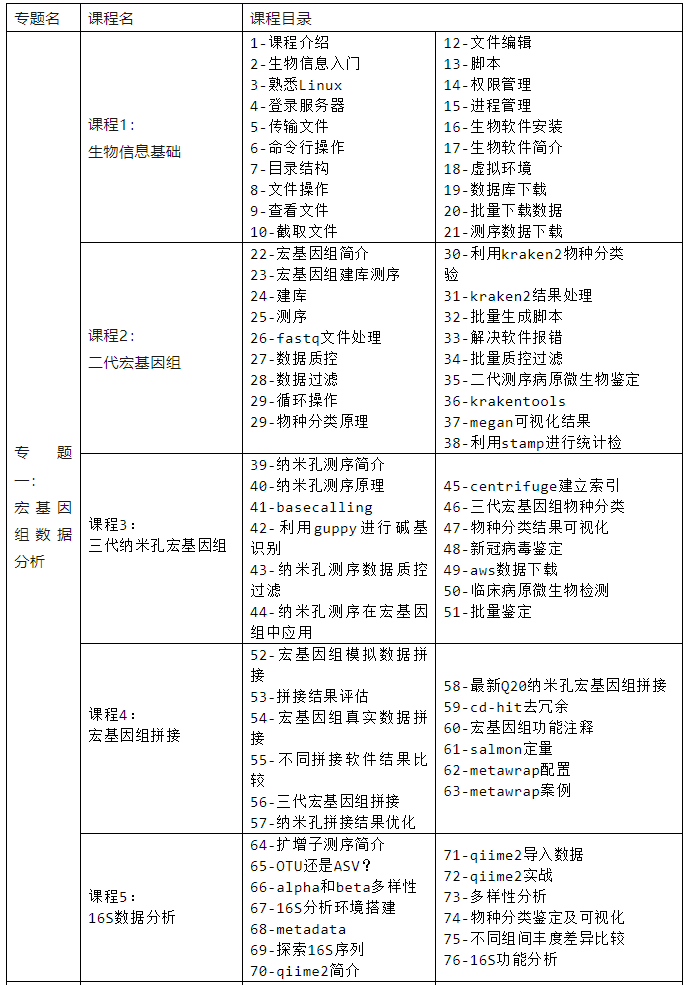
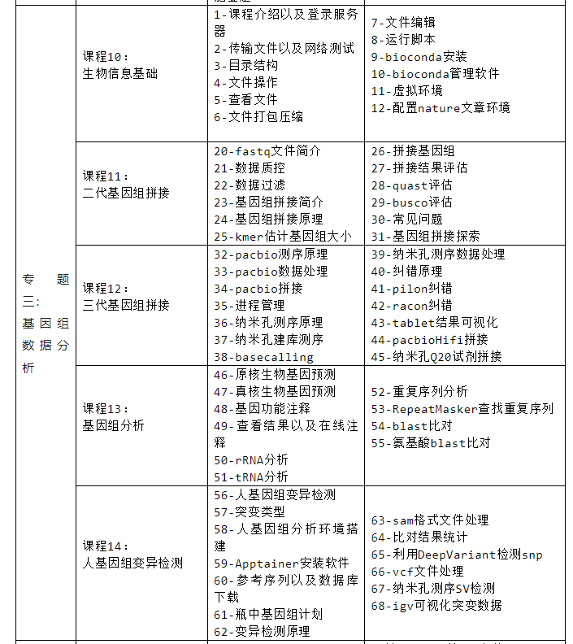
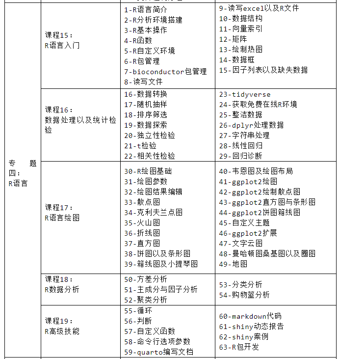
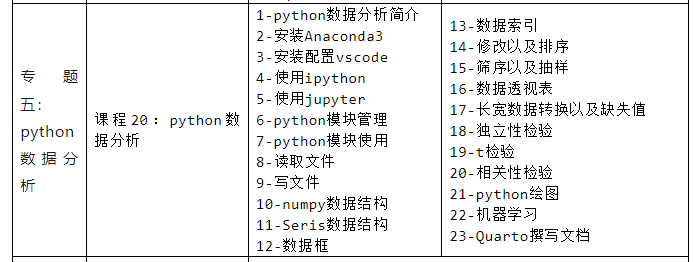
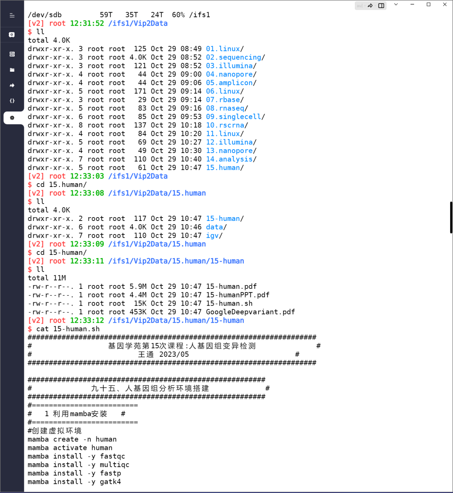
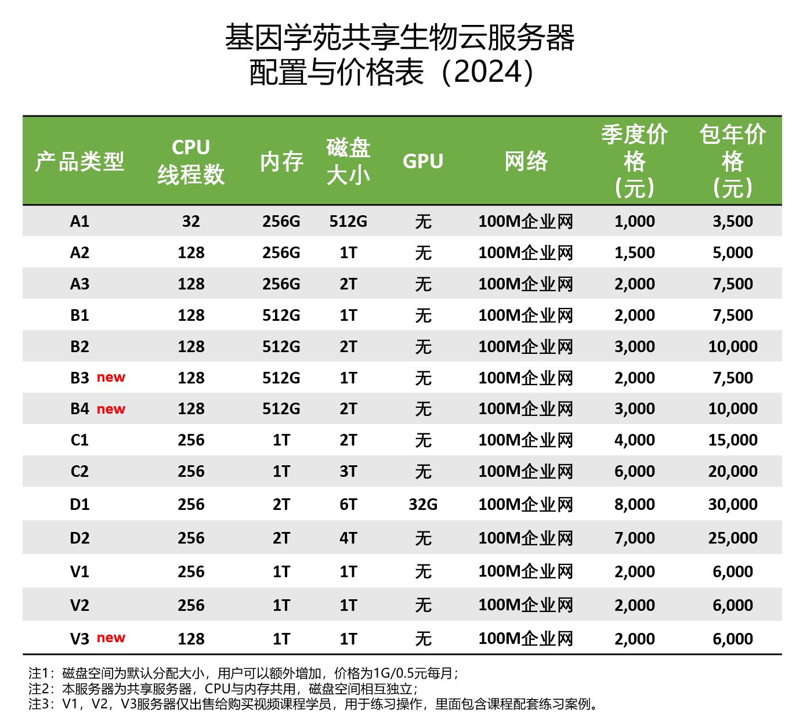
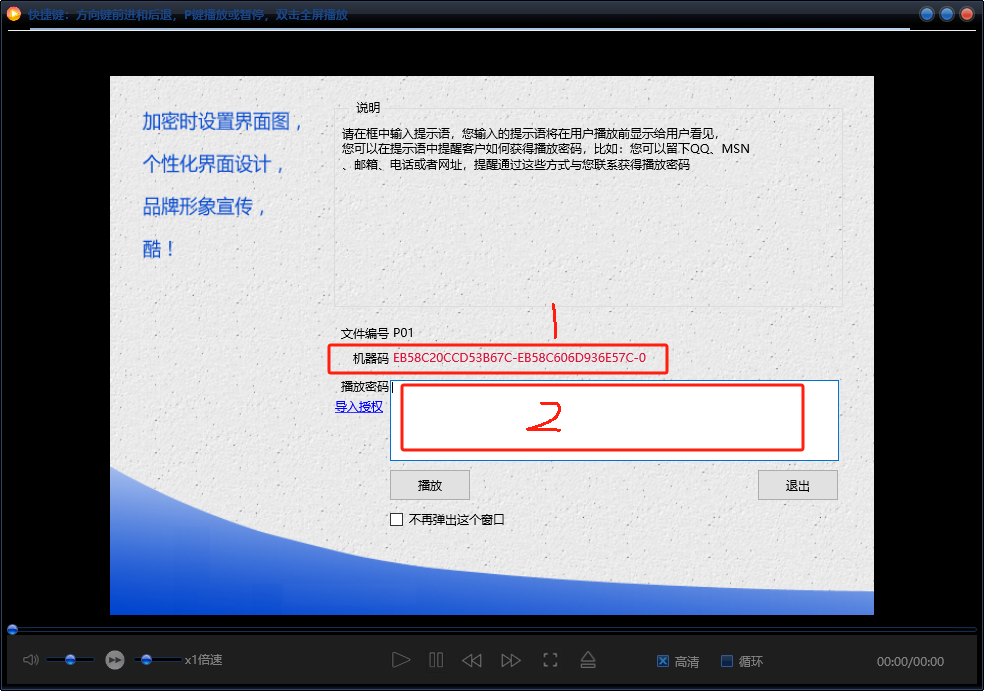

#  1.3 生物信息视频课程

>今年我们的《基因学苑生物信息VIP课程第2季》已经全部更新完成。本课程包含五个专题，一共290节生物信息课程，全长超过200多小时，30多万文字讲义，大量PPT，10000多行代码，是学习生物信息非常好的材料。更重要的是配有六个月云服务器上机操作，非常适合零基础学员自学。

## 课程介绍

4500元= 290集加密视频 + 6个月上机操作+文字讲义+PPT+案例代码+微信答疑群

1. 课程包含**五个专题**，分别是宏基因组，RNAseq和单细胞，基因组数据分析，R语言和**python数据分析**；

2. 提供本地版加密视频，加密视频仅在一台设备上播放，支持windows系统和苹果电脑 ，视频有效期至2028年12月31日；

3. **包括****6个月****上机操作**，服务器内包含上课全部案例数据和代码，可配合视频快速学习；

4. 包含课程配套30万字讲义，大量PPT，10000+案例代码；

5. 加入微信答疑群；

6. 可开具发票，具体发票请添加下面微信。

   ##  如何购买

**1、渠道一：**

添加下面微信，转账付款，发送下载地址，进行课程解锁，获取账号，开发票等事宜。

手机微信扫描下方二维码

####  

**2、渠道二：**

**淘宝付款购买：复制下面地址到浏览器中或者使用手机淘宝扫描二维码，付款完添加上面微信。**

**淘宝链接：https://item.taobao.com/item.htm?spm=a21dvs.23580594.0.0.6ffb645ea5q4SL&ft=t&id=619716421433**

手机淘宝扫码二维码

## 课程目录

### 专题一：宏基因组数据分析

### 专题二： RNAseq与单细胞数据分析

### 专题三： 测序原理与基因组数据分析

### 专题四： R语言数据分析专题

### 专题五： python数据分析专题

## 上机操作

##  常见问题

**1、上机操作服务器是什么？**

我们生物信息培训理念一直是鼓励亲自上手操作，因此，课程都提供上机操作。上机操作为一个服务器账号，登录之后可以按照视频演示，在服务器中完成同样的操作，通过多反复练习来掌握生物信息。

**2、课程是否适合零基础？**

课程是《基因学苑VIP课程第2季》全部内容，额外加python数据分析专题，相当于43天培训的全部内容。里面包含了生物信息基础，Linux，生物软件管理，R，python，二三代测序原理等基础内容，还包括RNAseq，单细胞，宏基因组，16S，人基因组变异检测等应用内容。适合零基础从头开始学习。

**3、是否能只购买课程一部分？**

本课程为打包销售，不单独售卖。

**4、想在多台设备播放怎么办？**

课程为本地加密版本，只能在一台电脑设备上播放，windows系统和苹果系统均可，不支持手机端播放，也不支持录屏。因为视频内容很大且里面有很多操作演示，不适合手机端播放。默认只支持一台设备，如果想多台设备播放，每台加1000元。

**5、课程可以看多久？**

课程有效期到2028年12月31日。

**6、如何进行解锁？**

视频需要使用专用播放器进行播放，下载播放器，导入任何一个视频，将下图1所示的机器码发给我即可进行解锁，然后将解锁码填入图中2部分即可，一次解锁即可观看全部内容。

**7、是否可以开发票**

本教程提供发票，发票为电子发票，具体信息可添加上面微信进行咨询。

