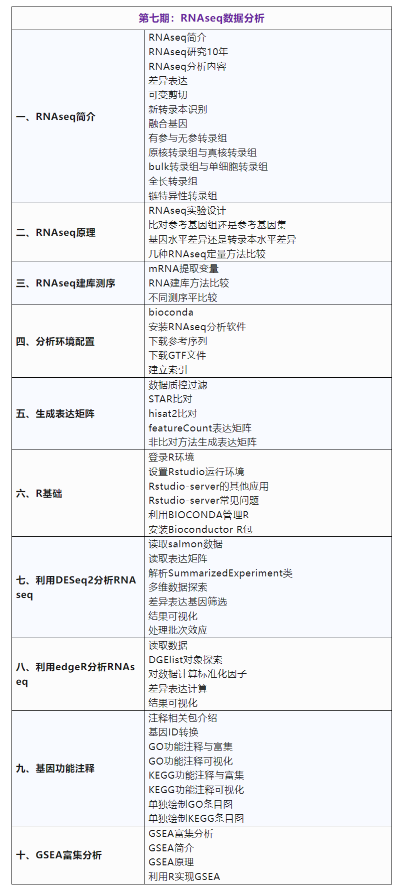
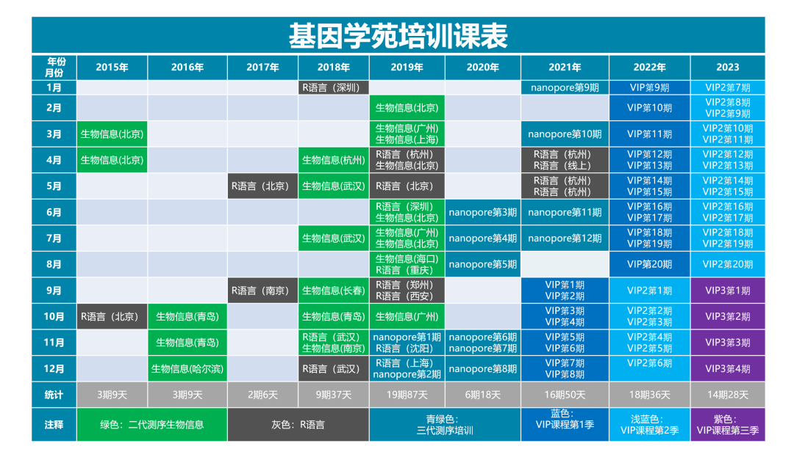
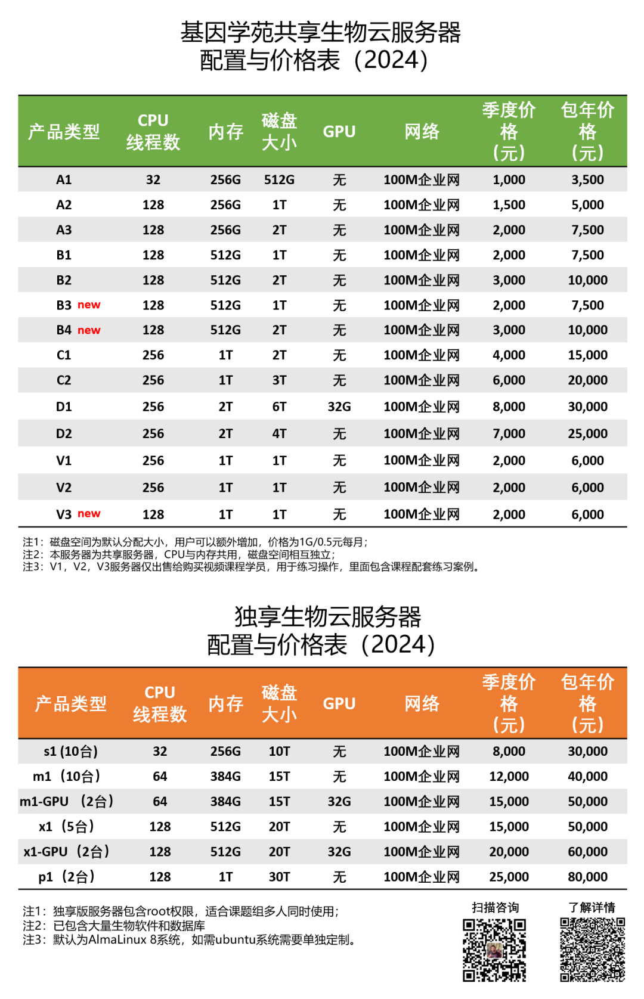

# 《RNAseq数据分析》培训课程开始报名

> 基因学苑VIP课程第三季第六次课程开始报名，本次内容为RNAseq数据分析。通过三天时间，我们将从零系统地学习RNAesq数据分析。从测序数据开始，到数据质控过滤，生成表达矩阵，差异表达分析，差异表达基因组功能注释，富集分析，到结果可视化，一次课程全部搞定。

###  **《RNAseq数据分析》** 

**本期亮点：**

1、完全从零基础开始学RNAseq**；**

2、生物信息分析真实案例，亲自上手操作；

3、从测序数据到结果可视化，一次搞定 ；

4、周末三天时间，快速掌握一项技能；

5、视频**回看**，课程结束后可以继续学习；

6、微信群及时**答疑**，快速解决问题；

## **课程目录**

（根据实际情况略有调整）

##  **课程价格** 

 **上课日期：** **2024年3月9日-2024年3月11日**

 **上课时间 ** **：上午9点到12点，下午14点到17点**

 **上课方式：**  **腾讯会议直播**，提供直播录屏

 **价   格：**  **3,000元（大写：人民币叁仟元整）**

​       **（已报名全年VIP用户免费参加本次课程）**

**付款方式：**银行对公转账

**户    名：**青岛同源基因科技有限责任公司

**开户银行：**中国建设银行青岛高新区支行

**账户：**37101006101052502221

也可以公务卡微信支付宝扫码支付等，**可开发票**，具体信息可以联系工作人员。

##  **报名方式** 

#### **扫描下方二维码，添加微信报名**

#### 

 ***\*基因学苑生物信息VIP\*******\*（第3季）简\*******\*介\**** 

从2015年我们就开始生物信息培训，现在已经是**第9个年头**。在2021年我们推出了基因学苑VIP计划第一季，目前已经有超过500人学习了第一季的课程。第二季于2022年9月-2023年8月举办，有超过120人参与直播学习。

从2015年培训至今，我们已经累计组织过**90期培训班**，累计培训天数达到**280天**。培训内容包括二代测序生物信息分析，R语言，nanopore测序生物信息分析等。累计参加学员**超过3000人**。

目前我们将组织基因学苑VIP课程（第三季），现在面向全球招生。为了适合更多学员需求，本次我们将采用灵活报名方式，也就是每期课程可以单独报名，也可以购买VIP会员。

##  **常见问题** 

**1、如何报名？**

添加上面微信->开发票付款->进微信群->开通服务器账号->参加直播课程。

**2、可以开发票吗？**

可以签订合同，开具发票，具体开票内容可以添加微信上面，或者搜索bio-wangtong。

**3、开课后是否可以继续报名？**

可以，随时都可以报名，每一期可以单独报名，如果想购买VIP，之前内容可以观看视频。

**4、参加了之前两季度，是否还需要参加本期课程？**

根据个人需要，本季度课程新增了python系列课程，以及R高级技能，并且nanopore测序分析部分内容有所更新。

**5、课程具体时间如何安排？**

每个月一期，每期3天，通过腾讯会议在线直播，具体时间课程会在每一期单独招生计划中设定。

**6、临时有事，不能参与直播怎么办？**

我们课程将提供录播部分，录播部分将于直播之后上线，可以观看直播，并参照视频内容进行上机练习。建议参与直播，有问题可以随时解决。

**7、单独报名之后是否可以补差价办理VIP会员？**

可以单独报名1期，如果觉得可以补差价为全年会员，全年会员包含10-12期课程，且包含一年云服务器。

