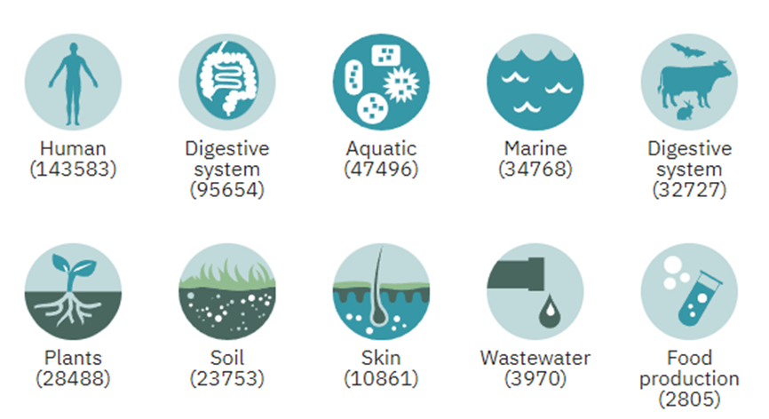

# 12.1 了解宏基因组

## 1 宏基因组测序简介

**宏基因组定义：（维基百科）**

Metagenomics is the study of genetic material recovered directly from **environmental samples**. The broad field may also be referred to as environmental genomics, ecogenomics or community genomic。

**宏基因组** **( Metagenome)****：（也称微生物环境基因组Microbial Environmental Genome, 或元基因组）是由 Handelsman 等 1998 年提出的新名词， 其定义为“the genomes of the total microbiota found in nature” , 即环境中全部微小生物遗传物质的总和。它包含了可培养的和未可培养的微生物的基因，目前主要指环境样品中的细菌和真菌的基因组总和。

**宏基因组学**(**或元基因组学，**metagenomics)**：**是一种以环境样品中的微生物群体基因组为研究对象，以功能基因筛选或测序分析为研究手段，以**微生物多样性、种群结构、进化关系、功能活性、相互协作关系及与环境之间的关系**为研究目的的新的微生物研究方法。一般包括从环境样品中提取基因组DNA, 进行高通量测序分析，或克隆DNA到合适的载体，导入宿主菌体，筛选目的转化子等工作。

广义宏基因组：泛指研究微生物组的学科—宏基因组学(Metagenomics)，狭义仅指宏基因组测，区别于扩增子测序与宏转录组测序，主要分析样品物种组成与功能基因，

狭义宏基因组主要是指宏基因组DNA测序，区别于扩增子测序。

**微生物：**指“一切肉眼看不见或看不清的微小生物的总称”。从这个概念来看微生物的范围其实包括是非常广泛的，只要是微小的生物，都可以属于微生物。微生物可以分为两类，无细胞结构和有细胞结构，有细胞结构又可以分为原核微生物与真核微生物。原核生物可以分为“三菌三体”，细菌放线菌和蓝细菌，支原体衣原体和立克次氏体。

## 2 研究对象

宏基因组研究是微生物研究的延伸，传统微生物研究都可以采用宏基因组测序的方法。只要有微生物的地方，都可以采用宏基因组研究的方法。

目前宏基因研究主要的样品包括人肠道，各种动物肠道，人体各部位，植物根系，土壤，水体，空气，极端环境条件下等。

https://www.ebi.ac.uk/metagenomics/

 

​                               

图 1 EBI 宏基因组测序样品分类统计

## 3 发展历史 

宏基因组的发展与测序技术的发展是息息相关的，正是因为高通量测序的出现，才让宏基因组测序成为可能。下面选取宏基因组发展历史上几个重要节点作为介绍。

1991：首次提出环境基因组学(environmental genomics)的概念，同年构建了第一个通过克隆环境样品中DNA 的噬菌体文库。

1998：美国国立环境卫生科学研究所启动了环境基因组计划(environmental genome project，EGP)，开展有关人体遗传变异与环境胁迫相互关系的研究。环境基因组学第一次提出特定生态条件下，全部生物基因组总体概念，这是基因组学的重要进展。

1998：由 Handelsman等提出的新名词宏基因组 ( Metagenome)（也称微生物环境基因组Microbial Environmental Genome, 或元基因组），其定义为“the genomes of the total microbiota found in nature” , 即环境中全部微小生物遗传物质的总和。

**2004**年：**Jillian Banfield**与**J. Craig Venter**进行鸟枪法宏基因组测序。

2005年：454测序仪上市，正式进入高通量测序时代。

2007年3月，美国国家科学院以“环境基因组学新科学——揭示微生物世界的奥秘”为题发表咨询报告，指出宏基因组学为探索微生物世界的奥秘提供新的方法，这是继发明显微镜以来研究微生物方法的最重要进展，是对微生物世界认识的革命性突破

2009年：发布mothur软件，分析高通量扩增子分析。

2009年：pacbio测序仪发布，测序读长增长到10K以上。

2010年：EMP地球微生物组计划。

2010年：《nature》封面文章，基于宏基因组测序构建人类肠道微生物组参考基因集，正式开启宏基因组测序时代。

**2011年：illumnia发布miseq测序仪，PE 300测序，连接起来可达到500bp左右，达到16S序列三分之一长度。**

2013年：小鼠肠道微生物基因组数据发布。

2013年：美国人肠道微生物基因组计划。

**2014年：牛津纳米孔公司发布minion测序仪，纳米孔测序时代来临。**

2015-2019：大量环境样本被测序出来，微生物研究进入宏基因组测序时代。

2019年：Qiime2流程发布。

2020年：快速，实时，长读长纳米孔宏基因组在新冠病毒研究中重要应用……

## 4研究目的

宏基因组研究本质上还是微生物学研究，只是传统微生物学研究的一个扩展，所以研究目的与其他生物学研究类似，同样是关注基因型，表型与环境之间的相互关系以及相互作用，不过微生物与环境之间有更强的相互作用关系。下面从科学研究与技术应用两个维度来介绍宏基因组学的研究目的。

### 4.1 科学研究

**回答问题1：定性分析，样品中包含哪些微生物？**

原核生物，真菌，病毒，显微藻类，原生动物……

**回答问题2：定量分析，不同微生物之间丰度？**

样品中每种微生物所占的比例格式多少，不同比例变化与表型之间有哪些关联？

**回答问题3：功能分析，样品中包含哪些基因，实现哪些代谢功能？**

将整个样品当做一个基因集合，检测样品中包含了哪些基因，这些基因的功能以及代谢分析。

**回答问题4：比较分析，不同样品之间的差别？**

比较不同表型样品中微生物物种组成及丰度的差别，与表型进行关联分析。

**回答问题5：关联分析，样品基因型，表型以及环境之间的关系？**

不同条件处理下，不同时间下样品物种组成及丰度的变化。

### 4.2 技术应用

**应用1：发现新物种**

通过测序不同环境下样本，鉴定出之前无法进行分离以及纯培养的微生物样本。

**应用2：流行病学快速诊断**

通过对疾病样本进行宏基因组测序，获得样品微生物组成及丰度，尤其是低覆盖度样本的测序。

**应用3：病原菌溯源**

发现病原微生物的栖息源头以及传播途径。

**应用4：微生物与人体健康研究，寻找标记biomarker。**

微生物组成以及丰度的变化与人体健康之间的关联关系。

**应用5：筛选重要微生物菌种**

筛选出具有重要应用价值的微生物品种。