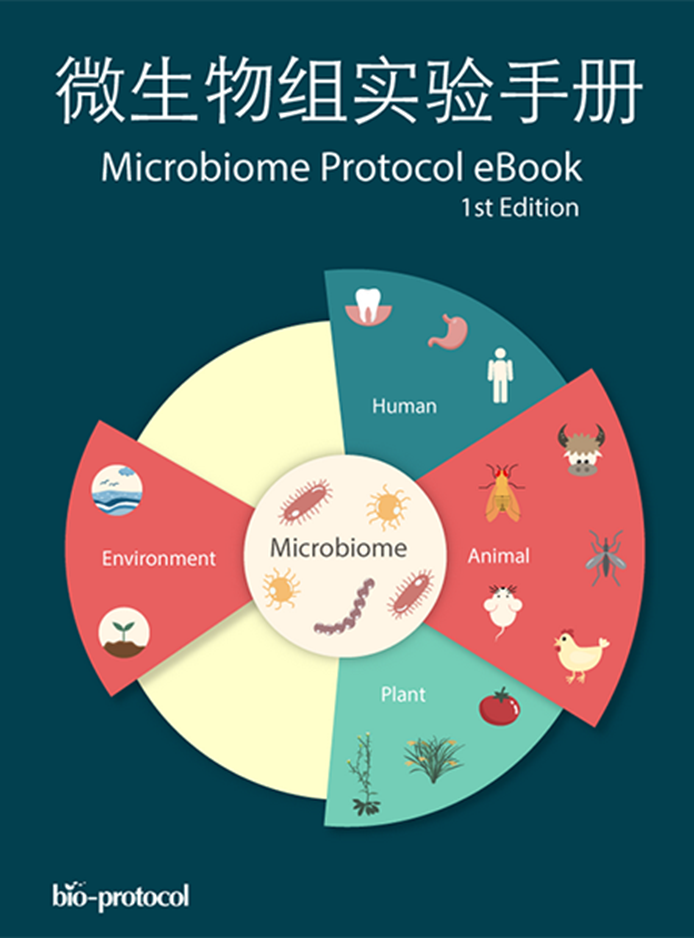
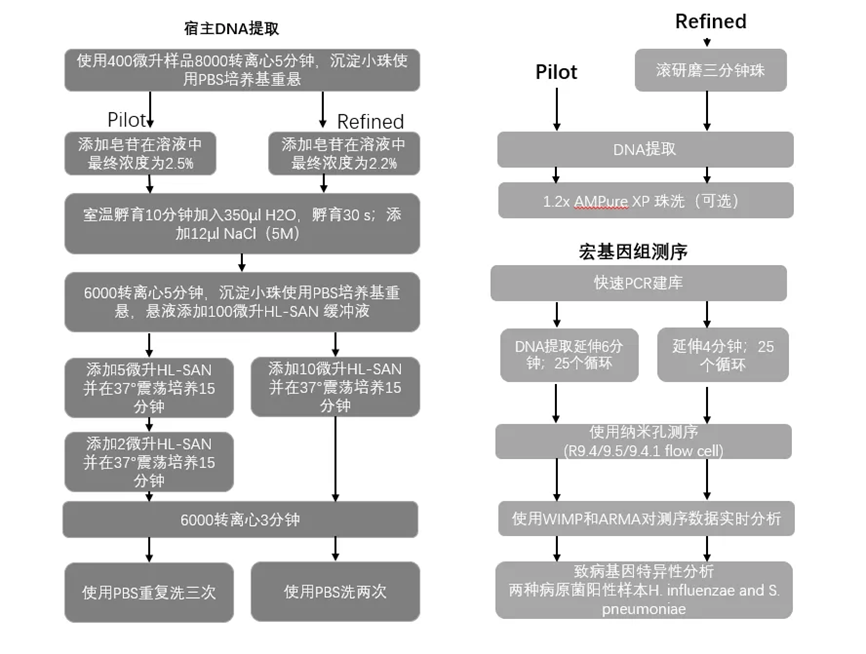
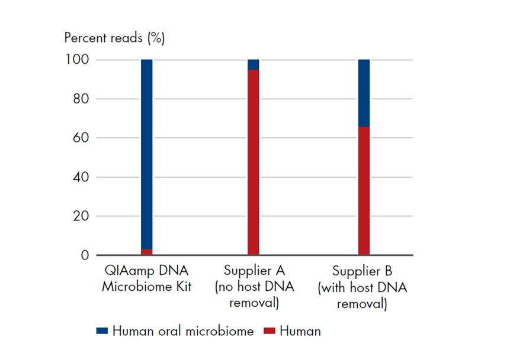
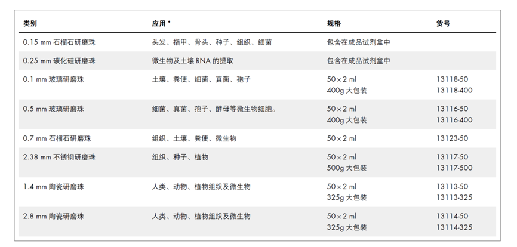

# 12.5   宏基因组建库测序

## 1 宏基因组样品提取

宏基因组研究涉及的样品广发，因此样品提取比较困难，且有很强的针对性。这里面为大家推荐国内的Bio-protocol精选集。下面是引用里面的简介。

*“Bio-protocol联合宏基因组共同发起了《微生物组实验手册》项目，以填补微生物组领域方法空白，解决实验和分析难重复的问题，推动实验标准化，助力微生物组学发展。《微生物组实验手册》共有167名编委、评审，和352位作者的加入，集合了125个研究所和大学，以微生物组为主题，包括样本制备、分离培养、扩增子、宏基因组、代谢组、数据分析等实验和分析方法，为读者提供146篇实用、优质的实验方案。希望这本实验手册能对广大从事微生物组研究的科研工作者有所帮助或启发。*

*我们从中选了40篇文章可以说是该实验手册详尽实验方案的典型代表， 汇集成了这本PDF合集，以飨读者。该实验手册的完整版包含实验方案（146篇）、实验操作视频、作者留言问答等内容，请访问在线版*[*https://bio-protocol.org/bio101/MPB*](https://bio-protocol.org/bio101/MPB) *”*

​                               

图 1 微生物组实验手册

## 2 测序更多微生物序列 

当前临床样本病原微生物鉴定最大的问题就是DNA提取问题，例如DNA无法提取，需要反转录，提取量不足以及宿主污染等问题。宿主污染是影响非常大的因素，尤其是病毒检测，由于同一细胞内，病毒基因组与宿主基因组丰度相差太大。如果全部进行测序，很难测序到病毒的序列。因此，对于临床样本的病原微生物鉴定，富集得到更多的目标DNA，去除宿主就是最重要的工作。

### 2.1 如何去除宿主污染

宏基因组测序过程中，一些样品往往会包括宿主基因组和一些抑制因子，例如复杂多糖、胆酸盐、脂类和尿酸等，这些都会对测序目标序列造成影响。尤其是宿主污染是最难解决的问题，例如拭子，口腔样品，呼吸道样品等。尤其是在做病毒宏基因组研究中，由于宿主细胞与微生物细胞二者基因组相差巨大 ，例如一个人细胞包含3G数据，而一个病毒细胞可能只有30K，二者相差10万倍，这就导致测序数据中绝大部分都是来源于宿主的序列。没有测序到目标序列，无法进行后续数据分析。因此，对于此类宏基因组样品，减少宿主污染非常重要。常用的方法主要分为以下四种方式：

**1、物理方法，例如离心，细菌滤膜，**

**2、扩增目标序列；**

**3、消化宿主基因组；**

**4、生物信息学方法过滤。**

 

图 2 去宿主方法流程图

### 2.2 去除宿主试剂盒

由于宏基因组样品包含种类很多，处理宿主的方法也不尽相同，例如使用离心，生物膜过滤，化学试剂消化，选择特异性的DNA提取试剂盒等等，根据不同的研究样品选择合适的方法。目前已经有很多成熟的商业化试剂盒可供选择，例如Qiagen推出了一些专门针对人肠道样品，土壤样品，口腔等不同的提取试剂盒。

**粪便样本QIAamp® PowerFecal DNA Kit**

粪便样本中含有大量的PCR 抑制剂，如复杂多糖、胆酸盐、脂类和尿酸等，严重时这些抑制剂会完全抑制PCR 信号，MO BIO 专利的IRT 技术可高效去除多种抑制因子，所得的核酸可直接进行PCR 或NGS 检测。

专门用于快速提取粪便、肠内容物等样本的DNA

• 配有0.7 mm 干燥的石榴石研磨珠，搭配Vortex 高效破碎样本

• 专利抑制因子去除技术IRT：去除脂肪、多糖、亚铁血红素等一切PCR 抑制因子

• 30 分钟内快速提取高达250 mg 粪便样品中DNA

• 通量：1–24 份样本，可在QIAcube 上半自动化

**口腔皮肤拭子样本QIAamp DNA Microbiome Kit**

有效去除宿主DNA 背景

• 可从拭子和体液中分离细菌DNA

• 高效去除宿主DNA，适用于深度微生物组学分析

• 在宏基因组鸟枪法测序实验中实现更高的细菌DNA 检测分辨率

 

图 3 选择针对皮肤拭子样本的试剂盒有效减少人基因组的污染

### 2.3 富集目标序列

表 1 针对不同样品，采用不同大小研磨珠来提取DNA

 

## 2.4 不同测序平台比较

宏基因组测序同样需要考虑不同测序平台的影响，目前主要有二代测序illumina，华大DNBseq，三代pacbio平台以及纳米孔测序平台。不同的测序技术也会带来直接的影响。下面总结一个个平台优缺点。

 表 2 不同测序平台比较

| **平台** | **二代测序**                                                 | **Pacbio**                                                   | **Nanopore**                                                 |
| -------- | ------------------------------------------------------------ | ------------------------------------------------------------ | ------------------------------------------------------------ |
| **优点** | 1、数据量大  2、价格便宜  3、测序丰度高，可以鉴定低丰度微生物 | 1、可以得到16S全长序列；  2、准确性高，鉴定准确              | 1、可以进行实时测序，方便进行快速鉴定  2、可以得到16S全长  3、宏基因组进行拼接效果较好； |
| **缺点** | 1、读长短，唯一性差  2、测序速度慢，不能进行快速鉴定；  3、16S测序无法得到全长；  4、不便于宏基因组拼接； | 1、价格高  2、数据量低，不能进行定量鉴定  3、无法实时测序，进行快速鉴定 | 1、价格贵  2、错误率高  3、16S序列错误率较高                 |