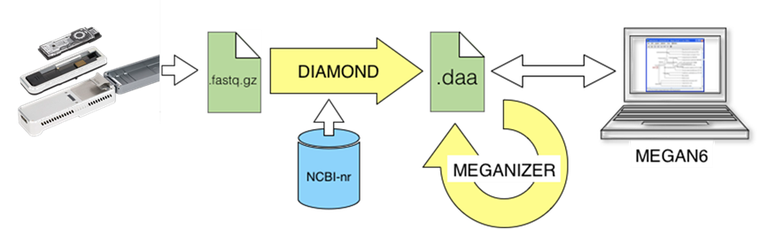
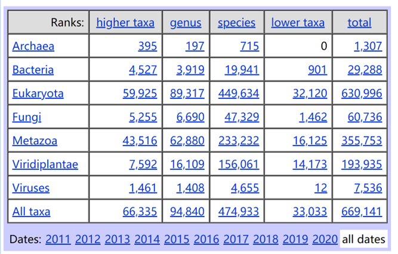

# 12.8 宏基因组物种分类原理

当前使用的宏基因组物种分类方法，主要是使用NCBI的物种分类数据库进行分类。将测序数据与NCBI的序列数据库经行比对，例如nt库，nr库，refseq数据库等。如果测序数据与数据库中序列具有很好的相似性，而认为二者为同源序列，具有相同的祖先。将测序ID转换为NCBI Accession ID，然后将Accession ID转换为物种分类Tax ID。则得到了测序数据的物种分类信息。物种分类本质上则是根据序列相似性进行三种ID相互转换的过程。

 

​                               

图 1 利用纳米孔测序进行快速鉴定示意图

 

**测序序列ID：**标记每条测序数据，每条序列的ID不同，不同测序平台采用不同的表示方法，fastq文件中第一行@符号行，没有特殊意义。

**Accession ID：**A unique alphanumeric character string that is used to unambiguously identify a particular record in a database. Examples include MGI accession IDs, GenBank accession IDs, and PubMed accession IDs.

表 **1** **NCBI Accession Number**

| **Accession prefix** | **Molecule type** | **Comment**                                                  |
| -------------------- | ----------------- | ------------------------------------------------------------ |
| **AC_**              | Genomic           | Complete genomic molecule,  usually alternate assembly       |
| **NC_**              | Genomic           | Complete genomic molecule, usually reference  assembly       |
| **NG_**              | Genomic           | Incomplete genomic region                                    |
| **NT_**              | Genomic           | Contig or scaffold, clone-based or WGSa                      |
| **NW_**              | Genomic           | Contig or scaffold, primarily  WGSa                          |
| **NZ_b**             | Genomic           | Complete genomes and unfinished WGS data                     |
| **NM_**              | mRNA              | Protein-coding transcripts  (usually curated)                |
| **NR_**              | RNA               | Non-protein-coding transcripts                               |
| **XM_c**             | mRNA              | Predicted model protein-coding  transcript                   |
| **XR_c**             | RNA               | Predicted model non-protein-coding  transcript               |
| **AP_**              | Protein           | Annotated on AC_ alternate  assembly                         |
| **NP_**              | Protein           | Associated with an NM_ or NC_ accession                      |
| **YP_c**             | Protein           | Annotated on genomic molecules  without an instantiated   transcript record |
| **XP_c**             | Protein           | Predicted model, associated with an XM_  accession           |
| **WP_**              | Protein           | Non-redundant across multiple  strains and species           |

 

**Taxon ID：**This is shared by all names for a specific TaxNode. Each TaxNode has a stable, unique numerical identifier, the taxonomy identifier (TaxId). Each TaxId has a labelled primary name (a formal or informal name) which shows up on the NCBI records.

In publications this can be standardized as a primary name with its TaxId displayed as “NCBI:txid” followed by a number, e.g.

Homo sapiens NCBI:txid9606

表 1 NCBI物种分类数据库统计

 

https://www.ncbi.nlm.nih.gov/Taxonomy/taxonomyhome.html/index.cgi?chapter=STATISTICS&uncultured=hide&unspecified=hide

**三者之间的关系：**测序的ID可以比对到多个Accession ID，序列越长，唯一性越好，选择比对最好的Accession ID。由于物种分类包括过个层级，一个Accession对应唯一Taxon ID。一个Taxon ID中可以包含多个Accession ID。每个Taxon还对应一个parent taxid，对应一个division id。

**举列：**

有一条序列，比对到了Accession ID是NC_000001，NC_000001对应的Taxon ID为9606。9606对应的name为Homo sapiens，9606的parent tax_id为9605，对应Homo。对应的division id为5，Primates灵长类。

 

```shel
@ERR4007992.1 NB501556:135:HTCW3AFXY:1:11101:9571:1066 length=76
AATTTGACCAGAAGTTATGGGCATCCCTCCCCTGGGAAGGAGGCAGGCAGAAAAGTTTGGAATCTATGTAGTAAAA
+
AAA/A/6//EE/EEEEEEEE/EEE/<E/EEEAE/EEE6EE//E/6EE/EE/E/E/AEE6/EE/E//E//6//E</E
```

