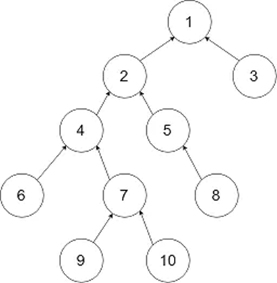
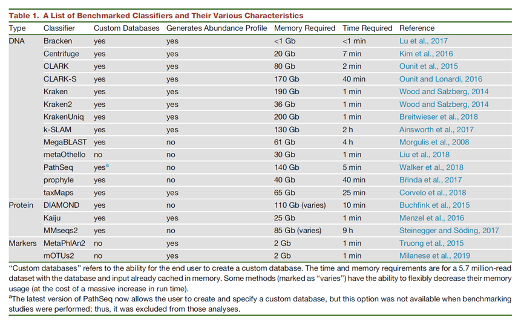

# 12.9 不同物种分类算法比较

## 1 不同物种分类算法比较

**LCA：“lowest common ancestor”，最小公共祖先法。**

所谓LCA，是当给定一个有根树T时，对于任意两个结点u、v，找到一个离根最远的结点x，使得x同时是u和v的祖先，x 便是u、v的最小公共祖先。

​                                  

图1 LCA原理

对于这棵树来说lca(9, 10) = 7, lac(6, 10) = 4, lac(3, 6) = 1，Kraken，Kraken 2，Opal，CLARK,与MetaOthello等软件是基于kmer的比对，利用LCA算法。

**序列相似性：**

相似性（similarity）：是指所检测的序列与目标序列之间相同的碱基或氨基酸占整个序列的比例。相似性越高，同源性越高。但是需要注意，同源必须相似，但是相似不一定同源。

基于相似性比对的方法，可以比对全基因组序列，也可以比对Marker基因，例如16S等。blast，diamond，last，Megan，MetaPhlan，GASiC，MG-RAST等软件基于序列相似性方法进行物种分类。基于相似性的缺点是比较速度较慢。

**分类器：**

基于机器学习的判别法进行分类，例如贝叶斯和embase 估计Bracken, MetaKallisto，Pathoscope；基于线性模型和混合线性模型分类PhyloPythia，DiTASiC和MetaPalette；马尔科夫模型Phymm/PhymmBL基于支持向量机PhyloPythia+，Burrows-Wheeler转换，例如Centrifuge。

## 2 biom文件格式

biom（The Biological Observation Matrix）格式是宏基因组研究中最常用的结果保存格式，可将OTU或Feature表、样本属性、物种信息等多个表保存于同一个文件中，且格式统一，体积更小巧，目前被微生物组领域几乎所有主流软件所支持。biom主要用来展示不同物种在不同样品中的丰度分布，类似与基因表达矩阵。如果该物种在某个样品中不存在，就是0，与基因表达矩阵不同的是，不同样品中物种差别可能很大，所以会存在很多0的情况。通过biom格式文件，方便不同软件之间相互调用，比如可以将metaphlan的结果导入megan中查看。

支持biom格式的软件包括QIIME，MG-RAST，PICRUSt，Mothur，phyloseq包，MEGAN，VAMPS，metagenomeSeq，Phinch，RDP Classifier，USEARCH，PhyloToAST，EBI Metagenomics，GCModeller，MetaPhlAn 2等。

官方网站：http://biom-format.org/

BIOM目前分为1.0 JSON和2.0 HDF5两个版本；1.0 JSON是编程语言广泛支持的格式，类似于散列的键值对结果。会根据数据松散程度，选择不同的存储结构来节省空间。2.0 HDF5是二进制格式，被许多程序语言支持，读取更高效和节约空间。

稠密矩阵（ dense）

```shell
OTU ID sampleA sampleB sampleC
OTU0  0  0  4
OTU1  6  0  0
OTU2  1  0  7
OTU3  0  0  3
```

稀疏矩阵（ sparse）

```shell
sampleA OTU1 6
SampleA OTU2 1
SampleB OTU0 4
SamppleC OTU2 7
SampleC OTU3 3
```

可以使用biom对biom格式文件进行操作

```shell
# 安装Python包

conda install biom-format # 2.1.7
```

 

## 3 不同分析软件的比较

宏基因组物种鉴定软件有很多，但不同软件核心算法不同，使用的数据库不同，会有较大差别，且很难进行横向比较。

在比对算法上，有基于blast直接比对，也有使用kmer方法比对，有比对核酸数据库，也有比对氨基酸数据库。有使用nt库作为索引数据库，也有使用marker gene作为数据库，因此很难进行评估。

下面这篇文章对于对于20种宏基因组物种鉴定工具进行横向比较。

文章列表：https://doi.org/10.1016/j.cell.2019.07.010

 

图 2 宏基因组分析方法比较