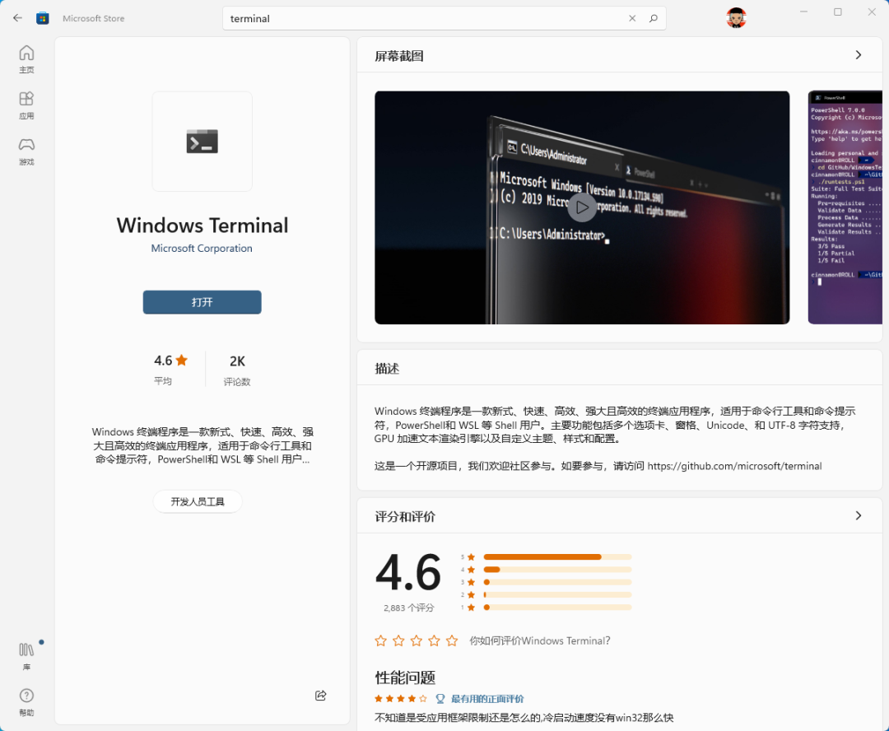
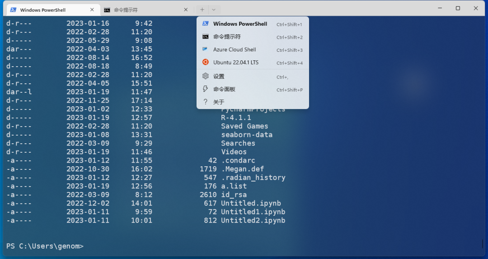
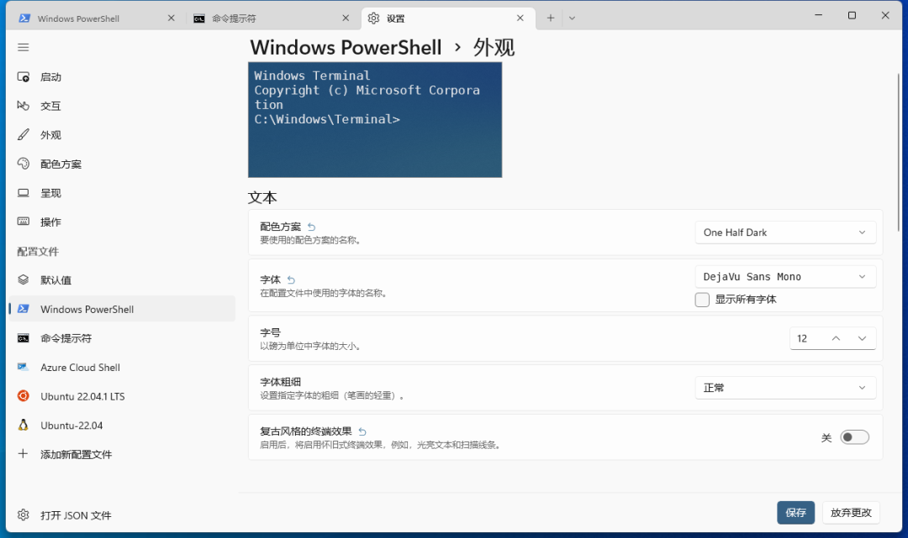
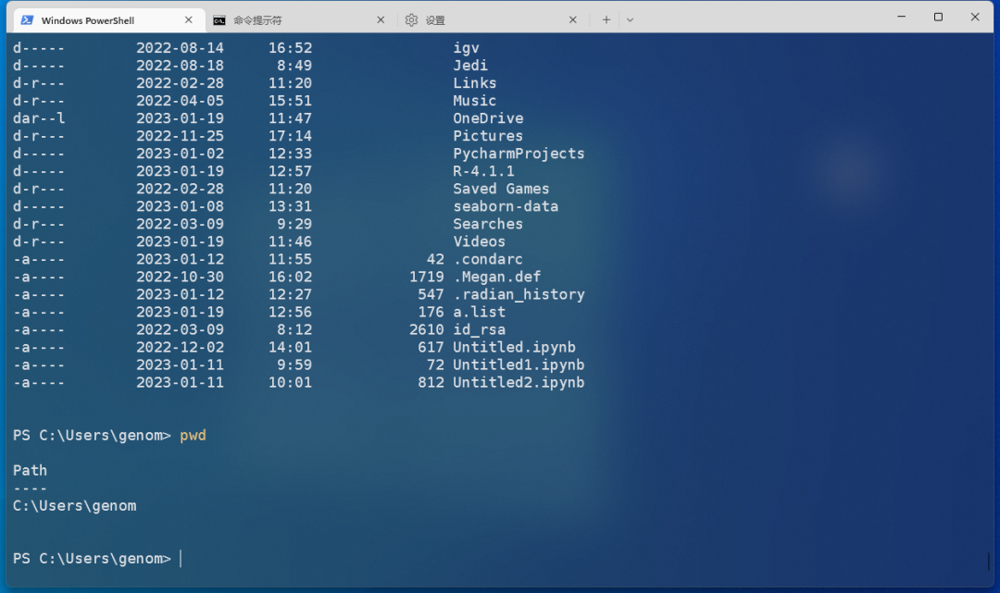
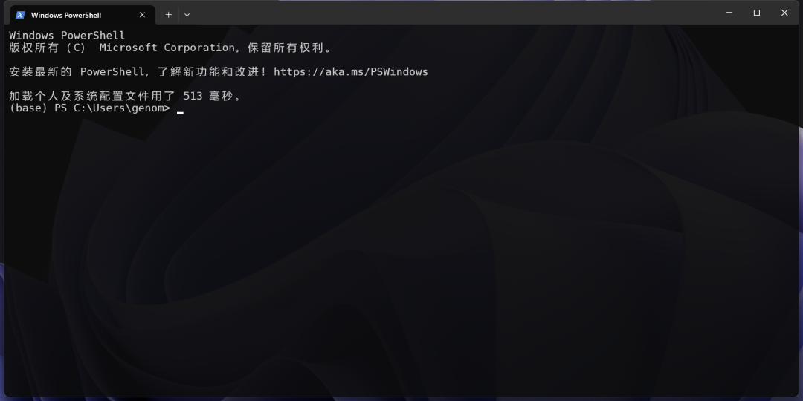
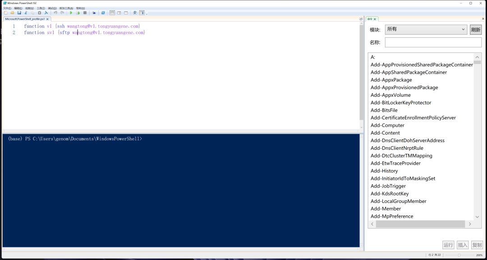
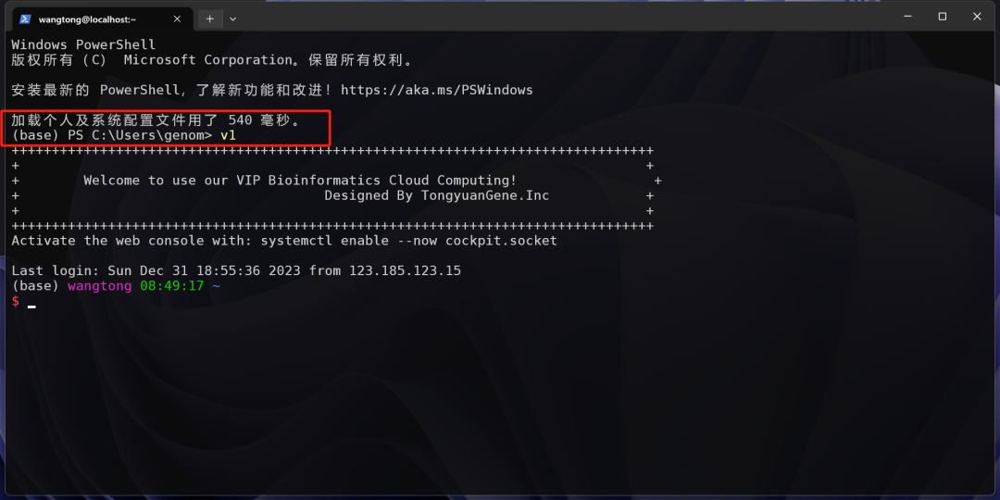

# 2.5 windows terminal

>我们推荐新手使用termius登录服务器和传输文件，但其实也有更加便捷的方法，操作系统自带的终端其实就可以直接登录服务器和传输文件。系统终端一般都自带ssh和scp与sftp命令。系统自带终端启动更快。这次内容我们带大家使用windows自带终端快速访问服务器。

## windows terminal简介

而现在新发布的windows terminal非常的好用。首先可以从windows store下载该软件，也可以从微软的github页面进行下载。

<https://github.com/microsoft/terminal/releases>

<https://learn.microsoft.com/zh-cn/windows/terminal/install>

如果熟悉命令操作，也可以在dos中一条命令进行下载。


```shell
winget install --id=Microsoft.WindowsTerminal -e
```




安装完成之后该软件名在中文系统环境下为**`终端`**。在开始菜单中找到就可以直接运行。


## 使用和配置

终端默认支持PowerShell，CMD，WSL以及微软Azure云服务。默认打开是CMD，如果喜欢使用其他终端，例如wsl ubuntu ，可以在设置中进行修改。



配置选项极其丰富，可以使用鼠标的方式，也可以创建一个json文件进行配置。



我这里选择默认启动方式为PowerShell，可以对整体进行设置，也可以对其中一个外观进行配置，例如这里单独配置PowerShell，可以设置字体，字号，连光标形状都可以进行自己配置，还支持透明度。



## 远程登录

**1.打开windows terminal**

可以是传统windows dos命令行，也可以是PowerShell。windows terminal可以查看之前内容进行下载安装。


**2.运行命令**

```shell
#生成密钥对
ssh-keygen.exe
```

**3.将公钥上传至服务器**
如果是mac或者Linux系统可以直接使用`ssh-copy-id`命令，如果没有可以使用`scp`命令进行传输，传输过程中直接改名字。或者登录服务器端追加到**authroziled_keys**文件中。

```shell
scp .\id_rsa.pub wangtong@192.168.0.133:~/.ssh/authorized_keys
```

**4.直接登录**

接下来就可以直接使用ssh命令登录了，不用输入密码即可自动登录。

```shell
ssh wangtong@192.168.0.133
```

**5.设置别名**

如果嫌每次登录输入IP地址麻烦，还可以设置别名，由于windows不方便使用alias直接设置别名，可以修改属性的方法完成永久设置，使用echo命令找到配置文件，如果没有文件夹和文件名，自己手动创建即可。

```shell
#查找属性文件
echo $PROFILE
C:\Users\wangtong\Documents\WindowsPowerShell\Microsoft.PowerShell_profile.ps1
```

**6.在文件中添加别名**

在属性文件目录下创建一个Microsoft.PowerShell_profile.ps1文件，然后打开。

```shell
# function 别名 { 需要替代的命令，可以包含空格 }
function a1 {ssh wangtong@192.168.0.133}
function sa1 {sftp wangtong@192.168.0.133}
```

将上面函数添加到文件中，用户名和IP地址根据自己的情况修改，不要完全照搬上面的。为了设置不间断连接，可以添加-o选项，-o ServerAliveInterval=60



**7.修改权限**
因为 Windows 系统为了防止恶意脚本自动执行，故默认不允许自动运行脚本。
需要以管理员身份，找到cmd或者PowerShell，点击邮件，选择“以管理员身份运行”，在 PowerShell 中执行以下命令完成配置。

```shell
Set-ExecutionPolicy RemoteSigned
```

**8.快速登录**

以后直接在命令行中敲设置好的命令别名即可快速登录，使用sftp命令进行文件传输。

