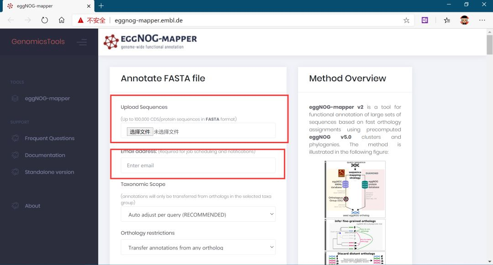
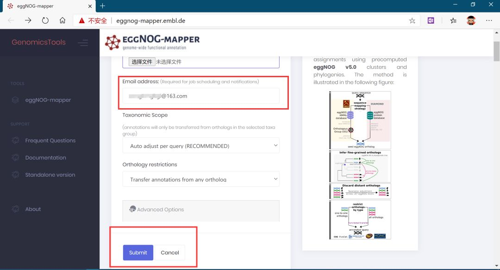
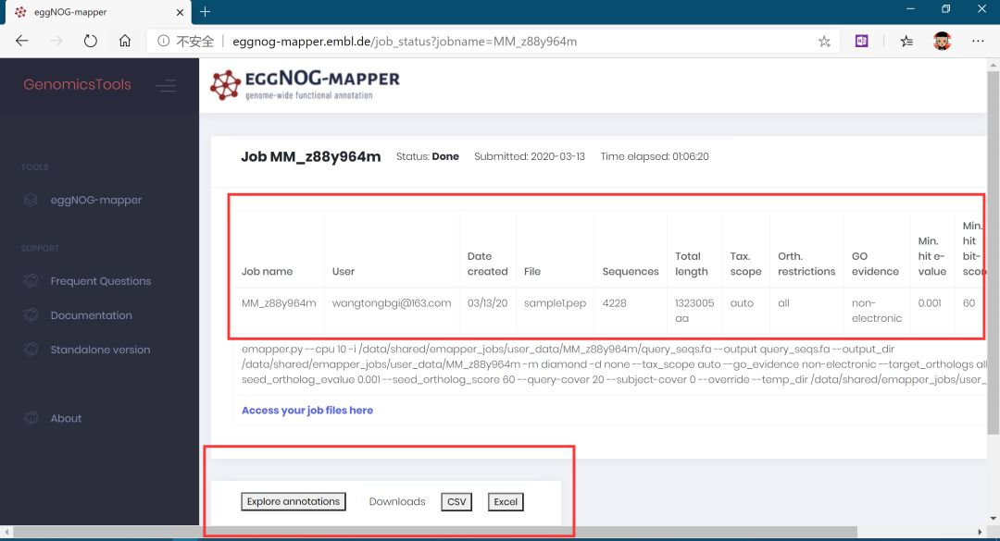
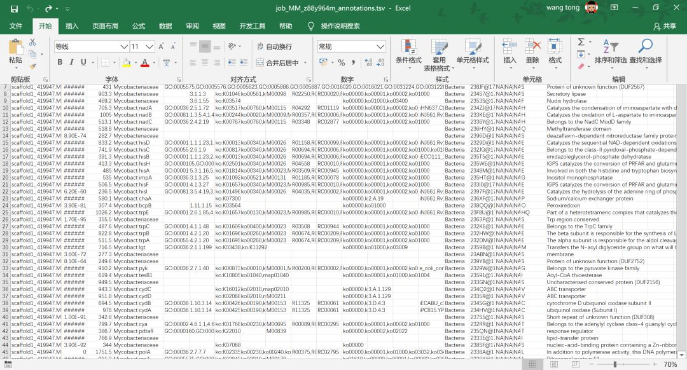

# 3.2 免费又好用的基因功能注释平台

>得到基因序列之后，需要将基因序列与已知数据库进行比对，例如nr库，uniprot，GO，kegg等，由于数据库比较大，往往需要较长的比对时间。我们可以使用eggnog-mapper工具进行功能注释，但是需要下载较大的数据库。目前，eggnog官网提供了一个在线工具，只需上传文件，即可进行基因功能注释，非常方便。

**eggnog**

官方网址：http://eggnog-mapper.embl.de/

输入文件：基因的氨基酸序列文件，最多可以包含10万条序列，基本上满足目前绝大部分物种了。

**步奏一：提交序列文件，留下邮箱；**

**步奏二：提交任务**

**步奏三：等待结果；**

我们提交了4228个细菌的基因，18点12分提交，19:22分返回结果，运行速度还是非常快的。

**查看结果**

最终结果可以下载为csv或者excel列表文件，直接在Excel中进行查看。

