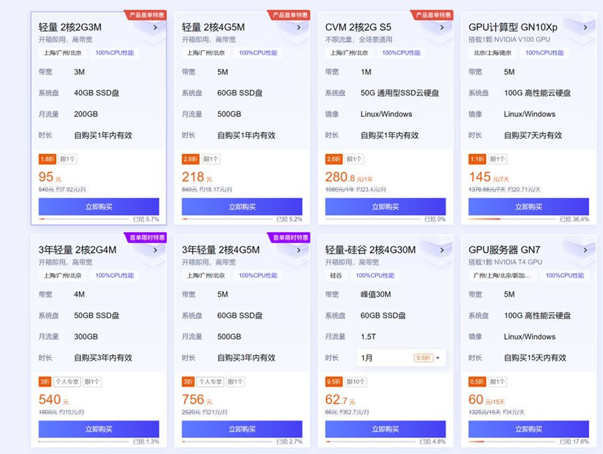

## 4.1 了解服务器？ 

### 1 什么是服务器？

什么是服务器呢。根据名字，服务器是用来提供服务的机器，你可以简单理解为一台计算性能更强的电脑，但其实二者还是有很多不同的。根据百度百词次条中的定义：服务器是计算机的一种，它比普通计算机运行更快、负载更高、价格更贵。服务器在网络中为其它客户机（如PC机、智能手机、ATM等终端甚至是火车系统等大型设备）提供计算或者应用服务。服务器具有高速的CPU运算能力、长时间的可靠运行、强大的I/O外部数据吞吐能力以及更好的扩展性。

根据服务器所提供的服务，一般来说服务器都具备承担响应服务请求、承担服务、保障服务的能力。服务器作为电子设备，其内部的结构十分的复杂，但与普通的计算机内部结构相差不大，如：cpu、硬盘、内存，系统、系统总线等。

​                               

图 1 服务器的应用

现代社会的运行需要大量的计算资源，例如商业系统，医疗卫生，交通运输，电信网络，证券交易，互联网等都需要大量服务器作为后台支撑。一旦服务器宕机，将会造成大量的影响。例如2021年10月Facebook、Instagram、WhatsApp的网站和App曾集体出现宕机，持续时间超6个小时，市值一夜蒸发超640亿美元。

### 2 做生物信息，为什么要使用服务器？

在基因测序领域，每天将产生大量的测序数据，这些测序数据需要大量的计算机存储设备进行存储，传输，计算分析等，这些都需要大量的计算资源，也就是服务器。因此做生物信息需要充足的计算资源。

所以，如果想做生物信息，最好还是使用服务器。

**第一：**计算资源大，因为生物数据很大，需要非常大的计算量，而个人电脑一般情况下是完成不了的。比如一般人笔记本 也就是8G内存或者16G内存。而一些分析， 比如拼接一个真菌的基因组，有可能需要100G内存，个人电脑是根本完成不了的，你说我不着急，让笔记本慢慢处理，这不是能用时间换空间的问题，如果内存不够，就是完成不了。

 **第二：**在做生物数据计算的时候，需要频繁的去读写磁盘，这对笔记本的磁盘是不太好的，那服务器的磁盘就没问题吗，当然不能这么绝对说服务器的磁盘就永远不坏。只不过服务器的磁盘一般做成RAID阵列，不仅能够提高磁盘读写效率，更重要的是可以进行容错，比如一块磁盘坏了，数据还可以恢复，个人电脑就不太容易了。

 **第三：**服务器一般可以连续运行，不用关机，如果突然宕机或者关机那就是重大事故了，比如微信或者支付宝后台服务器突然死机了，那将损失惨重。在做生物信息分析的时候，有一些分析非常 耗时，比如拼接一个大的基因组，可能需要10几天，你不能10几天让笔记本电脑一直不关机运行吧，下班了还开着盖子捧着走。那可以设置盒盖之后继续运行吗，但是万一不小心断掉了，那么就功亏一窥了。

综上原因，我们还是非常强烈推荐大家做分析的时候使用服务器来做。当然，如果只提取几条序列，瞬间就完成了，需要的计算资源很小，当然也是可以在自己电脑上完成了。

### 3 做生物信息，需要多少计算资源？

做生物信息，需要多少计算资源？这个问题很难计算，因为生物数据分析的计算资源需求是动态变化的，影响因素较多，很难计算。主要与数据量大小，软件算法，磁盘读写速度，CPU运行速度以及计算量大小有关。例如同样的数据拼接基因组要比序列比对消耗更多的计算资源。构建系统发育树，虽然数据量很小，但计算量较大，因此，很难估算具体需要多少计算资源，例如多少CPU，多少内存，多少磁盘这些具体指标。只能根据经验值预估。

计算资源没有上限，越大的计算资源计算速度越快，就可以更快的拿到结果。但是计算资源

有下限。例如拼接一个基因组需要100G内存，如果只有90G内存，则无法完成。

下面我们拿一个具体案例来看一下做生物信息对计算资源的消耗。

假设人基因组大小约等于3G数据，这个碱基数目就和计算机里面的字节数目近似。当前的测序技术，例如illumina测序，如果要对一个人全基因组进行测序，至少要30X数据，也就是测序3基因组大小的30倍，共90G。而每个文件中除了碱基序列信息，还包括ID信息，质量值信息等，那么总字节数目至少要基因组大小的70倍，也就是210G，而每次测序都要被30X数据在多一些。不够文件可以进行压缩。最终所占存储要低很多，这里是一个人全基因组分析的案例，原始测序数据两个文件，共86G存储。

```shell
(base) root 16:41:05 /ifs1/Sequencing/Korea/wgs_data/rawdata
 $ ll
 total 86G
 -rw-r--r--. 1 root root 39G Nov 24 2019 KPGP-00216_L1_R1.fq.gz
 -rw-r--r--. 1 root root 56 Nov 24 2019 KPGP-00216_L1_R1.fq.gz.md5
 -rw-r--r--. 1 root root 48G Nov 24 2019 KPGP-00216_L1_R2.fq.gz
 -rw-r--r--. 1 root root 56 Nov 24 2019 KPGP-00216_L1_R2.fq.gz.md5
```

开始进行分析，例如最简单的进行与参考序列的比对，参考序列就是人全基因组以及一些索引。这个所占存储不多，5G左右，其实序列本身可以不需要。

```shell
(base) root 16:44:31 /ifs1/Sequencing/Korea/wgs_data/cleandata

$ ll /ifs1/Database/GATK/hg38/Homo_sapiens_assembly38.*

-rwxr-xr-x. 1 root root 20K Oct 25 2019 /ifs1/Database/GATK/hg38/Homo_sapiens_assembly38.amb
 -rwxr-xr-x. 1 root root 445K Oct 25 2019 /ifs1/Database/GATK/hg38/Homo_sapiens_assembly38.ann
 -rwxr-xr-x. 1 root root 3.0G Oct 25 2019 /ifs1/Database/GATK/hg38/Homo_sapiens_assembly38.bwt
 -rwxr-xr-x. 1 root root 569K Oct 25 2019 /ifs1/Database/GATK/hg38/Homo_sapiens_assembly38.dict
 -rwxr-xr-x. 1 root root 3.1G Oct 25 2019 /ifs1/Database/GATK/hg38/Homo_sapiens_assembly38.fasta
 -rwxr-xr-x. 1 root root 477K Oct 25 2019 /ifs1/Database/GATK/hg38/Homo_sapiens_assembly38.fasta.64.alt
 -rwxr-xr-x. 1 root root 158K Oct 25 2019 /ifs1/Database/GATK/hg38/Homo_sapiens_assembly38.fasta.fai
 -rwxr-xr-x. 1 root root 768M Oct 25 2019 /ifs1/Database/GATK/hg38/Homo_sapiens_assembly38.pac
 -rwxr-xr-x. 1 root root 1.5G Oct 25 2019 /ifs1/Database/GATK/hg38/Homo_sapiens_assembly38.sa
```

接下来就是将测序数据与参考序列进行比对，本质上是将这两部分数据进行合并，并且记录位置信息，这样可以计算所占存储空间就是测序数据48G+参考序列3G，然后还要加比对位置信息等，所以最终比对结果占的空间很大。这个案例中，原始出来的sam格式，需要251G存储，然后对这个原始结果进行一系列处理，包括排序，转换bam，标记Duplication，BQSR等操作。如果每一步奏都保留，最终需要372G。当然，如果想节约存储，可以只保留最终的BQSR，只需要51G。峰值需要372G。

```shell
(base) root 16:51:05 /ifs1/Sequencing/Korea/wgs_data/bam
 $ ll
 total 372G
 -rw-r--r--. 1 root root 2.9K Nov 24 2019 Sample1.markdup_metrics.txt
 -rw-r--r--. 1 root root 251G Nov 24 2019 Sample1.sam
 -rw-r--r--. 1 root root 9.0M Nov 24 2019 Sample1.sorted.bai
 -rw-r--r--. 1 root root 35G Nov 24 2019 Sample1.sorted.bam
 -rw-r--r--. 1 root root  0 Nov 24 2019 Sample1.sorted.bam.bc
 -rw-r--r--. 1 root root 36G Nov 24 2019 Sample1.sorted.markdup.bam
 -rw-r--r--. 1 root root 9.0M Nov 24 2019 Sample1.sorted.markdup.bam.bai
 -rw-r--r--. 1 root root 9.0M Nov 24 2019 Sample1.sorted.markdup.BQSR.bai
 -rw-r--r--. 1 root root 51G Nov 24 2019 Sample1.sorted.markdup.BQSR.bam
 -rw-r--r--. 1 root root 213K Nov 24 2019 Sample1.sorted.markdup.recal_data.table
```

 

最终得到的变异检测结果是一个列表，有几百万行，这个因为不包括序列信息，文件大小就会小很多。这个案例中，最终结果不到200M，中间过程也就8G左右。

 

```
(base) root 16:53:42 /ifs1/Sequencing/Korea/wgs_data/vcf
 $ ll
 total 8.0G
 -rw-r--r--. 1 root root 43K Nov 24 2019 a.state
 -rw-r--r--. 1 root root 7.0G Nov 24 2019 Sample1.HC.g.vcf.gz
 -rw-r--r--. 1 root root 5.2M Nov 24 2019 Sample1.HC.g.vcf.gz.tbi
 -rw-r--r--. 1 root root 2.8M Nov 24 2019 Sample1.HC.snps.indel.plots.R
 -rw-r--r--. 1 root root 6.2M Nov 24 2019 Sample1.HC.snps.indel.plots.R.pdf
 -rw-r--r--. 1 root root 64M Nov 24 2019 Sample1.HC.snps.indel.recal
 -rw-r--r--. 1 root root 823K Nov 24 2019 Sample1.HC.snps.indel.recal.idx
 -rw-r--r--. 1 root root 593 Nov 24 2019 Sample1.HC.snps.indel.tranches
 -rw-r--r--. 1 root root 233M Nov 24 2019 Sample1.HC.snps.indel.VQSR.vcf.gz
 -rw-r--r--. 1 root root 2.2M Nov 24 2019 Sample1.HC.snps.indel.VQSR.vcf.gz.tbi
 -rw-r--r--. 1 root root 3.9M Nov 24 2019 Sample1.HC.snps.plots.R
 -rw-r--r--. 1 root root 8.1M Nov 24 2019 Sample1.HC.snps.plots.R.pdf
 -rw-r--r--. 1 root root 309M Nov 24 2019 Sample1.HC.snps.recal
 -rw-r--r--. 1 root root 7.3M Nov 24 2019 Sample1.HC.snps.recal.idx
 -rw-r--r--. 1 root root 589 Nov 24 2019 Sample1.HC.snps.tranches
 -rw-r--r--. 1 root root 7.3K Nov 24 2019 Sample1.HC.snps.tranches.pdf
 -rw-r--r--. 1 root root 228M Nov 24 2019 Sample1.HC.snps.VQSR.vcf.gz
 -rw-r--r--. 1 root root 2.2M Nov 24 2019 Sample1.HC.snps.VQSR.vcf.gz.tbi
 -rw-r--r--. 1 root root 195M Nov 24 2019 Sample1.HC.vcf.gz
 -rw-r--r--. 1 root root 2.2M Nov 24 2019 Sample1.HC.vcf.gz.tbi
```

注释需要下载各种注释库，这个也需要一定的存储空间，这里下载dbsnp等，一共需要14G左右空间。

```
(base) root 16:55:50 /ifs1/Database/GATK/hg38
 $ ll
 total 14G
 -rwxr-xr-x. 1 root root 51M Oct 25 2019 1000G_omni2.5.hg38.vcf.gz
 -rwxr-xr-x. 1 root root 1.5M Oct 25 2019 1000G_omni2.5.hg38.vcf.gz.tbi
 -rwxr-xr-x. 1 root root 1.8G Oct 25 2019 1000G_phase1.snps.high_confidence.hg38.vcf.gz
 -rwxr-xr-x. 1 root root 2.1M Oct 25 2019 1000G_phase1.snps.high_confidence.hg38.vcf.gz.tbi
 -rwxr-xr-x. 1 root root 3.0M Oct 25 2019 Axiom_Exome_Plus.genotypes.all_populations.poly.hg38.vcf.gz
 -rwxr-xr-x. 1 root root 412K Oct 25 2019 Axiom_Exome_Plus.genotypes.all_populations.poly.hg38.vcf.gz.tbi
 -rwxr-xr-x. 1 root root 1.5G Oct 25 2019 dbsnp_138.hg38.vcf.gz
 -rwxr-xr-x. 1 root root 2.3M Oct 25 2019 dbsnp_138.hg38.vcf.gz.tbi
 -rwxr-xr-x. 1 root root 3.0G Oct 25 2019 dbsnp_144.hg38.vcf.gz
 -rwxr-xr-x. 1 root root 2.4M Oct 25 2019 dbsnp_144.hg38.vcf.gz.tbi
 -rwxr-xr-x. 1 root root 3.2G Oct 25 2019 dbsnp_146.hg38.vcf.gz
 -rwxr-xr-x. 1 root root 2.4M Oct 25 2019 dbsnp_146.hg38.vcf.gz.tbi
 -rwxr-xr-x. 1 root root 172M Oct 25 2019 hapmap_3.3_grch38_pop_stratified_af.vcf.gz
 -rwxr-xr-x. 1 root root 1.5M Oct 25 2019 hapmap_3.3_grch38_pop_stratified_af.vcf.gz.tbi
 -rwxr-xr-x. 1 root root 60M Oct 25 2019 hapmap_3.3.hg38.vcf.gz
```

从以上这些过程可以看到，分析一个人全基因组至少需要**86+48+51+8G=193G**，此外，人参考序列和注释库共18G左右。这是最低值，如果保留全部数据，那么至少需要532G的存储。这是一个人的内容。当然也有很多节省的方法，例如测序得到的就是`cleandata`，及时删除中间结果，对所有结果进行深度压缩，这些都可以节约一些存储，以上数字只做参考。

上面案例我们介绍的是二代**illumina**测序，如果是**纳米孔测序**，则需要更多的磁盘，因为纳米孔测序需要保留最原始的数据，而且需要测序更多的倍数。例如想要利用纳米孔测序做人全基因组分析，至少要测序45X数据，就是135G。而fast5存储内容大约是fastq文件的10倍，实际还要包括中间存储等，一般计算20倍刚好，那么原始fast5存储大约是2700G，这样一个人全基因组测序原始数据则需要差不多3T的磁盘。

### 4 服务器与个人电脑的差别？

现代社会，每个人都有很多计算资源，例如个人电脑，智能手机，智能手表，智能汽车以及各种智能设备都属于一个计算设备。但这些都属于个人消费的智能设备，与服务器有很大的区别。

我们自己使用的笔记本电脑叫做个人电脑PC，peronal computer，个人电脑与服务器最大的区别就是个人电脑一般就你一个人用，而服务器对外提供服务，可以很多人一起使用。比如我们是如何访问一个网站的呢，个人客户端发送一个请求到服务器，服务器端收到这个请求就开始进行处理，可以很多人同时提供请求，服务器并行处理。但是这个请求也不是无限的，比如服务器一次只能处理1百万个请求，那么一次出现1千次请求，服务器就处理不了就会卡顿或者拒绝请求。这就是为什么经常某某明星结婚了，出轨了，离婚了上了微博热搜榜，服务器就卡顿了，这是因为同一时间给服务器发送请求获取信息，服务器处理不了就瘫痪了。包括春运火车票等都是同样的道理。

下面我们来系统介绍一下服务器与这些设备之间的差别。

**一、使用场景不同**

服务器是对外提供服务的，需要较多的计算资源，服务器一般不需要关机，需要持续工作，稳定性是最重要的。

 **二、计算能力不同**

服务器大都是多颗CPU，个人消费设备一般是单个CPU。内存方面，服务器要处理大量的任务，往往需要更高的内存。磁盘方面，服务器为了数据安全和较大的IO操作，需要高速读写磁盘，而且还需要为磁盘创建RAID。

 **三、扩展性方面**

随着业务的开展，服务器计算资源不够的情况下要能够进行扩展。一般服务器都有较好的扩展性，可以在不关机的情况下对内存，磁盘进行扩展。例如当有一块磁盘坏掉的情况下，直接进行更换。

 **四、多用户多任务**

个人电脑设备一般只有一个用户，而服务器可以满足多个用户多个任务同时运行。例如一台游戏服务器，可以多个账号同时登录进行操作。

 **五、安全性方面**

由于服务器是网络中的核心设备，因此它必须具备高可靠性、安全性。服务器采用专用的ECC内存、RAID技术、热插拔技术、冗余电源、冗余风扇等方法使服务器具备容错能力、安全保护能力。

 **六、价格**

服务器价格较贵，而个人电脑相对比较便宜。

### 5 测试服务器

作为生物数据计算平台搭建，需要使用root权限，可以购买一台云服务器作为测试学习使用。配置不用太高，只用来提供测试，不用于分析数据，因为云服务器价格较高。购买这台设备不需要配置太高，只需要能编译软件就行。一般4G以上内存就够。如果2G有些时候可能无法编译成功软件。

云服务器的好处就是非常简单，有IP地址，账户密码就可以直接登录，最好的一点就是可以快速重置，恢复初始环境。无需反复安装操作系统。

这里推荐购买这款腾讯云服务器，2核4G的配置。

​        ****                       

图 4 云服务器价格表

**特别提醒：该价格表基于作者撰写此文的时间点，后面有可能无法找到该页面。不要来问我为什么页面访问不了了，这是腾讯云的活动，有可能活动结束了。**

**链接地址：**[**https://curl.qcloud.com/gm6m0QoY**](https://curl.qcloud.com/gm6m0QoY)

 

图 3 微信扫码直接访问链接地址