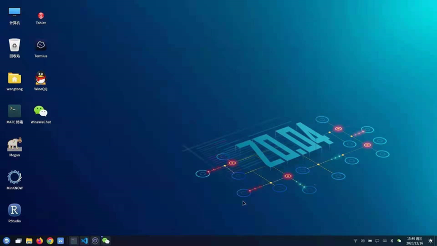
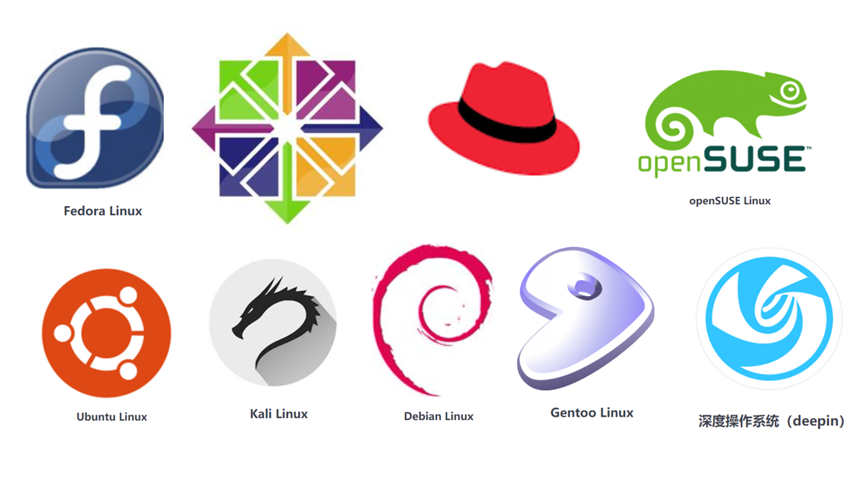
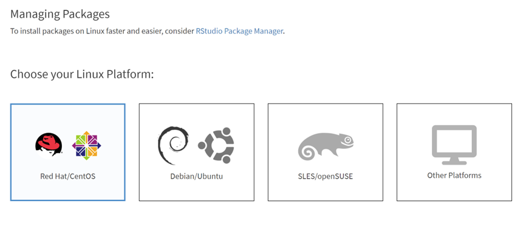
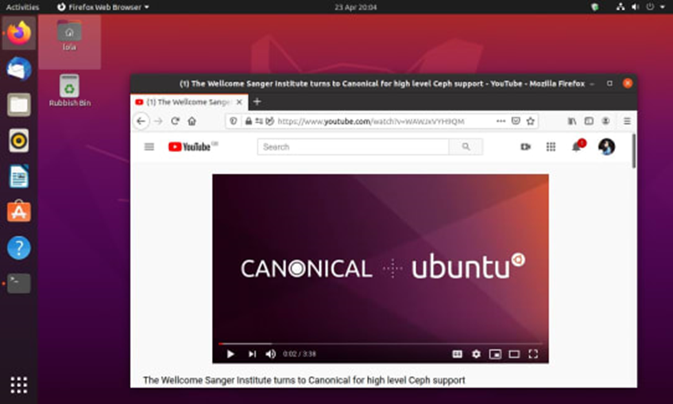

## 4.2 熟悉Linux操作系统

### 1 Linux系统简介

Linux属于一种计算机操作系统，操作系统Operating System，简称OS。是管理和控制计算机硬件与软件资源的计算机程序，是直接运行在“裸机”上的最基本的系统软件，任何其他软件都必须在操作系统的支持下才能运行。与windows系统和苹果的macos类似。

Linux操作系统具有广泛的应用，可以安装到各种系统之上。手机的Android也是一种linux操作系统，此外，各种数据中心的服务器上安装的也大部分是Linux操作系统。

Linux操作系统诞生于1991 年10 月5 日。1991年8月一位来自芬兰赫尔辛基大学的年轻人Linus Benedict Torvalds，对外发布了一套全新的操作系统。Linux这个名字也是Linus与Unix名字的组合。那么linux到底该如何发音呢。有“里那克斯”，还是“里讷克斯”，或者是“里纽克斯”。Linux的正确读音。音标是 [’li:nэks] 重音在“哩”上

Linux相比于windows和macos具有很多显著的优势。

第一，Linux系统是开源免费的，可以安装在多种硬件设备之上；

第二，稳定并且效率更高；

第三，支持多任务多用户；

第四，安全性高；

​                               

图 1 Linux系统图形化界面

但是，Linux目前主要应用在服务器设备上，对于消费计算机设备使用起来没有windows系统和macos系统更加人性化，具有较高的学习门槛。而且软件生态较差，目前在个人计算操作机系统市场中只占3%左右。

### 2 Linux发行版本介绍

Linux从最开始就是开源并且免费的，这也深刻影响了计算机的世界，我们今天所做的生物信息要学习Linux系统与最开始的开源免费有很大的关系。由于开源免费的原因，Linux存在多种发行版本。

所谓发行版本，要理解Linux广义和狭义的概念。通常说Linux是指其广义概念，即指Linux发行版本。而狭义的Linux仅指Linux系统内核。Linux内核指的是一个由Linus Torvalds负责维护，提供硬件抽象层、磁盘、文件系统控制及多任务功能的系统核心程序。Linux发行套件系统是我们常说的Linux操作系统，也就是由Linux内核与各种常用软件的集合产品。

Linux发行版本就是Linux内核加上打包好的一些软件，包括桌面程序，办公程序等。类似于不同手机厂家有单独的操作系统一样。全球大约有数百款的Linux系统版本，每个系统版本都有自己的特性和目标人群—有的主打稳定性和安全性，有的主打免费使用，还有的主要定制化等特点。常见的包括Ubuntu，Redhat，CentOS，OpenSUSE，Fedora，Debian等，它们都使用了Linux内核。国内也有麒麟，统信，deepin等发行版本。

 

图 2 常见Linux发行版本

不同的发行版本给用户提供了更多选择，但也造成了很大的问题，由于开发环境不统一，给开发者带来了很多额外的工作，例如常见的Linux两大阵营Redhat和Debian使用不同的软件安装工具，yum和apt。这样很多软件在不同的系统中安装方式完全不同。在安装生物软件过程中经常会遇到环境问题，这是学习生物信息中非常困难的问题。

### 3 Ubuntu还是CentOS？

Ubuntu和CentOS是Linux当中非常著名的两个发行版本。很多生物信息软件都会分别提供这两个系统版本。

 Ubuntu基于Debian发行版和GNOME桌面环境，是一个以桌面应用为主的Linux操作系统。CentOS的全称Community Enterprise Operating System，中文意思是：社区企业操作系统是Linux发行版之一，CentOS 是一个基于Red Hat Linux 提供的可自由使用源代码的企业级Linux发行版本。

 ****

图 3 一些软件会提供多个发行版本可供选择

由于我们主要使用Linux系统的命令行模式，因此，不同系统版本之间差别并不大。而且由于Linux系统方便进行源代码编译，所以选择这两个版本其一即可。

 

图 4 ubuntu桌面操作系统

根据笔者近年来的使用，由于很多个人开发者使用的环境大多为ubuntu系统，因此，近年来更多的生物信息软件针对ubuntu系统更友好一些。比如，ubuntu系统默认的系统软件版本更新，例如gcc，glibc，zlib等。这样就导致这些软件安装到ubuntu系统更容易一些。不过如果使用bioconda安装，二者之间的差别几乎可以忽略不计。

### 4 做生物信息为什么要学习Linux？

学习生物信息，为什么要学习Linux，而且是学习Linux的命令行模式，而非图形化的模式，主要有以下几个原因：

1. 使用的生物软件只有Linux命令行版本；
2. Linux系统是开源免费的；
3. 高性能计算都采用Linux系统；
4. Linux系统本身具有很多优点，例如多用户多任务；
5. 命令行进行自动化和批量化操作。

### 5 为何Linux比较难学？

主要有以下几点原因。

1. Linux主要采用命令行模式，虽然现在很多Linux操作系统都具有图形界面，但是我们使用的是命令行模式。
2. 目录结构，这个也是新手最容易出错的地方，在命令行操作的时候，最常见的错误就是目录结构的问题，常常出现“file can not found”这样的错误，在处理生物数据的时候，找不到数据所在目录。
3. 环境配置，Linux发行版本不统一，而且由于免费开源这个特性，就会造成开发环境不统一，这个是安装软件中最常见的问题。
4. 权限控制，Linux系统是一个多用户多任务的操作系统，也就是说多个用户可以同时登陆，同时工作，那么属于一个公共空间，多用户就会需要严格的权限管理，这也是一个初学者不容易理解的地方；

我们知道了学习Linux有哪些困难所在，接下来的课程中，我们会一个一个详细介绍这些问题。每个问题解决了，学习Linux也就不困难了。

图5 学习生物信息，从Linux开始