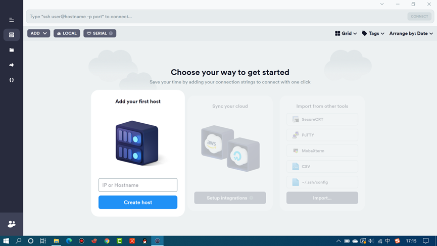
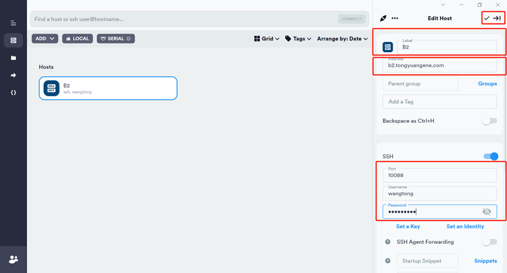
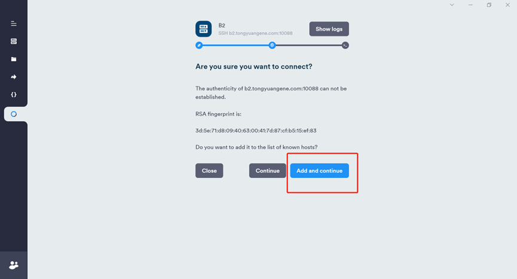
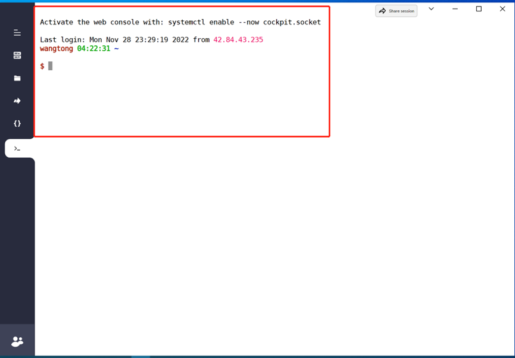
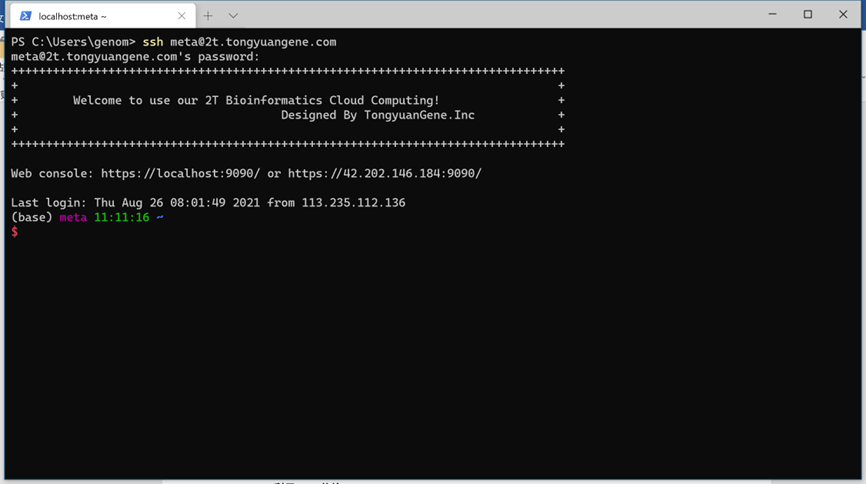
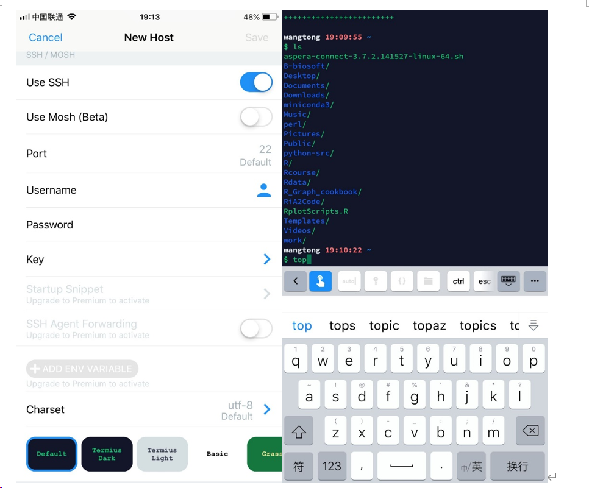

# 4.3 登录服务器传输文件

> 服务器相比于个人电脑具有较高的计算资源，例如有更大的CPU，内存，有磁盘阵列，具有更高的文件读写速度。通常我们需要通过个人电脑将测序数据传输到服务器端，然后在服务器上进行数据分析。作为生物信息分析人员，每天都需要通过SSH工具远程登录服务器，那么使用一款高效的连接工具就很有必要。

## 1 选择合适的工具

使用服务器需要使用**ssh登录**以及**sftp传输文件**，支持这两项功能的工具有很多。有收费也有免费，这里我们给大家列出一些，根据个人使用习惯来进行选择。这里面我们推荐windows用户选择xshell+xftp或者termius，mac用户选择termius。

**windows系统：**

xshell+xftp：<https://www.xshell.com/zh/free-for-home-school/>

putty：<https://www.chiark.greenend.org.uk/~sgtatham/putty/>

SSH Secure Shell Client：<https://www.ssh.com/ssh/>

secureCRT：<https://www.vandyke.com/products/securecrt/>

termius：<https://www.termius.com>

mobaxterm：<https://mobaxterm.mobatek.net/download.html>

**macos系统：**

termius：<https://www.termius.com>

secureCRT：<https://www.vandyke.com/products/securecrt/>

Royal：<https://www.royalapps.com/ts/mac/features>

tabby：<https://tabby.sh/>

## 2 如何登录服务器

为了保持windows系统与macos系统一致性，这里推荐使用termius工具。Termius是一款支持SSH与Telnet协议的连接工具，支持windows系统，macos，Linux，iOS以及Android等几乎支持主流平台。且内置sftp，使用一个工具即可同时登录服务器和传输文件。

​                               

图 1 termius价格体系

这里面需要注意，**目前macos系统从AppStore下载的termius无法读取本地文件，因此强烈推荐从官网下载进行安装。**根据个人系统进行下载。

windows版本下载地址：https://www.termius.com/windows 

macos版本下载地址：https://termius.com/mac-os

**目前termius版本需要注册账号，可以使用个人邮箱进行注册。**

 

图 2 打开termius，新建一个host

 

 

图 3 填写标签，ip地址，端口号，用户名和密码

 

图4 双击新建host，选择图中蓝色部分

 

图 5出现图中界面，完成登录

## 3 命令行登录

当使用Linux命令行模式，widnows DOS， macos默认终端等，可以使用命令方式登录服务器。打开终端（Terminal），使用SSH命令进行登录，使用scp命令进行文件传输。

```shell
ssh wangtong@vip.tongyuangene.com 

输入密码： 
```

 

**注意事项1：Linux 输入密码是没有任何显示的，输入错误，可以连续按退格键。**

 

图6windows系统使用ssh远程登录

## 4 移动端登录

iOS或者Andriod可以通过应用商店下载安装Termius应用。也可以从官网下载，网址:http://www.termius.com/ 

 

   

图 7 手机端登录服务器

## 5 为何连不上服务器？

**1、账户密码问题**

注意账户拼写，密码注意大小写，中英文字符，还有端口号，默认是10088。

**2、网路问题**

一些单位外网无法访问内网服务器，只能在单位内部访问，访问内网需要专门VPN。

**3、端口号**

SSH默认端口号为22，一些单位将22端口号封锁。

**4、计算资源紧张**

openssh也是一个网络应用，当客户端发起访问请求，需要服务器端进行处理。而当服务器计算资源紧张，例如CPU被占满，那么服务器就不能立即处理openssh的任务，需要等待。

**5、网络拥堵**

访问服务器网络很重要，很多情况下都是因为网络问题造成无法访问。

## 6 通过ping命令测试网络

如果想测试本地网络与服务器端是否连通，可以使用系统自带的ping命令进行测试。

```
Windows PowerShell

版权所有 (C) Microsoft Corporation。保留所有权利。
尝试新的跨平台 PowerShell https://aka.ms/pscore6
PS C:\Users\genom> ping 2t.tongyuangene.com

正在 Ping 2t.tongyuangene.com [42.202.146.184] 具有 32 字节的数据:
来自 42.202.146.184 的回复: 字节=32 时间=580ms TTL=54
来自 42.202.146.184 的回复: 字节=32 时间=628ms TTL=54
来自 42.202.146.184 的回复: 字节=32 时间=656ms TTL=54
来自 42.202.146.184 的回复: 字节=32 时间=629ms TTL=54

45.232.123.199 的 Ping 统计信息:

  数据包: 已发送 = 4，已接收 = 4，丢失 = 0 (0% 丢失)，

往返行程的估计时间(以毫秒为单位):

  最短 = 580ms，最长 = 656ms，平均 = 623ms

PS C:\Users\genom>
```

