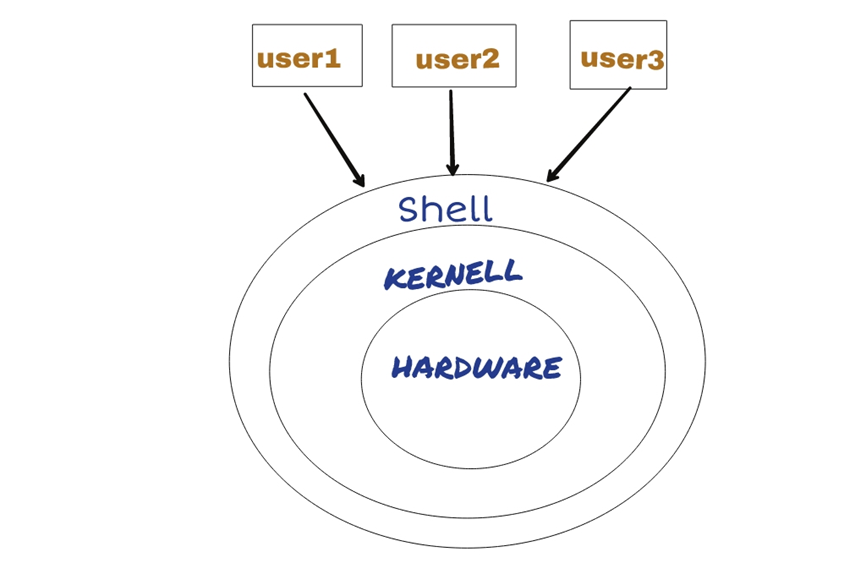

# 4.4 Linux基本操作

> 命令行界面（英语：command-line interface，缩写：CLI）是在图形用户界面得到普及之前使用最为广泛的用户界面，它通常不支持鼠标，用户通过键盘输入指令，计算机接收到指令后，予以执行。命令行操作更加高效，节省内存，方便进行自动化和批量化操作。因此，绝大部分的生物信息软件均采用命令行操作模式。其中“$”符为命令行提示符，表示接受输入命令，我们的分析操作都是在命令行中完成。

## 1 Linux shell命令行

命令行的语言也称为shell语言，Shell就是终端程序的统称，它充当了人与内核（硬件）之间的翻译官，用户把一些命令“告诉”终端程序，它就会调用相应的程序服务去完成某些工作。现在包括红帽系统在内的许多主流Linux系统默认使用的终端是Bash（Bourne-Again SHell）解释器。除了bash shell，还有cshell，zshell等。 



​                          

图 1 Linux Shell示意图

## 2 基本命令

```shell
#用户名  时间  目录结构
wangtong 17:22:53 ~
$
```

表 1**常用Linux****基本命令**

| **whoami**   | **显示当前用户名**   |
| ------------ | -------------------- |
| **id**       | 显示用户id           |
| **date**     | 显示当前日期         |
| **pwd**      | 显示当前目录         |
| **cal**      | 显示日历             |
| **w**        | 显示详细登录用户     |
| **last**     | 显示最近用户登录信息 |
| **clear**    | 清空屏幕             |
| **history**  | 显示历史记录         |
| **who**      | 查看登录信息         |
| **uptime**   | 查看系统负载信息     |
| **ifconfig** | 查看网络信息         |

**命令：which**

which 可执行文件名称 | 查看可执行文件的位置，在PATH变量指定的路径中查看系统命令是否存在及其位置

**命令：passwd**

passwd 修改密码，Linux密码要求大写字母开头，包含字母与数字组合，不能过于简单。
 -l  使密码失效
 -u  与-l相对，用户解锁
 -S  列出登陆用户passwd文件内的相关参数
 -n  后面接天数，shadow 的第 4 字段，多久不可修改密码天数
 -x  后面接天数，shadow 的第 5 字段，多久内必须要更动密码
 -w  后面接天数，shadow 的第 6 字段，密码过期前的警告天数
 -i  后面接『日期』，shadow 的第 7 字段，密码失效日期

```
#用户名  时间  目录结构

wangtong 17:22:53 ~
$

#passwd修改密码
$ passwd

Changing password for user wangtong.
Changing password for wangtong.
(current) UNIX password: 
New password: 
Retype new password:
```

**命令：exit**

退出登录，不要小看这个exit，exit是正确退出，最好不要直接点windows关闭窗口按钮退出，也不要使用ctrl+D给定退出信号退出。

## 3 命令行选项参数

命令行软件由于没有图形化界面，软件的不同功能需要通过选项进行设置。通过“选”与“不选”开启或者关闭软件的功能，而参数是用来对选项进行调节。选项可以不接参数。选项分为短选项和长选项，分别通过一个连字符和两个连字符进行设置。

 

图 2 图形化界面下的菜单就是命令行的选项参数

常见选项参数

表 2 **常见选项参数**

| **-i** | **输入文件**               |
| ------ | -------------------------- |
| **-o** | 输出文件                   |
| **-v** | 软件版本version或者verbose |
| **-h** | 帮助信息help               |
| **-t** | 线程数thread               |
| **-f** | 强制force                  |
| **-d** | 目录dirctory               |
| **-g** | 全局global                 |
| **-a** | 全部all                    |
| **-r** | 递归reverse                |
| **-w** | word 或者width             |

 

具体参数含义还要看不同软件

## 5 命令行常用快捷键

表 3 **常用快捷键**

| **快捷键** | **作用**                   |
| ---------- | -------------------------- |
| **鼠标**   | 鼠标左键选中，右键粘贴     |
| **Tab**    | Tab键补齐                  |
| **方向键** | 上下方向键查找历史记录     |
| **Ctrl+A** | 光标移动到行首             |
| **Ctrl+E** | 光标移动到行尾             |
| **Ctrl+C** | 终止当前操作               |
| **Ctrl+D** | 关闭进程                   |
| **Ctrl+L** | 清空屏幕                   |
| **Ctrl+R** | 搜索历史记录               |
| **Ctrl+W** | 剪切光标所在处之前的一个词 |
| **Ctrl+Z** | 暂停进程                   |

## 6 Linux特殊符号

键盘有100多个按键，在使用Linux之前，其中有大部分都没有被用到，例如主键盘上面的数字键中的符号，例如“~·！@#$%^&*（）<|>?\ ”等，而在使用Linux系统中，这些内容都将被用到，而且非常有用。

表 4 Linux特殊符号   

| **符号** | **释义**                                                     |
| -------- | ------------------------------------------------------------ |
| **tab**  | 文本分隔符，相当于四个空格，在命令行界面可以用来自动补齐命令与目录。 |
| **ESC**  | esc+. ，上一条命令的选项参数，vim恢复到命令模式。            |
| **~**    | 家目录                                                       |
| **`**    | 反引号，编程中调用shell命令                                  |
| **!**    | 调用前面的命令，！！调用上一条，!23调用前面低23条。          |
| **@**    | at符，后面接IP地址。                                         |
| **#**    | Linux文件中注释行，表示不起作用。                            |
| **$**    | 文件行结尾标识符，变量标识符。                               |
| **%**    | 格式化文本。                                                 |
| **^**    | 文件行首标识符                                               |
| **&**    | 任务放到后台                                                 |
| *****    | 通配符，代表一个字符或者很多个字符。                         |
| **\**    | 用来转义，\t表示制表符，\n表示换行符。                       |
| **<**    | 数据流的流入方向，表示输入，将数据传入给左侧软件。           |
| **\|**   | 管道，改变数据流的方向，将数据传入给另外的软件。             |
| **>**    | 数据流的流出方向，表示输出，将屏幕输出的内容写入一个文件。   |
| **2>**   | 数据流的流出的第二个方向，表示错误输出，报错信息会写入到这个文件中。 |
| **>>**   | 表示追加写入                                                 |
| **/**    | 根目录，目录分隔符                                           |
| **‘’**   | 双引号，支持转义                                             |
| **‘**    | 单引号，不支持转义                                           |
| **()**   | shell编程中使用，命令行用的不多                              |
| **[]**   | 索引                                                         |
| **{}**   | 代码块                                                       |
| **:**    | vim或者less命令中，表示可以输入命令                          |
| **;**    | 分割不同命令                                                 |
| **-**    | 短选项标识符-h                                               |
| **--**   | 长选项标识符--help                                           |

## 7 Linux常见错误及解决方法

### 7.1 返回信息

结果：正常运行结果

Note：软件正常运行提示运行状态信息；

Warnings：偏离正常设定，提示用户注意，不影响运行，比如统计检验不满足预定数目，需要用户注意；

Error：软件运行出错，无法继续进行，导致中断，需要排查原因；

### 7.2 常见错误

**1、**`bash:xxx: command not found`

命令拼写错误

没加空格

没区分大小写

**2、**`No such file or directory`

路径错误

**3**、`Permission denied`

无操作权限

**4***、`cp: omitting directory`

拷贝文件夹忘记使用-R

**5**、`Argument list too long`

source刷新配置文件提示参数列表太长，可以新开一个窗口

## 8 获取帮助

-h/--help选项参数

man 命令

info 命令

搜索引擎 Linux+命令

 

图 3 通过bing搜索查找Linux命令的使用方法