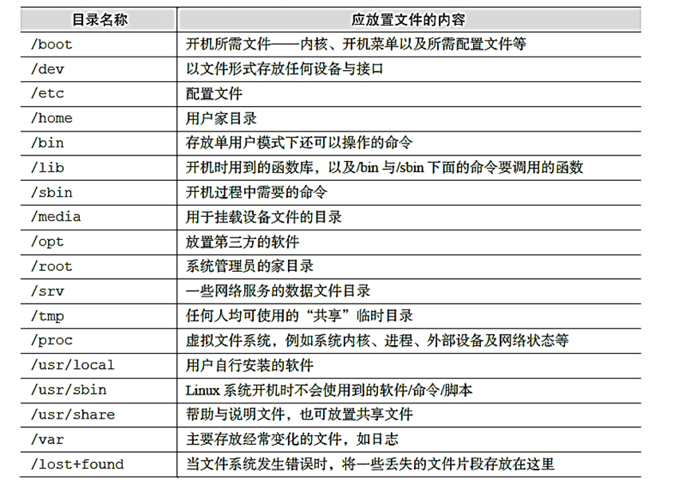

# 4.5 目录结构

> 由于在命令行界面无法显示具体文件夹图标，因此所有的目录都是采用文本模式显示，学习Linux最难的地方在于熟悉Linux系统的目录结构，目录结构是整个Linux操作的核心，几乎每一次操作都涉及到目录结构，因此，必须熟悉Linux的目录结构。否则经常会遇到`command not found`或者`no such file or directory`的问题。

## 1 系统目录结构介绍

Linux目录结构是Linux初学者最难的地方，也是最容易出错的地方，很多时候操作不正确都是因为目录结构的问题。由于使用图形化的windows或者macos系统，用户很多时候无需关注真实的数据路径，但是在Linux命令行模式下，每一次操作都需要用到数据路径。windows目录结构与Linux目录结构主要差别在两点：第一，Linux系统不存在盘符，所有数据路径都是有“/”开始；第二：Linux系统采用正斜线分割目录，windows采用反斜线分割目录。

windows系统目录结构：“C:\Users\wangtong\Desktop”

Linux系统目录结构：“/home/wangtong/”

​                               

图 1 Linux树状目录结构

 

表 1 Linux系统中常见的目录名称以及相应内容

 

## 2 目录切换

目录切换是Linux操作中最频繁的操作。目录切换可以使用cd命令，cd的全称为change directory，后面接要切换到的目录即可。cd之后同时配合ls操作。

**命令：pwd** print working directory

```
$ pwd #显示当前目录名
/ifs1/User/wangtong
pwd  
```

ls 显示目录下的文件

**命令：cd** 

cd：Change directory
 修改工作目录，cd和ls应该是使用最多的两个命令，尤其是对于Linux目录结构不熟的用户。

cd /  切换到根目录

cd ~  切换到用户个人目录

cd ~;ls  切换到用户个人目录并显示目录下文件

cd -  切换到上次使用目录

cd .  使用相对路径

cd .. 使用相对路径，回到上层

ls /  查看根目录信息

 

**命令：ls** ls：List files

-a 列出包括.a开头的隐藏文件的所有文件 

-A 通-a，但不列出"."和".." 

-l 列出文件的详细信息 

-c 根据ctime排序显示 

-t 根据文件修改时间排序 

---color[=WHEN] 用色彩辨别文件类型 WHEN 可以是'never'、'always'或'auto'其中之一 

## 3 绝对目录与相对目录

在Linux系统中，绝对路径是由根目录 / 开始写起。绝对路径包含了文件或者目录全部层级关系。和绝对路径不同，相对路径不是从根目录 / 开始写起，而是从当前所在的工作目录开始写起。使用相对路径表明某文件的存储位置时，在相对目录中，经常要使用到两个特殊的符号：当前目录（用 . 表示）和上级父目录（用 .. 表示）。

绝对目录的好处是比较安全，在任何情况下都可以直接访问，当目录层级较多时，过于冗余。相对目录的好处是比较简洁。但是当当前目录切换时，相对目录可能失效。在写脚本中，最好写绝对目录，更加安全。

### 3.1 文件表示方法

```shell
#绝对目录
/ifs1/MetaDatabase/genome/human.fa

#相对目录
../../MetaDatabase/genome/human.fa 
```

 

### 3.2 检查文件是否存在

使用ll命令列出文件

```shell
#绝对目录
ll /ifs1/MetaDatabase/genome/human.fa

#相对目录
ll ../../MetaDatabase/genome/human.fa 
```

