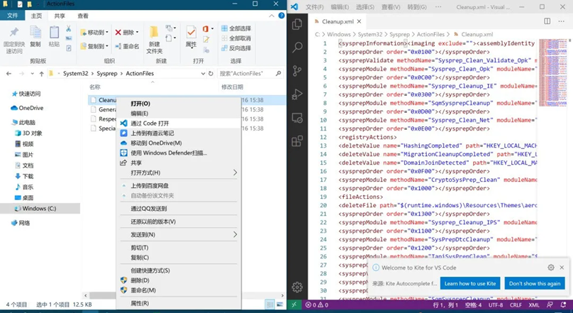

# 4.8 脚本操作

## 1 echo命令写脚本

Linux系统的bash shell脚本中没有print命令，而有一个echo命令。echo是回声的意思，在Linux系统中echo命令用于在终端设备上输出字符串或变量提取后的值，类似于print的功能。echo是在Linux系统中最常用的几个命令之一，但操作却非常简单。

```
(base) wangtong 10:24:29 ~
$ echo "hello,world"
hello,world
(base) wangtong 10:24:46 ~
$ echo $HOME
/ifs1/User/wangtong
(base) wangtong 10:24:50 ~
```

人们一般使用在变量前加上`$`符号的方式提取出变量的值，例如：`$PATH`，然后再用`echo`命令予以输出。或者直接使用echo命令输出一段字符串到屏幕上，起到给用户提示的作用。
传统写脚本的步奏是首先用vim创建一个脚本文件，例如bwa.sh，然后将代码写入脚本文件中，然后保存退出，运行测试，如果提示错误，打开vim修改，在测试运行。如果没有问题，nohup sh bwa.sh &运行脚本。需要反复在vim中进行调整。如果使用echo就很方便了。
**1 命令行测试**

```
(base) wangtong 10:28:32 ~/bwa
$ bwa mem -t 4 -R '@RG\tID:A1\tPL:illumina\tSM:MTB' ref.fna /ifs1/Sequencing/H37Rv_clean.1.fq.gz /ifs1/Sequencing/H37Rv_clean.2.fq.g
z [M::bwa_idx_load_from_disk] read 0 ALT contigs
@SQ    SN:gi|448814763|ref|NC_000962.3|    LN:4411532
@RG    ID:A1   PL:illumina SM:MTB
@PG    ID:bwa  PN:bwa  VN:0.7.17-r1188 CL:bwa mem -t 4 -R @RG\tID:A1\tPL:illumina\tSM:MTB ref.fna /ifs1/Sequencing/H37Rv_clean.1.fq
.gz /ifs1/Sequencing/H37Rv_clean.2.fq.gz
```

**2 如果脚本没有问题，使用echo重定向到文件中，注意需要使用引号。**

```
(base) wangtong 10:28:43 ~/bwa
$ echo "bwa mem -t 4 -R '@RG\tID:A1\tPL:illumina\tSM:MTB' ref.fna /ifs1/Sequencing/H37Rv_clean.1.fq.gz /ifs1/Sequencing/H37Rv_clean.
2.fq.gz " >bwa.sh
```

## 2 vscode查看文本

在做生物信息分析过程中，经常需要查看序列，编辑文本，修改程序代码等，这个过程中就需要使用文本编辑器。一般系统自带的文本编辑器都过于简单，例如windows的记事本等，不能打开大文件，不能识别不同换行符，不支持语法高亮等，无法达到工作要求。优秀的文本编辑器有很多，例如收费的Utraledit，Sublime Text3，editplus等，免费的有notepad++，atom等，这里我们推荐使用微软推出的vscode编辑器，它的一个显著特性就是支持windows，mac和Linux多个平台，使用体验都差不多。安装完在图形界面下，可以使用右键快速打开多种扩展名的文本文件。
下载地址：https://code.visualstudio.com/



图1 vscode查看文本

## 3 运行脚本 

脚本中包含多条命令，如果想运行脚本的命令，在CentOS系统上使用sh命令，在Ubuntu系统中使用bash命令，系统将按顺序依次执行脚本中的命令。脚本中也可以添加控制条件以及循环从操作，这就属于Linux Shell编程。

```
#编辑脚本
prodigal -a MGH78578.pep -d MGH78578.cds -f gff -g 11 -o MGH78578.gff -p single -s MGH78578.stat -i MGH78578.fasta
```

**centos系统**

```
sh prodigal.sh
```

**ubuntu系统**

```
bash prodigal.sh 
```

**赋予可执行全权限**

```
chmod u+x prodigal.sh
```

**直接运行**

```
prodigal.sh
```

