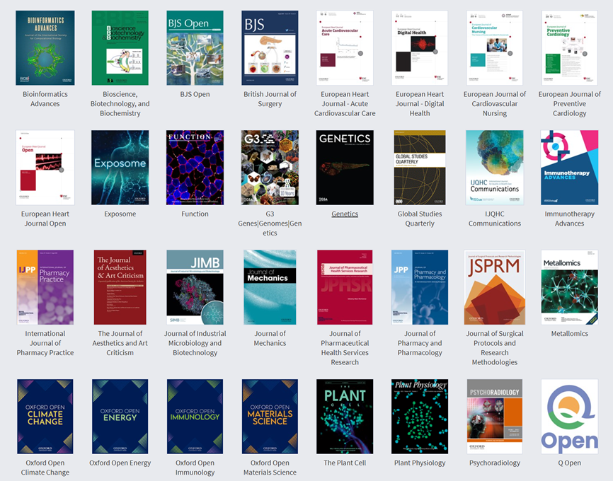
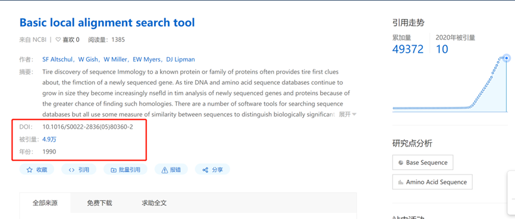
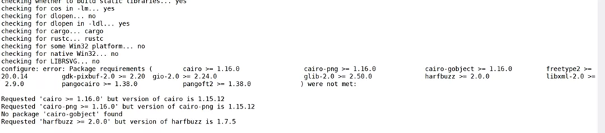
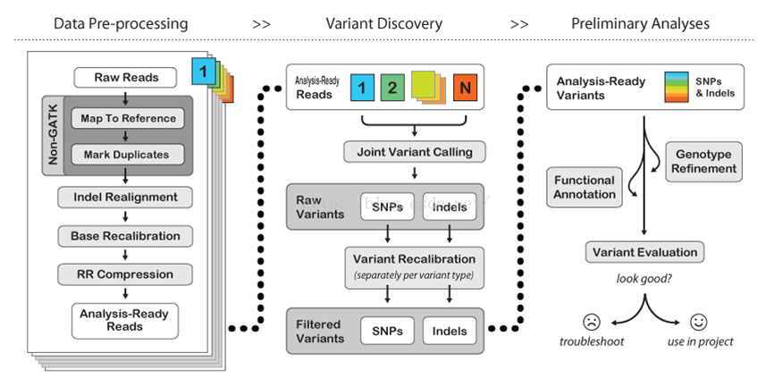
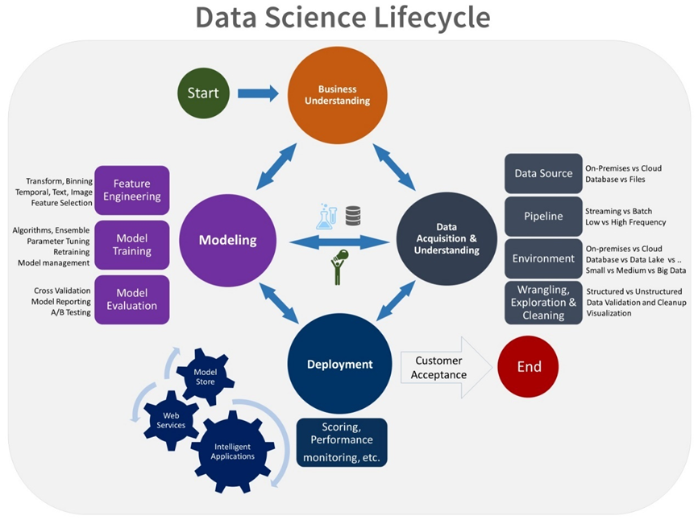

# 5.1 生物软件

## 1 什么是生物软件？

什么是生物软件？首先要明白什么是软件。软件是控制计算机硬件功能及其运行的指令、例行程序和符号语言。通常软件是由程序+文档组成。生物软件顾名思义，就是专门用来处理生物数据的软件。本质上，生物软件就是将处理生物数据的方法和过程以及对各个问题的解决方法写到程序中。

与传统的应用软件例如微信，QQ，手机App相比，生物软件通常具有以下几个显著特点：

1、一般只有Linux系统版本，而且采用命令行模式，没有图形化界面，这对于新手非常不友好；

2、一般都是开源且免费，可以很容易获取；

3、需要有发表文献支持；

4、需要有一个专门网站或者专属页面的官网；

5、开发语言多种多样，可能是C，java，python，perl或者R；

6、开发者水平不一，参差不齐；

7、版本很关键，不同版本之间差别很大；

8、有很多选项参数。

 

## 2 生物软件发表文献

生物软件也可以单独发表SCI，例如发表方法学的，软件比较之类的文章。发表论文之后的生物软件才可以进行引用。一般生物软件常发表在《Bioinfomatics》、《Nature Biotechnology》、《Nature Method》、《Nature Protocols》等文章之上。

除了经典的生物软件之外，目前一些R包，pyhton模块，整合流程等都可以单独发表SCI文章。

​                               

图 1 生物信息杂志

如果想要发表生物软件类文章，需要完成以下内容：

1、公开软件源代码；

2、撰写软件详细文档，包括开发目的，解决问题，如何安装，使用说明，使用案例，常见问题；

3、撰写论文；

4、提供一个软件官网，可以一个独立网站或者代码托管github；

5、持续更新；

## 3 如何查找生物软件？

生物软件成千上万，从哪里下载软件？不同软件之间有哪些差别，哪款软件才是最合适的。下面我们介绍几种查找软件的方法。

### 3.1文献引用

生物软件需要发表文章才能被人熟知，才能进行引用。我们可以根据软件的文章来查找软件。一般软件的文章也是软件的说明书，文章内会给出软件的链接地址，开发目的，使用说明等。另外，软件文章的引用率也是软件质量的评估标准，引用率越高，一般可以认为软件的质量越好，结果越可靠，例如blast软件，至今引用率已经超过4.9万次。

 

图 2 blast软件引用已经超过4.9万次

### 3.2某一领域权威机构

一些比较大的科学研究机构的软件质量更高，例如NCBI，EBI，BROAD，sanger，华盛顿大学，冷泉港实验室等，这些科研结构会发表一些重要软件。例如Rob  Knight 实验室开发的qiime2几乎是宏基因组16S分析领域标准流程，具有非常大的影响力。

### 3.3论坛 、微信公众号推荐

国内外各大论坛，微信公众号，知乎等网络平台，也会有很多生物信息软件的推荐和教程。例如经常有人在biostar论坛讨论生物信息软件。可以通过这些平台来查找生物信息软件。

biostar论坛：<www.biostar.org](http://www.biostar.org>

微信知乎搜索：

<https://weixin.sogou.com/>

<https://zhihu.sogou.com/>

### 3.4 Github

github是著名的代码托管网站，目前绝大部分的生物软件官网都选在github上。可以通过github进行搜索，下载等。github的好处是可以管理软件的版本，提交错误信息，与软件作者进行直接的交流。目前Github拥有超过900万开发者用户，用户可以十分轻易地找到海量的开源代码。

<https://github.com/>

 

图 3 github吉祥物Octocat

### 3.5 博客

<https://mybiosoftware.com/>

<https://truwl.com/tools>

上面是两个博客地址，里面搜集了一些生物软件的内容，可以通过这里来找到一些软件的下载地址。

## 4 为什么生物软件不容易安装？

生物软件千差万别，有些非常难安装，主要有以下几点原因。

第一、由于Linux系统开源的特点，至今无法有统一的系统环境，例如Redhat与Debian两大阵营就有很大的差别。不如windows与macos，具有相对统一的集成开发环境，软件安装比较容易。

第二、客观上来说，生物学研究是一项复杂的工作，很难有一款软件完美的解决问题，比如基因组拼接，由于这件事情本身的复杂性，找不到一款工具得到最优结果，这样才会出现很多软件可供选择；

第三、生物软件的开发语言也包含很多种，有C，C++，Java，python，perl，R等等。

第四：由于很多生物软件个人作者较多，且非计算机专业背景，目前生物软件没有标准的开发规范，软件质量参差不齐，也导致比较难安装；

第五、灌水类文章较多，没有实际价值，很多都是闭门造车，还重新发明轮子，最后重蹈覆辙；

第六、python的版本问题，python2与pyhton3的版本不兼容，并且很多包也有严格的版本要求；

第七、缺乏长期维护更新，文章发表即软件结束生命周期，后续系统版本升级，导致软件无法使用。例如openssh升级，软件没有升级，导致软件无法使用。

## 5 生物软件安装的几种方法？

1、二进制：下载之后，可直接运行；

2、需要自行编译；

3、解决环境依赖之后编译；

**4、利用bioconda安装；**

5、利用docker安装；

6、利用yum，apt安装；

 

## 6 如何确定一款优秀生物软件

**1、功能强大**

一个好的软件需要安装简单，使用简单，功能强大。可以很好的解决用户的需求。例如qiime2软件，可以完成整个二代测序16S序列分析的问题。bwa比对适应多种比对情况，还提供samtools，bcftools工具，对比对完数据做进一步的处理。

**2、安装简单**

作者有责任让软件易于安装。很多软件光安装一步就把一大部分用户拒之门外了，有些软件明明只调用其他工具一个函数，也得安装一堆依赖，并且总喜欢调用最新的依赖。

                               

图 4 软件调用最新配置，导致该包很难安装

如果一款软件安装太复杂，最好不要使用了，肯定能找到更好的替代。软件难安装，说明软件作者开发水平较低，作者水平较低，写的代码你愿意相信吗，软件的结果当然也不可靠了。

**3、文档清晰**

文档会描述软件的功能，如何安装，如何使用，有哪些注意事项等内容，如果作者不清楚这些事情，描述不清楚，文档过于简单，说明本身对于这个事情理解的不够深入，思路不清晰，考虑的不周全，开发出来的软件当然不靠谱了

**4、持续更新**

软件持续更新，才能适应新的情况，解决以往不足，一款好的需要持续更新，例如blast软件，从诞生到现在始终在持续更新。注：blast后被作者开发的blast+替代，blast+继续更新。

**5、引用率高**

一般引用率高代表经过更多的数据验证，可靠性更高。

## 7普通用户安装软件

Linux系统是多用户，多任务系统，可以允许多个用户同时运行。Linux的用户分为管理员用户（通常为root）和普通用户。通常生物信息分析时，都是使用普通用户登录使用。这是因为管理员用于权限过大，如果误操作，影响非常大。强烈不建议使用管理员账户进行各种数据分析工作。管理员用户可以进行各种系统配置，例如安装gcc，glibc这些配置以及用户管理等工作。管理员安装的软件工具，可以让所有用户同时使用。

作为普通用户，也可以单独安装生物软件，但是只能在自己的权限目录内读写。只要是通过源代码变异的方式进行安装。

举个例子，如果centos 7系统gcc编译器4.8.5。如果需要使用更高版本的gcc软件，可以自己进行编译安装，安装完成之后还需要修改默认配置，是自己安装的gcc软件优先级更高。而如果是系统管理员可以使用yum，apt，rpm包等进行安装，一条命令即可，更加方便。例如安装R软件，管理员可以使用yum命令直接进行安装。
```shell
#1 centos系统安装R
yum install -y R.x86_64

#2 ubuntu系统安装R
apt install -y r-base

#3 普通用户编译R
wget https://cloud.r-project.org/src/base/R-4/R-4.1.1.tar.gz
tar -zxvf R-4.1.1.tar.gz -C ~/biosoft
cd ~/biosoft/ R-4.1.1
./configure --enable-R-shlib --with-pcre1 

#4 编译
make
make install
```

不过目前普通用户使用bioconda也可以完成绝大部分软件的安装。

## 8流程类生物软件的问题

### 8.1什么是分析流程

所谓分析流程就是把一些常用的操作连接起来，实现自动化，达到输入数据，直接就能出结果的效果。举例来说，要做一个细菌基因组的分析，通常从拿到数据，需要做数据质控，数据过滤，过滤完质控，基因组拼接，拼接结果统计，基因预测，基因功能注释等。如果将每个过程连接起来，上一步的输出作为下一步的输入，就可以实现自动化的操作。

有很多专门用于构建流程的语言，比如一些脚本语言，例如shell语言，perl语言，pyhton等，还有专门的流程语言，例如Common Workflow language，SnakeMake，NextFlow等。

 

 图 5 GATK分析人基因变异检测流程

### 8.2流程的缺点

1、生物数据分析属于探索性工作，自动化流程不适合数据探索；

2、流程的过程中，有很多软件，每一个软件都有很多选项参数，流程没有办法测试全部选项参数组合，因此，里面都是固定好的常用选项参数，所有的样本都用同样的选项参数“工厂化”生产，显然也是有问题的。

3、流程当中，中间环节出问题，很难排错，需要对每一个环节非常清楚。

 

图 6 流程设计模式图

