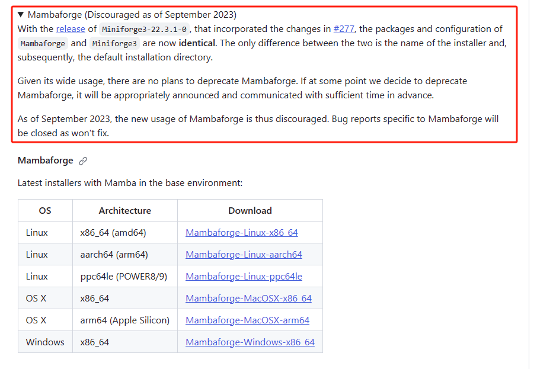
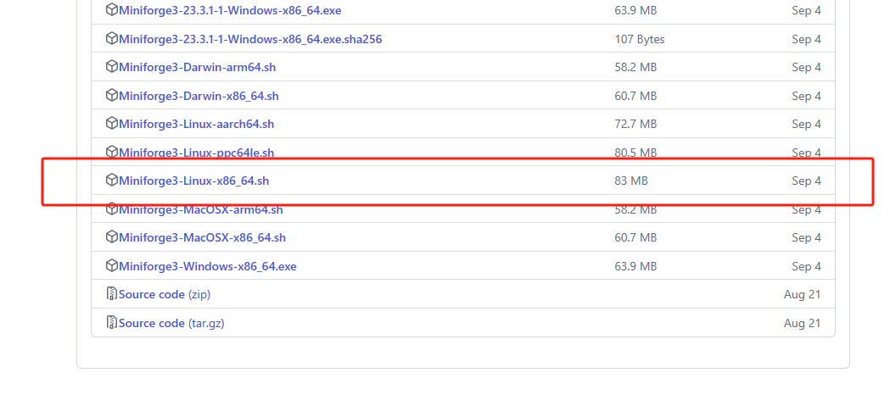

# 5.4 利用mamba安装生物软件

> 生物信息发展太快了，隔一段时间就得更新一下知识。之前推荐安装bioconda，隔一段时间出来一个mamba，替换conda。后来mamba又独立出来，这个时候就推荐大家安装Mambaforge。最近Mambaforge又快要不维护了。所以，目前最佳方式是直接安装Miniforge3。

**mambaforge不在鼓励使用了**

https://github.com/conda-forge/miniforge




**安装Miniforge3**

https://github.com/conda-forge/miniforge/releases



**1、下载安装：**
```shell
#下载mambaforge
wget https://github.com/conda-forge/miniforge/releases/latest/download/Mambaforge-Linux-x86_64.sh
```
**2、安装**
```shell
sh Mambaforge-Linux-x86_64.sh 
source ~/.bashrc
```

**3、添加软件源：**

目前bioconda提供是两个软件源，分别是biconda和conda-forge，默认的defaults是用来管理python相关的包。bioconda是官方维护的软件源，conda-forge通道是社区维护的，包含很多不在默认通道里面的通用型软件。安装完成之后需要将这两个软件源都添加进来。
```shell
conda config --add channels bioconda 
```

以上步奏的效果是在每个用户的家目录下创建一个.condarc文件，并将这些软件源写入该文件。
```shell
$ cat ~/.condarc
channels:
  - conda-forge
  - bioconda
  - defaults
```