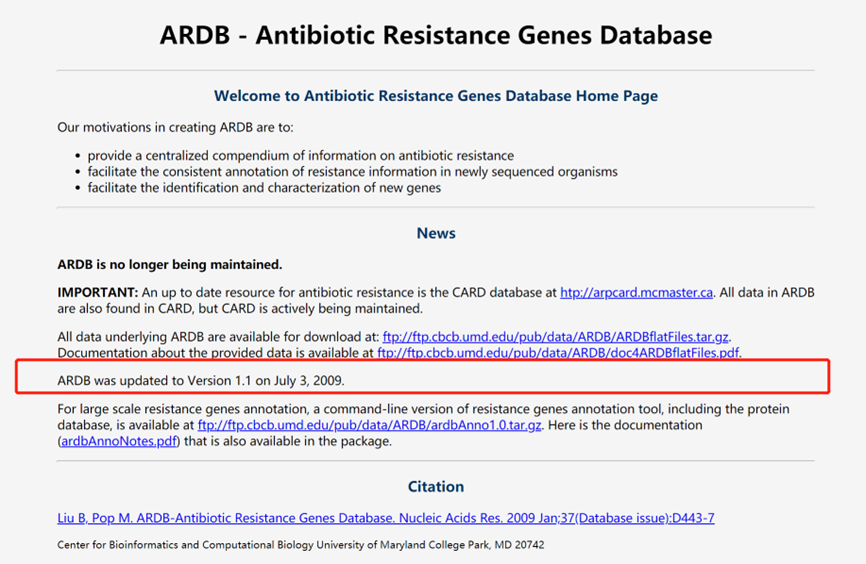
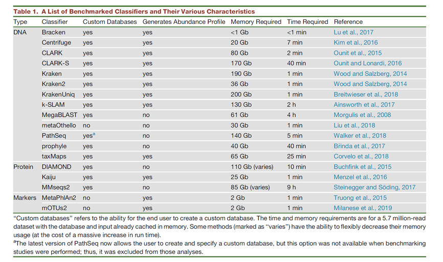

# 6.1 生物数据库

> 生物数据的处理本质上有两条路线：其中一条是序列本身具有结构特征，那么就可以通过软件算法来实现，比如预测基因，非编码RNA，重复序列的分析等；另一条路线是序列本身没有结构特征，只能通过与已有序列进行比对，根据已知信息来推测未知信息，比如基因功能注释，16SrRNA物种鉴定等，常见的一个例子就是得到一条序列，需要判断序列来自于哪个物种，就只能与数据库进行比对。

## 1 生物数据库简介

生物信息中说的数据库和IT行业中说的数据库还有些不同。这里的数据库更像一个信息集合，而非数据管理技术。比如基因的功能，必须与已知信息去比对查找。这个类似于查字典，遇到一个词语不知道什么意思，直接去查字典，查到了就找到了，查不到就没办法了。除了基因功能，微生物分类，变异与表型关系等都属于这种，需要借助已知数据库。如果数据库查不到就没有办法了。

所以，很多生物信息分析结果要严重依赖数据库的质量。

## 2 生物数据库常见问题？

和生物软件一样，生物数据库也有很多可供选择，但是这同样也存在很多问题。下面我们来总结一下。

### 2.1 数据库过于冗余

同样一个分析，就会有很多个类似的数据库。例如16S的物种分类分析，就有silva，greengene，rdp，Fungene等几个可供选择。有时为了注释结果完整，每个库都试一遍，合并结果非常繁琐。

### 2.2 长时间不在更新

数据库的质量参差不齐，给用户造成很大的干扰。有一些发表之后长时间不在更新，例如ARDB数据库，一个用于注释耐药基因的数据库，自从2009年发表之后已不在更新，但目前依然有很多文章在引用该数据库。

                         

图1 ARDB数据库网站截图

### 2.3 存在误差

对于数据库的使用，我们同样还是不能过于迷信数据库，为什么呢，因为存在一个误差的问题，这就涉及到基因的同源性判断问题，也就是数据库中的精确性直接影响到比对结果的判断，例如数据库中一个基因功能标识不准确，那么与之比对的所有序列都会有问题，因此，对于数据库比对的结果还需要更进一步的验证。

依赖数据库还有一个问题，如果数据库信息错了怎么办呢，这就有很大的问题，这个错误会被无限放大，所有与之相关的注释结果全错了。这就要求我们在使用数据库的时候一定要小心，一是要注意数据库的准确性，二是，也不能完全相信数据库的结果。

### 2.4 相互不兼容

对于微生物物种分类，有很多的分析软件，每个软件会自建数据库索引文件，这些索引相互之间不兼容，非常麻烦，每次使用新的数据库都需要重新建立索引文件。

 

图 2 文章《Benchmarking Metagenomics Tools for Taxonomic Classification》

### 2.5 版本问题

数据库需要不断加入新的数据，或者纠正已有信息，这样就会有不同的版本。使用不同的版本最终分析的结果可能会差别很大。例如人基因组参考序列存在多个版本。而且即使是同样的序列，存储在不同数据库的命名也有很大差别，例如来自UCSC数据库中，一般命名为hg18,19，hg38。而在NCBI数据库中命名为GRch36,37,38，GRC是Genome Reference Consortium 的简称，而embl数据库中则是release然后跟一个版本号，有非常多的版本，千人基因组命名为b36，b37。

目前，广泛使用的版本是GRCH37和GRCH38。2009年，the Genome Reference Consortium (GRC)发布了第19版人类基因组GRCH37，也常被称为hg19。GRCH37被广泛应用于数据分析。2013年，GRC发布了GRCH38。但由于注释工具、数据库的不健全及升级基因组工作繁杂，时至今日，GRCH37仍被相当程度地使用。

不同数据库采用不同的命名方式，UCSC命名最简单，就是hg加数字，比如hg18，hg19和hg38这些版本比较常用；NCBI的命名更复杂一些，是GRCH开头，然后数字，36,37,38等。

而ENSEMBL命名就更复杂了，只给出版本比如52,59,61,80,81,82等。这三种命名方式有一个对应关系。如下表所示：

表 1 不同版本基因组比较

| 发布时间 | UCSC | NCBI   | ENSEMBL                   | 1000G |
| -------- | ---- | ------ | ------------------------- | ----- |
| ——       | hg18 | GRCh36 | release_52                | b36   |
| 2009     | hg19 | GRCh37 | release_59/61/64/68/69/75 | b37   |
| 2013     | hg38 | GRCh38 | 76/77/78/80/81/82         | ---   |

 

### 2.6 数据库权威性

由于生物学问题的复杂性，与数据库比对的结果不一定就是百分之百准确的，还需要做基因的验证。例如注释得到一个基因，对一个突变机型注释，物种分类的结果等。例如通常都可以将测序序列与NCBI直接进行blast比对进行物种分类将定。但是NCBI物种分类数据库有给出声明。声明里有介绍到NCBI的物种分类数据库并不是权威的分类，只是收集用户提交的信息，结果还需进一步验证。

| 发布时间 | UCSC | NCBI   | ENSEMBL                   | 1000G |
| -------- | ---- | ------ | ------------------------- | ----- |
| ——       | hg18 | GRCh36 | release_52                | b36   |
| 2009     | hg19 | GRCh37 | release_59/61/64/68/69/75 | b37   |
| 2013     | hg38 | GRCh38 | 76/77/78/80/81/82         | ---   |

图 3 NCBI物种分类数据库声明

## 3 如何查找生物数据库？

OXFORD Journals 在线页面包含一个常用数据库的页面。里面收集了大量生物学常用的数据库内容。数据库按照功能进行分类，可以在http://oxfordjournals.org找到需要的数据库。数据库按照功能进行分类。和生物软件一样，里面很多数据库都出于僵死状态，网站还在，已经很久没有更新了。

数据库列表：https://www.oxfordjournals.org/nar/database/cap/

同样和选择生物软件一样，选择生物数据库也尽量要选择引用率，使用率高的。