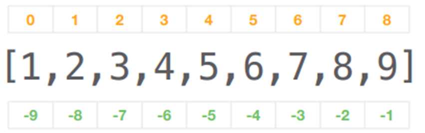

# 8.18  列表元组集合
列表是python中最常用的一种数据结构，列表是标量的一个集合，里面可以放多个标量。与列表类似的是元组，元组是一种不可以修改的“列表”，创建之后不能修改。还有集合，是一种去除重复元素的列表。
列表是一种有顺序的表，其中的列，代表一定序列。与列表类似的是数组这种数据类型。数组是用于储存多个相同类型数据的集合，而列表中可以包含不同数据类型。数组也可以通过索引来访问数组中具体的元素。但是因为数组在一创建时就需要明确数组的大小(开辟一块连续的空间)，所以数组在程序中使用起来就具有局限性。
列表也可以嵌套列表，构成多维数据，但这种情况下一般都使用多维数组，在python中，有numpy包专门用于处理多维数组。
## 1 创建列表元组和集合
```python
import os
# 通过[]直接生成
list1 = [1, 2, 3, 4, 5]
#print(list1)

#通过list()函数转换
list2 = list(['A', 'B', 'C', 'D'])

#将元组转换为列表
list3 = list(('A', 'B', 'C', 'D'))

#字符串切片
list4 = list('GGACACCATCAACAG')
print(list3)

list5 = "A:B:C:D:E:F".split(":")
print(list5)

# 字典转换为列表
list({'a':3, 'b':9, 'c':78})

#定义一个空列表，通过文件读入数据，存入列表
list6 = []
for i in open('test.fa','r'):
    list6.append(i.strip())

print(list6)

# 二维列表
blist = [[1, 2, 3], [4, 5, 6]]
```
## 2 求和计算
```python
# 求和计算
data = []

for line in open('neuron_data.txt'):
    length = float(line.strip())
    data.append(length)

n_items = len(data)
total = sum(data)
shortest = min(data)
longest = max(data)

data.sort()

output = open("results.txt","w")
output.write("number of dendritic lengths : %4i \n"%(n_items))
output.write("total dendritic length      : %6.1f \n"%(total))
output.write("shortest dendritic length   : %7.2f \n"%(shortest))
output.write("longest dendritic length    : %7.2f \n"%(longest))
output.write("%37.2f\n%37.2f"%(data[-2], data[-3]))
output.close()
```
## 3 列表索引
列表是一个集合，如果想获取其中任意元素，可以通过列表索引的方法。列表是具有顺序的集合，可以通过位置索引来选择，在python中索引从0开始也就是索引5，其实是第六个元素，也可以一次给定一个范围，但是注意索引是不包含右边界。如果用负数索引，则代表从后往前。

图1 列表索引
```python
alist = list(range(1,10))
# 列表第三个元素
alist[2]
# 列表第3到6个元素
alist[2:6]
# 列表第3到7个元素
alist[-7:-2]
# 按步长值索引
alist[1:8:2]

#索引多个值，可以使用一个for循环
new_list = [alist[i] for i in [3,6,8,3]]
print(new_list)
```
## 4 操作列表
与字符串数据类型一样，python的列表也有大量属性和方法。
```
# 查看列表属性与方法
>>> alist = list(range(1,10))
>>> print(dir(alist))

['__add__', '__class__', '__class_getitem__', '__contains__', '__delattr__', '__delitem__', '__dir__', '__doc__', '__eq__', '__format__', '__ge__', '__getattribute__', '__getitem__', '__gt__', '__hash__', '__iadd__', '__imul__', '__init__', '__init_subclass__', '__iter__', '__le__', '__len__', '__lt__', '__mul__', '__ne__', '__new__', '__reduce__', '__reduce_ex__', '__repr__', '__reversed__', '__rmul__', '__setattr__', '__setitem__', '__sizeof__', '__str__', '__subclasshook__', 'append', 'clear', 'copy', 'count', 'extend', 'index', 'insert', 'pop', 'remove', 'reverse', 'sort']
```
下面给出一些列表常见操作方法
```
# 创建列表
x = list(range(1, 10, 1))
print(x)

# 打印列表属性与方法
print(dir(x))


# 尾部添加单个元素
x.append(10)

#insert()指定插入单个元素
x.insert(0, 0)

# extend()尾部追加列表 
x.extend([11, 12, 13])

# pop()删除并返回指定位置元素(默认结尾处)(也可用负数来逆序弹出) 
print(x.pop())
print(x.pop(-2))

# remove()删除首个指定的值
x.remove(4)
print(x)
# del 删除指定位置元素
del x[2]

# clear()删除所有元素 
x.clear()

x = [1, 2, 2, 3, 3, 3, 4, 4, 4, 4]
# 下标查指定位置元素 
print(x[4])
# count()查指定元素出现次数 
print(x.count(4))
# index()查指定元素首次出现索引 
print(x.index(3))

x = [8, 5, 2, 3, 1, 7, 2, 8, 1, 4]

# sort()排序 
x.sort()

# reverse()翻转 
x.reverse()

#浅拷贝
x = [1, 2, 3, 4]
y = x
y.append(5)

#深拷贝
x = [1, 2, 3, 4]
y = x.copy()
y.pop()
```
## 5元组
元组（tuple）是一种特殊的列表，由小括号、逗号和数据对象构成的集合，各个项通过逗号隔开。
元组的特点是：

- 元组项可以是任何数据类型，也可以嵌套；
- 元组是一个位置有序的对象的集合；
- 元组是不可变的，不能在原处修改；
- 元组的各个项可以重复。

元组一旦创建就不能修改，这个可以用于月一些安全性较高的场合，防止被篡改。

```python
# 通过小括号创建元组
tup = (1, 2, 3, 4)
print(tup)

# 通过tuple函数创建元组
tup = tuple([1, 2, 3, 4])
print(tup)

# 查看元组属性与方法
dir(tup)
```
由于元组不可修改的特性，所以能对元组操作的方法很少。


## 6 集合
集合是Python中的内置数据结构之一，集合（set）是由唯一的、不可变的对象构成的无序集合。
集合的特点是：

- 元素不允许重复；
- 集合的元素是无序的；
- 集合的元素是为不可变对象；
- 集合不支持索引或切片操作，也没有键可用于获取集合中的元素值；
- 集合是去重复的无序列表；
- 集合是没有value的字典；

```python
# 通过set函数创建集合
set1 = set([1,2,3,4])
print(set1)
# 通过大括号创建集合
set2 = {1, 2, 3, 4, 1, 2}
print(set2)

# 字符串转换为集合
set3 = set('abcdabcd')
print(set3)

# 查看集合属性与方法
print(dir(set3))
```


