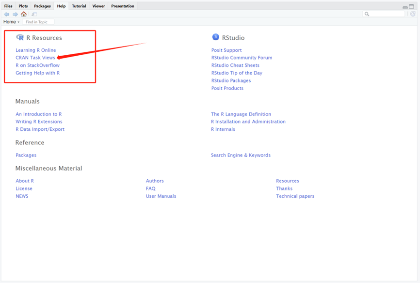
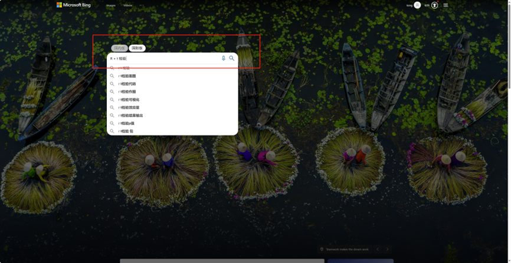
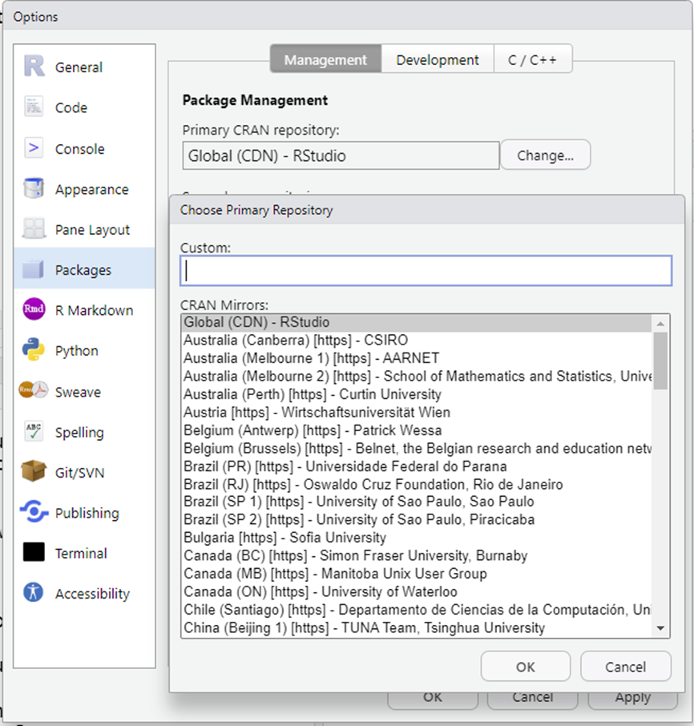

# 9.7 R语言包管理

R语言的一大优势就是有各种各样的扩展包，所谓R扩展包，就是将数据处理的算法通过R函数来实现，在加上测试数据，说明文档整合在一起，就是R的扩展包。在使用R的过程中，肯定需要使用到R的包，因此，需要掌握R包的管理，包括包的查找，安装，加载，升级，取消加载，删除，查看帮助文档等等操作。

## 1 如何选择合适的R包

**1通过R TaskView查找需要的软件包，根据大类查找。**

网址：<https://cran.rstudio.com/web/views/>

​                               

图 1 R taskview

**2 阅读文献，参考里面使用的R包。**

**3 bioconductor项目**

Bioconductor 是建立在R语言环境上的，用于生物信息数据的注释、处理、分析及可视化工具包的总集，由一系列R扩展包组成。很多生物数据都是使用bioconductor包来分析的。
 Bioconductor官网：<http://www.bioconductor.org/>

**4、bing搜索**

 

图 2 通过bing搜索关键字

## 2 R包的管理

由于不用R包之间存在相互依赖的关系，因此，强烈推荐采用在线安装的方式，这样软件可以自动解决依赖关系问题，节约大量时间。R默认的服务器在国外，为了加快下载速度，需要将R镜像站点修改为国内镜像站点。也可以使用Rstudio官方镜像。

<https://packagemanager.posit.co/client/#/>

### 2.1 R包默认安装到以下目录

R包的默认安装路径与登录账号是否为管理员有关，如果登录的为管理员账号，则默认安装到R安装目录下。如果登录的为普通账户，则在每个账号下的我的文档中。

```r
#windows系统：
[1] "C:/Users/genom/AppData/Local/R/win-library/4.3"
[2] "C:/Program Files/R/R-4.3.1/library"
#macos系统：
/Library/Frameworks/R.framework/Versions/4.3/Resources/library
#Linux系统：
/usr/local/lib64/R/library/
~/R/x86_64-pc-linux-gnu-library/4.3/

#查看R包安装目录
.libPaths()
.Library
.Library.site

```

### 2.2 设置镜像

通过网络安装R包，网络速度影响比较大，因此要选择合适的镜像，一般选择距离较近的镜像。也可以使用Rstudio官方镜像，可以通过Rstudio修改镜像站点。

 

图3 修改R镜像

也可以通过R函数修改默认镜像。

```r
chooseCRANmirror()  
chooseBioCmirror()
setRepositories()

```

常用R镜像站点

CRAN站点：

<https://mirrors.tuna.tsinghua.edu.cn/CRAN/>

<https://mirrors.ustc.edu.cn/CRAN/>

Bioconductor镜像：

<https://mirrors.ustc.edu.cn/bioc/>

<https://mirrors.tuna.tsinghua.edu.cn/bioconductor/>

github:  <https://github.com/>