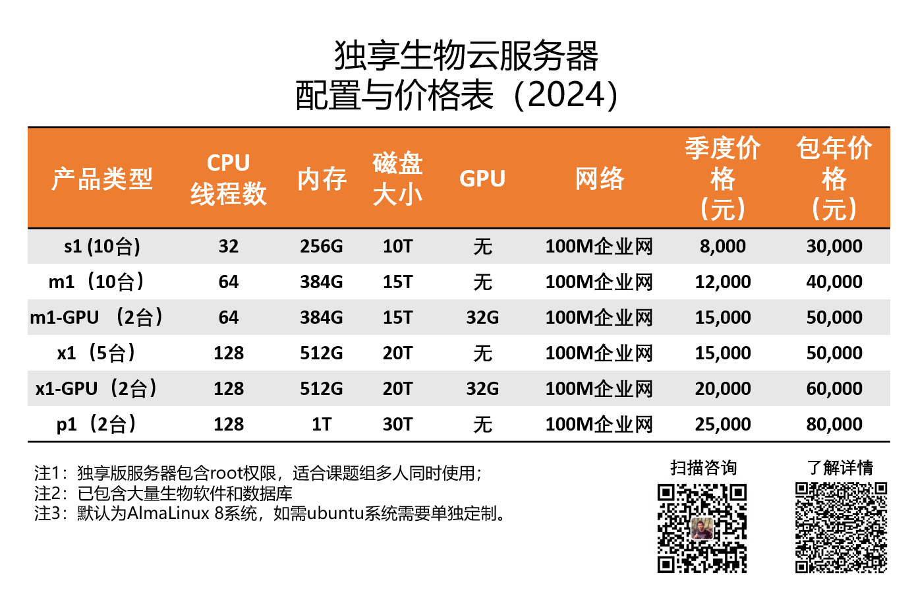

# 1.1 生物信息云计算平台

> 经过一个多月的准备，从采购服务器，存储，交换机，防火墙，光模块，网线等等硬件，到机器上架，布线，部署，测试。我和另外一个硬件工程师忙活了整整一个月。耗资百万，经历30多个日日夜夜，解决了一个又一个技术难题，2024年我们可以提供独享的生物云计算平台。目前我们有30台独享服务器可供选择。所有服务器开箱即用，里面已包含了大量生物软件和数据库。

## 独享云服务器

这次更新有很多亮点：

1. 可以提供独享服务器，非常适合整个课题组使用；
2.  采用联通电信双百兆网络，访问更快速；
3. 采用专业独立存储，数据更安全；
4. 万兆内网，无感访问共享存储数据库；
5. 提供GPU服务器可供选择；
6. 配置大量最新生物软件，R环境，python环境；
7. 新增两台适合大部分项目的128核心CPU，512G型号；
8. 新增一台v3服务器供学员上机操作；
9. 提供了4种配置可供不同项目选择；
10. 价格仅为大厂公有云1/5到1/10价格。

## 如何购买

截止到目前，我们已经有30台独享云服务器可供选择，根据实际计算需求进行选择即可，欢迎广大师生选购。

##  如何选择

- S类型：可供1-5人课题组使用，可完成细菌基因组，物种分类鉴定，16S，RNAseq等

- m类型：可供5-10人课题组使用，可完成宏基因组拼接，100M左右基因组拼接，单细胞数据分析等；

- x1类型 ：可供5-10人课题组使用，可完成宏基因组拼接，大型基因组拼接，人全基因组数据分析等；

- p1类型：可以完成绝大部分数据分析，速度更快。

  

  注释：计算资源具体消耗无法精确衡量，与数据量大小，计算类型，计算峰值，磁盘读写速度，软件算法都有很大关系，实际使用过程中越大的计算资源，理论上计算速度越快。

## 为什么选择我们的生物云计算平台？

我们的目标就是让用户上传数据，直接分析。

- 十年生物数据分析从业经验，更懂用户；256G以上内存，满足绝大多数生物分析；

- 全新Dell EMC服务器，磁盘包含冗余性，整机在数据中心机房，数据更加安全。
- 100M独立企业网，上传数据最快可达到12M/s；

- 已配置大量常用生物软件和数据库，省去自己安装软件大量时间，无需解决各种报错问题；

- 自己购买改配置计算资源，市场价格在十几万以上，同等配置下云服务器每月价格将近4万元；

- 无网络限制，国内国外皆可直接访问（外网由于物理距离原因，数据传输数据低于国内）；
- 专家团队，快速解决软件使用过程中各种问题。

## 常见问题

1.**购买流程？**

直接添加下面作者微信，确定型号，给一个用户名和邮箱开通账号，开通发票，具体发票信息请微信联系。

2.**有roo他账户吗？**

独享云服务器包含root账户，可以同一课题组中其他成员开通账号，多人使用，无任何限制。

3.**自己可以安装软件吗？**

可以，系统已完成基础配置，常用软件都可以自行安装。如果默认的软件无法满足使用要求，管理员可以使用yum或者apt工具对系统环境进行配置。

4.**可以选择操作系统吗？**

目前我们提供AlmaLinux与Ubuntu Server系统可供选择。

