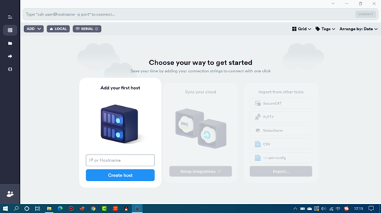
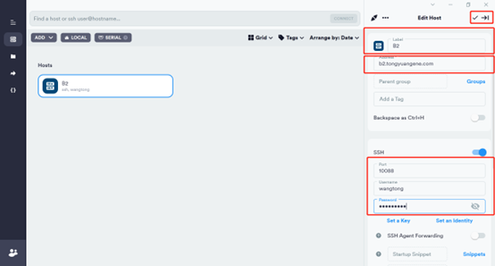
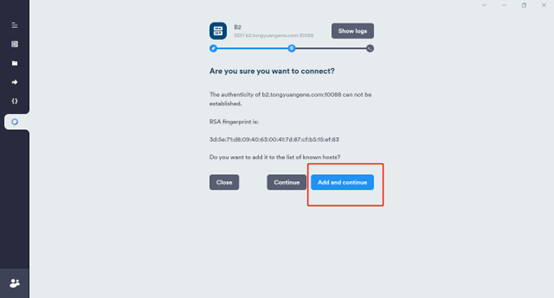
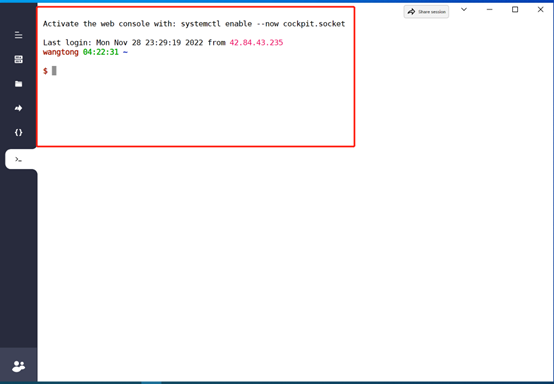
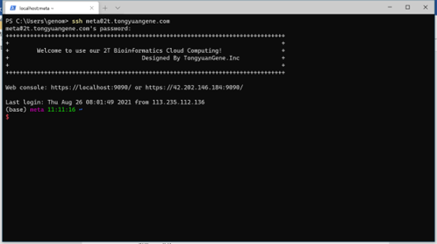
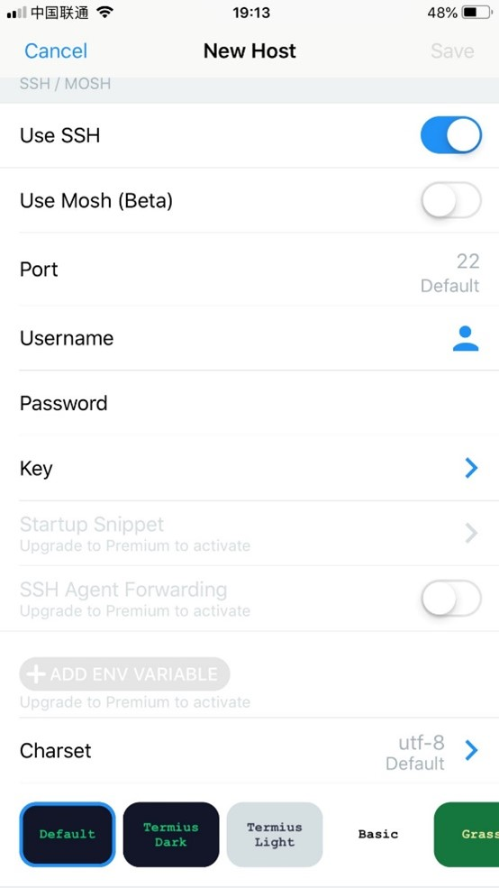
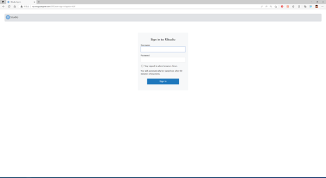
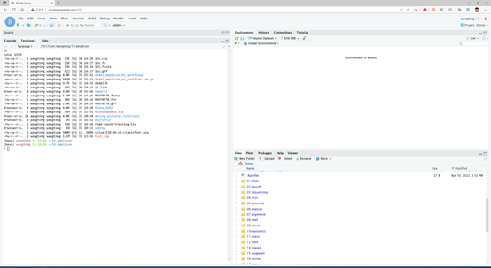

# 登录服务器 {#sec-login}

服务器相比于个人电脑具有较高的计算资源，例如有更大的CPU，内存，有磁盘阵列，具有更高的文件读写速度。通常我们需要通过个人电脑将测序数据传输到服务器端，然后在服务器上进行数据分析。作为生物信息分析人员，每天都需要通过SSH工具远程登录服务器，那么使用一款高效的连接工具就很有必要。 根据邮箱中给定的**IP地址**，**账户**，**密码**，**端口号**进行登录

## 选择合适的工具

使用服务器需要使用ssh登录以及sftp传输文件，支持这两项功能的工具有很多。有收费也有免费，这里我们给大家列出一些，根据个人使用习惯来进行选择。这里面我们推荐windows用户选择xshell+xftp或者termius，mac用户选择termius。

**windows系统**

[xshell+xftp](https://www.xshell.com/zh/free-for-home-school/)

[putty](https://www.chiark.greenend.org.uk/~sgtatham/putty/)

[SSH Secure Shell Client](https://www.ssh.com/ssh/)

[secureCRT](https://www.vandyke.com/products/securecrt/)

[termius](https://www.termius.com)

[mobaxterm](https://mobaxterm.mobatek.net/download.html)

**macos系统**

[termius](https://www.termius.com)

[secureCRT](https://www.vandyke.com/products/securecrt/)

[Royal](https://www.royalapps.com/ts/mac/features)

[tabby](https://tabby.sh/)

## 如何登录服务器

为了保持windows系统与macos系统一致性，这里推荐使用termius工具。Termius是一款支持SSH与Telnet协议的连接工具，支持windows系统，macos，Linux，iOS以及Android等几乎支持主流平台。且内置sftp，使用一个工具即可同时登录服务器和传输文件。 这里面需要注意，目前macos系统从AppStore下载的termius无法读取本地文件，因此强烈推荐从官网下载进行安装。根据个人系统进行下载。

windows版本下载地址：<https://www.termius.com/windows>

macos版本下载地址：<https://termius.com/mac-os>



图1 打开termius，新建一个host



图 2 填写标签，ip地址，端口号，用户名和密码



图 3 双击新建host，选择图中蓝色部分



图 4 出现图中界面，完成登录

## 命令行登录

当使用Linux命令行模式，widnows DOS， macos默认终端等，可以使用命令方式登录服务器。打开终端（Terminal），使用SSH命令进行登录，使用scp命令进行文件传输。

```         
ssh wangtong@vip.tongyuangene.com  
输入密码：
```

::: callout-note
注意事项1：Linux 输入密码是没有任何显示的，输入错误，可以连续按退格键。
:::



图 5 windows系统使用ssh远程登录

## 移动端登录

iOS或者Andriod可以通过应用商店下载安装Termius应用。也可以从官网下载，网址:<http://www.termius.com/>

::: {layout-ncol="2"}



:::

图6 手机端登录服务器

## 网页端登录

服务器可以通过浏览器访问Rstudio-server软件使用R语言。通过浏览器，例如Chrome，Firefox，Safari等均可，尽量别使用IE以及360浏览器，可能会登录失败。 登录网址：根据个人服务器IP进行登录，比如购买的是通用型我们的服务器可以使用下面地址进行登录<http://vip.tongyuangene.com:8787> 注意端口号要写清楚。登录账户密码与服务器登录账户密码一致。 其他服务器如下，请与自己购买型号保持一致： 

图 7 登录R语言环境

输入账户密码，与登录服务器账户密码相同。登录之后就可以使用Rstudio了。 

图 8 在网页端使用R语言
