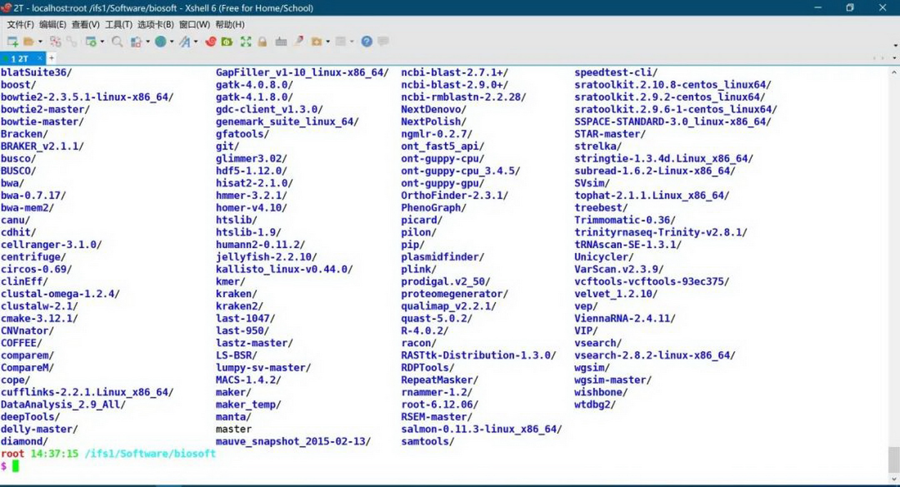
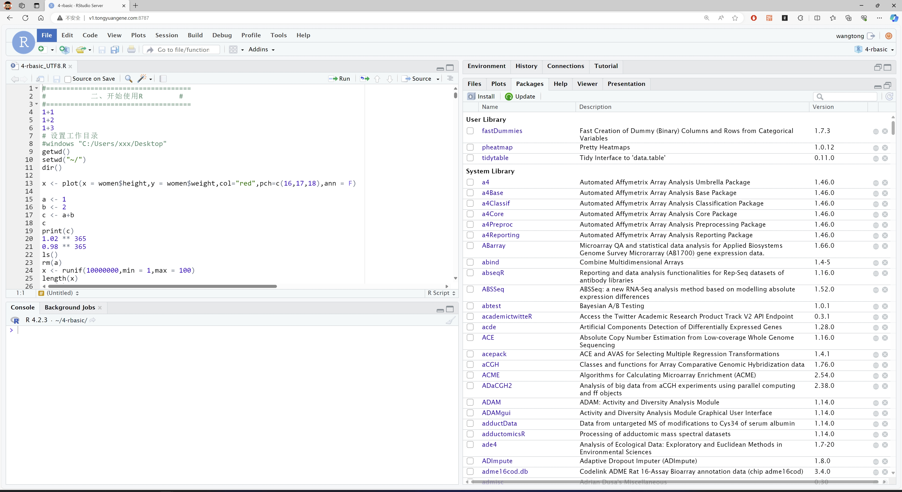

# 1.2 生物信息共享云平台

> 计算资源，生物软件安装，数据库配置，往往占据生物数据分析80%以上的时间，一直是阻挡生物数据分析的三座大山。为了实现我们"上传数据，直接分析"的理念。我们对计算资源的追求是无止境的，在2015年全球最早推出共享生物云计算，截止到目前，我们的云平台已经平稳运营超过9年。服务超过1000多位用户。

## 机器配置

在原有服务器基础之上，最近我们又采购了大量计算设备。根据计算需求不同，目前我们可提供14种配置可供选择，不同配置在CPU，内存和默认存储方面有所差别。


##  如何选择

可根据个人分析数据大小和内容进行选择。

- A类型：少量样品RNAseq，16S，WGCNA，GEO表达分析，肿瘤panel等；

- B类型：该配置是通用型配置，可以满足绝大部分生物云计算需求，例如基因组的拼接，人全基因组，外显子，单细胞分析等；
- C类型：如果需要更多计算资源，需要更快时间完成计算，可以选择C类型，C类型用户较少，可以完成一些大型基因组的拼接，宏基因组的分析等。
- D类型：旗舰配置，可以完成大型计算，例如一些超大基因组拼接，宏基因组拼接，其中D1类型包含显卡，可以完成三代纳米孔测序碱基识别等；
- V类型：这三台设备主要服务于购买过教学视频用户，与其他服务器不同之处在于里包含了视频课程中全部案例数据，配合视频可以进行同步操作。也可以做一些小规模数据分析。


## R环境

我们的云服务器里已经配置了R语言的使用环境，并且安装了大量R的扩展包，用户可以直接使用。RNAseq和单细胞直接使用即可分析。也可以安装自己需要的R包。




## 上传数据，直接分析

我们的生物云为用户解决了常用生物软件，生物数据库的配置问题。100M企业网络，可提供更快速网络数据上传和下载。这还不够，我们还为用户准备了大量软件使用脚本以及大量生物数据分析案例，在服务器里直接运行即可得到结果，省去自己准备数据的大量时间，可以快速掌握一项分析技能。


除了软件之外，我们还配置好了大量生物数据库，例如metamaps库，centrifuge库，最新nr，nt，blast索引，diamond索引，kraken索引，kraken2索引，metaphlan索引，humann索引等，省去大量下载数据时间。真正让您"上传数据，直接分析"。


## 内置bioconda

由于管理员安装的bioconda只能使用里面的软件，如果自己安装软件需要将bioconda安装到自己目录下， 这点不如rstudio-server方便。现在我们直接为用户安装好了bioconda。而且选择了miniforge版本，这个版本可以直接使用mamba命令，使用更快。登录账户之后，直接使用即可，例如安装bwa以及samtools软件。只需要运行下面命令即可。

```         
mamba install -n base -y bwa samtools
```

同时，我们还提供了一个超过**700**多行的软件安装命令。可以直接使用grep命令搜索需的软件，然后直接安装。软件列表包括了基因组拼接，rnaseq，单细胞测序，宏基因组，R语言，python语言等安装。

例如我们想要安装一个宏基因组分析的kraken2软件。

```         
(base) wangtong 09:01:13 ~
$ grep "kraken2" mamba.sh 
mamba create -n kraken2 -y
mamba activate kraken2
mamba install -n kraken2 -y fastqc 
mamba install -n kraken2 -y fastp
mamba install -n kraken2 -y multiqc
mamba install -n kraken2 -y seqkit
mamba install -n kraken2 -y bowtie2 
mamba install -n kraken2 -y samtools
mamba install -n kraken2 -y krakentools
mamba install -n kraken2 -y kraken2
mamba install -n kraken2 -y bracken 
mamba install -n kraken2 -y krona
```

搜索到了，直接安装即可。为了便于管理，这里推荐大家多创建虚拟环境。否则当软件过多时相互之间会有依赖冲突。

```         
#创建kraken2环境
mamba create -n kraken2 -y
#安装kraken2软件

mamba install -n kraken2 -y kraken2
```

更多软件，可以查看每个账户目录下的**mamba.sh**文件。老用户可以直接将该文件拷贝至个人目录下。

```         
cp /ifs1/Software/mamba.sh ~
```


## 常见问题

1.**购买流程？**

直接添加下面作者微信，确定型号，给一个用户名和邮箱开通账号，开通发票，具体发票信息请微信联系。


2.**有流程吗？**

没有流程，只提供计算资源，具体分析需要每个人独立完成。请有Linux操作经验的用户购买。本服务器主要用于真实数据分析，想学习Linux或者学习生物信息，请购买我们VIP，或者单独购买一些小的云服务器。

3.**整台服务器一个人用吗？**

我们的生物云属于共享模式，也就是多人共同使用，这样才能极大降低价格，充分利用资源，由于计算资源足够大，每个人都够用。每个人不能占据全部计算资源的一半。例如一共256线程，单个用户同时最多不超过128线程，这样错峰使用，大家可以同时流畅运行。

4.**我的数据被别人拷贝走了怎么办？**

每个用户都为普通用户，每个人的数据只有自己可以访问，相互之间并不干扰。

5.**自己可以安装软件吗？**

可以，系统已完成基础配置，常用软件都可以自行安装。如果默认的软件无法满足使用要求，也可以自己安装使用bioconda软件管理工具，完成7000余款软件的安装。

6.**磁盘不够怎么办？**

如果默认的2T磁盘不够用，可以选择付费增加存储空间，0.5元1G每月，比如要增加1T，则每月额外支付512元。