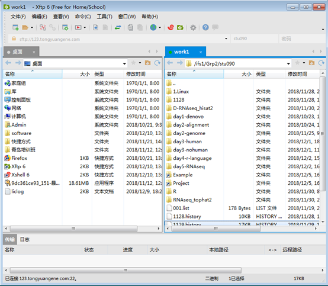

# 传输文件 {#sec-transfile}

> 通常的生物信息分析流程为将测序数据传输到服务器端进行分析，成为上载，得到结果之后传输到本地客户端，成为下载。能够进行服务器与客户端进行文件传输的工具有很多，包括**termius**, **xftp**，**Filezilla**，**winscp**等。

## termius传输文件

最新版本的termius已经支持sftp文件传输了，之前只有pro版本才能使用。这里推荐使用termius进行文件传输。


图1 使用termius进行文件传输

## filezilla传输文件

Filezilla可以在windows，mac以及Linux下使用。 Filezilla下载地址：<https://filezilla-project.org/>


图2 使用filezilla进行文件传输

## xftp传输文件

xftp只能在windows系统使用，xftp和xshell工具同属于xmanager套件，配合使用非常方便。xftp可以用于本地端与服务器端之间通过sftp或ftp协议进行数据传输，包括上传和下载数据。xftp登录同样需要IP地址，账户，密码与端口号，sftp端口号为22，ftp为21。



图3 使用xftp与服务器间传输数据

## 命令行传输

scp是 secure copy的缩写, scp是linux系统下基于ssh登陆进行安全的远程文件拷贝命令。scp命令可以跨服务器之间传输文件，同样需要给定IP地址，账户密码。

```         
#scp上载文件
scp -r data/ meta@vip.tongyuangene.com:~ 
#scp下载文件
scp -r meta@vip.tongyuangene.com:/ifs1/Software/data ./
```

也可以使用sftp命令进行传输。使用方法类似

```         
sftp meta@vip.tongyuangene.com
#使用mget与put命令进行文件传输
```
