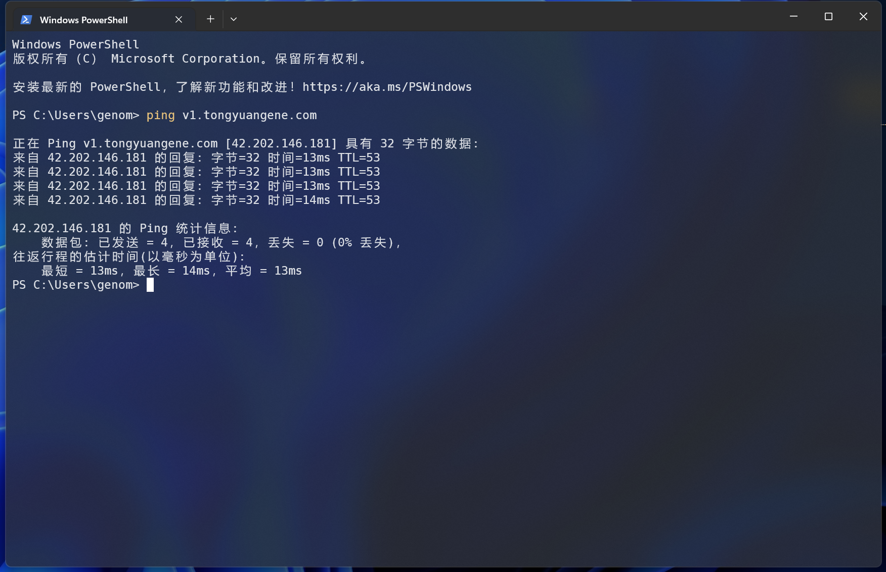
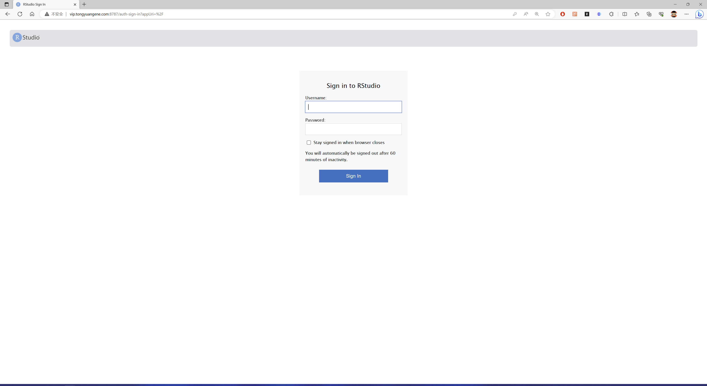
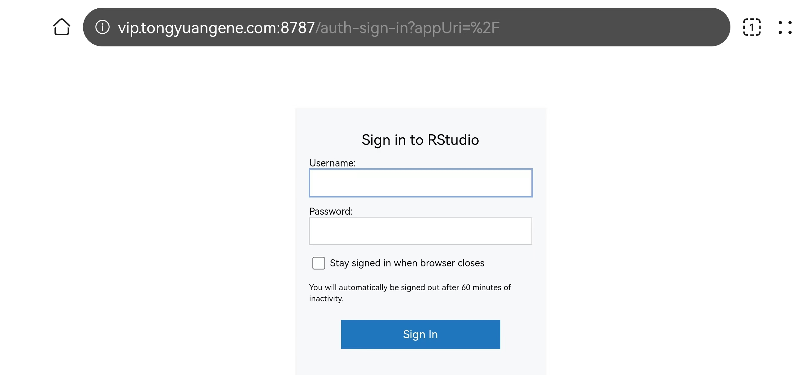

## 为何登录不上服务器？

服务器在使用过程中，偶尔会出现无法访问的问题，登录服务器需要**网络**，**IP地址**，**用户名**，**密码**这四个条件。也到无法访问的情况，需要去排查具体的影响因素，通常是网络问题。

### ping测试网络

首先确保自己网络是连通的，自己网络连接了互联网，浏览器访问下baidu测试。也可以通过ping命令。打开windows命令行，使用ping命令，服务器IP地址即可。如果能ping通，则证明网络没有问题。

```{r}
#| label: fig-ping
#| echo: false
#| fig-cap: windows命令行模式下ping测试网络连接


```

## 通过网络应用测试

如果服务器里提供了网络应用，例如web服务等，可以通过浏览器访问web服务器，测试网络是否连通。例如，服务器里提供了rstudio-server服务器，可以通过浏览器访问rstudio-server服务器。如果可以访问，则证明网络，账户，密码没有问题。

```{r}
#| label: fig-rstudio
#| echo: false
#| fig-cap: 通过浏览器访问Rstudio-server测试网络


```

## 更换手机网络

如果确定是网络问题，可以更换一下网络访问，现在每人都有一个手机网络。例如可以通过手机浏览器访问rstudio-server web服务器，如果可以访问，则代表服务器可以连接，本地网络问题。

```{r}
#| label: fig-shouji
#| echo: false
#| fig-cap: 通过浏览器访问Rstudio-server测试网络
#| fig-cap-location: bottom


```

## 其他问题

-   账户密码问题：注意账户拼写，密码注意大小写，中英文字符，还有端口号，默认是10088。

-   网路问题：一些单位外网无法访问内网服务器，只能在单位内部访问，访问内网需要专门VPN。

-   端口号：SSH默认端口号为22，一些单位将22端口号封锁。

-   网络拥堵：访问服务器网络很重要，很多情况下都是因为网络问题造成无法访问。

# 常见问题 {#sec-faq}

**1.在国外可以访问服务器吗？**

可以，只要有网络就可以访问。

**2.如何查看自己所剩磁盘空间大小？**

可以使用quota命令查看，剩余磁盘大小

```         
quota -uvs 
```

也可以使用du命令查看已使用磁盘大小

```         
du -sh ~
```

**3.磁盘空间不够了，怎么办？**

根据个人分析需求选择适合自己的服务器类型，可以选择增加，1元1g 每月，比如要增加500G，则需要每月付费500元。

**4.为何传输数据速度很慢？**

由于物理距离原因，目前从国内下载国外数据速度一般比较慢，即使用个人电脑下载速度也慢，推荐使用aspera进行下载。上传数据到服务器，国内上传速度一般可以达到**3-5M/s**，网速传输速度也和个人宽带条件有关，如果个人带宽较小，比如10M，那么传输速度只能达到几百K。

**5.如有有需要的软件没有怎么办？**

强烈推荐每个用户自行安装`bioconda`，通过bioconda可以很容易很方便的自己需要的软件。如果bioconda不支持，可以尝试`apptainer`安装。
