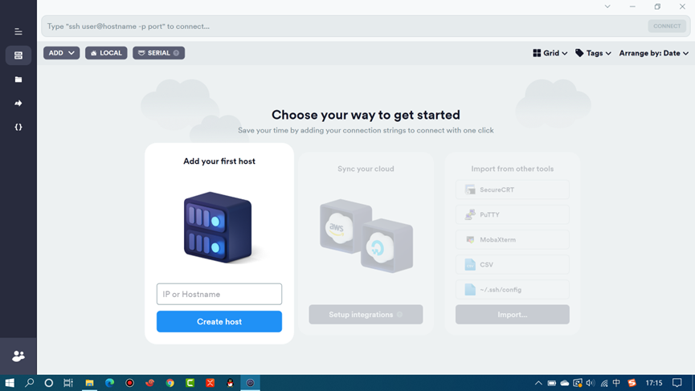
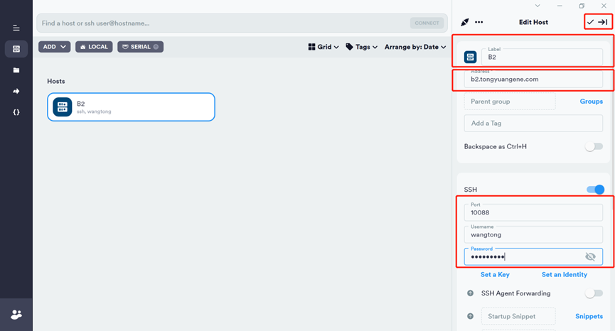
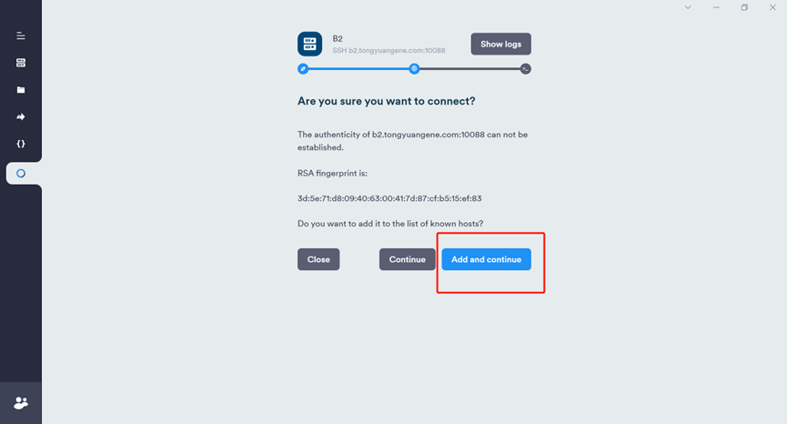
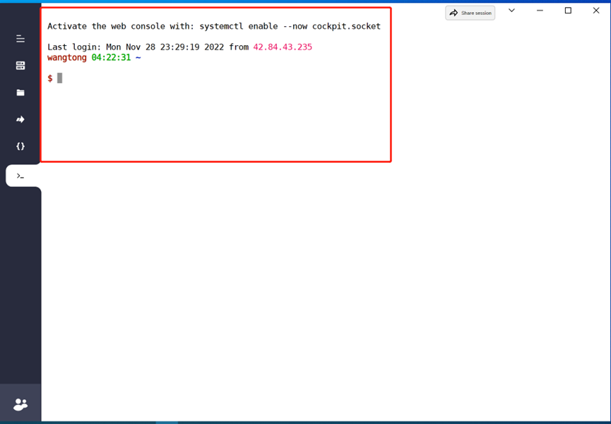
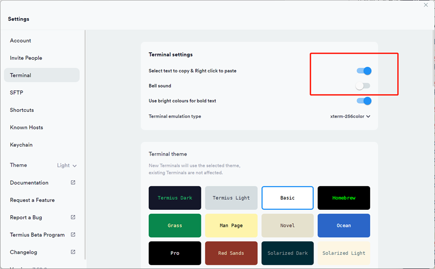
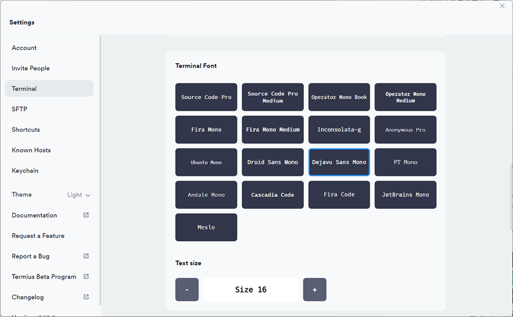
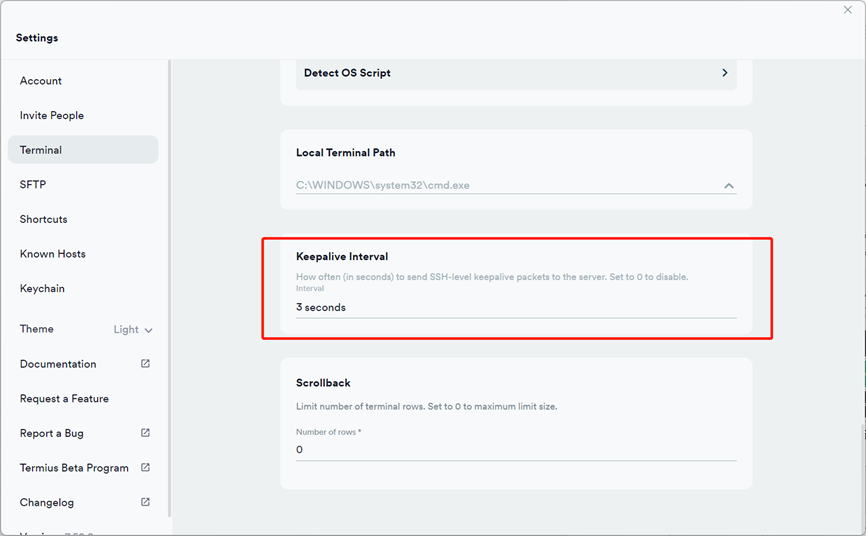
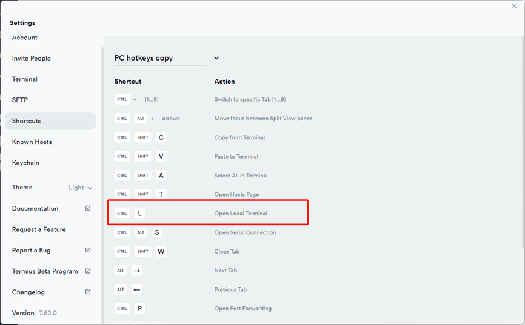

# 2.1 Termius使用

> 能够实现ssh远程登录服务器的工具有很多，有收费的也有免费的，目前我们首推termius。Termius是一款支持SSH与Telnet协议的连接工具，支持windows系统，macos，Linux，iOS以及Android等几乎支持主流平台。且内置sftp，使用一个工具即可同时登录服务器和传输文件。


## termius简介

Termius是一款支持SSH与Telnet协议的连接工具，支持windows系统，macos，Linux，iOS以及Android等几乎支持主流平台。且内置sftp，使用一个工具即可同时登录服务器和传输文件。之所以选择termius，主要是因为termius有以下优点：

1. 提供**免费**版本
2. 跨平台，支持 windows，macos，linux，iOS 以及Android；

3. 内置sftp，一个工具完成命令行仿真和文件传输；

4. 小巧美观，功能强大；

5. 免费的功能已足够强大，学生用户可以申请全功能版本。

## 下载安装

软件下载地址

windows版本下载地址: <https://www.termius.com/windows>

macos版本下载地址: <https://termius.com/mac-os>

**目前termius版本需要注册账号，可以使用个人邮箱进行注册。**

这里面需要注意，目前macos系统从AppStore下载的termius无法读取本地文件，因此强烈推荐从**官网**下载进行安装。根据个人系统进行下载。目前termius有四种套餐可供选择，一般用户选择免费版本即可，第一次现在安装提供15天Pro版本试用，到期后直接选择降级到Starter版本即可。


```{note}
注意:软件厂商会对软件策略进行调整，当你看到这篇内容的时候有可能发生变化了，不要刻舟求剑。
```


## termius使用

1.  打开termius，新建一个host



2. 填写标签，ip地址，端口号，用户名和密码

   登录信息需要自己有服务器账号，不要照抄图中案例内容。



3、双击新建host，选择图中蓝色部分



4、出现图中界面，完成登录



## termius设置

termius的设置主要包括字体，字号，主题，鼠标右键粘贴等内容。

1. termius设置右键粘贴功能以及关闭响铃



2. 设置字体字号



3. 设置不间断会话



4. 修改默认ctrl+L快捷键



##  termius文件传输

