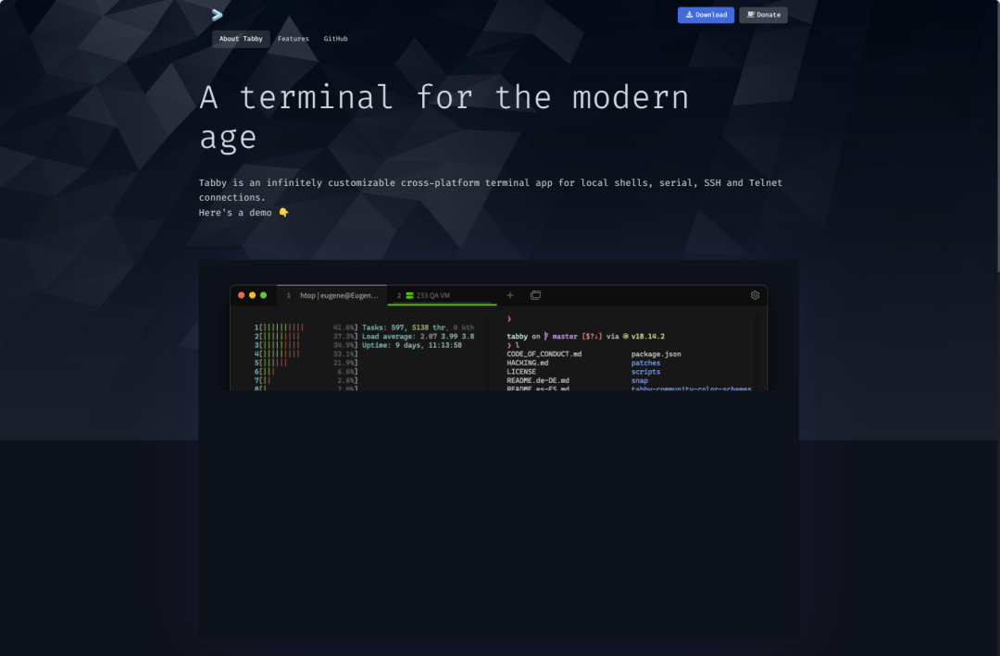
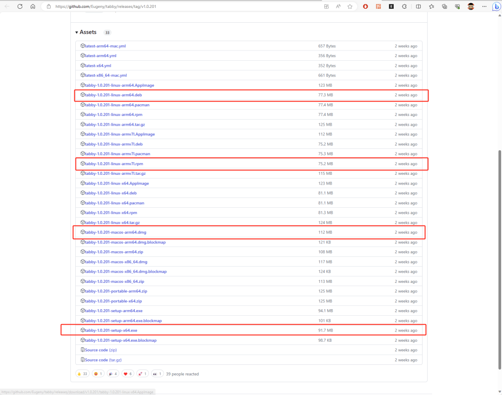
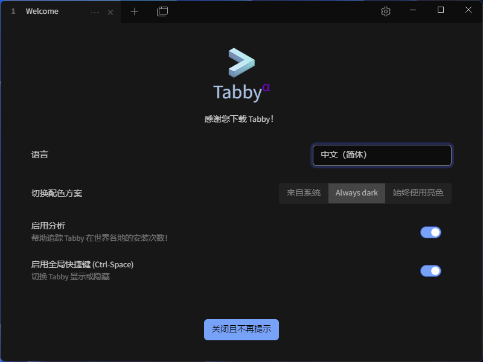
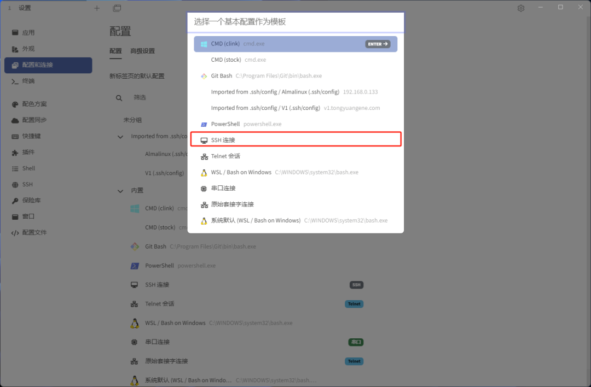
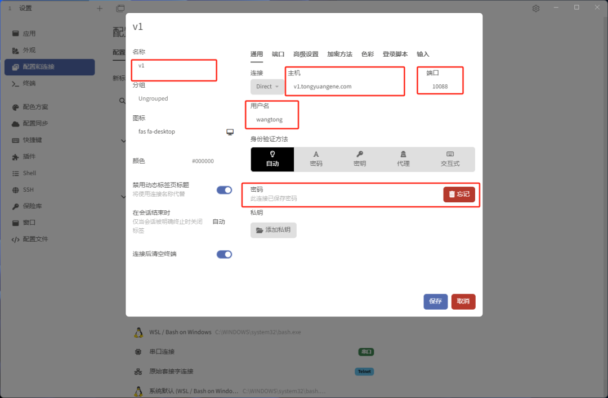
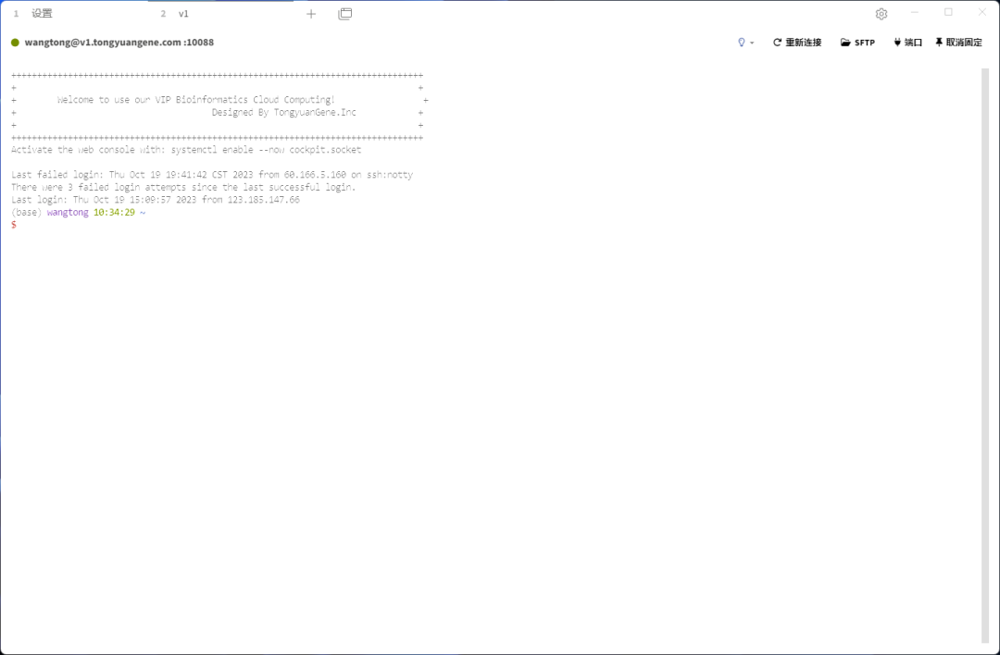
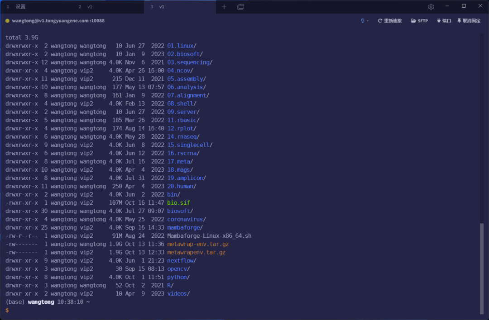
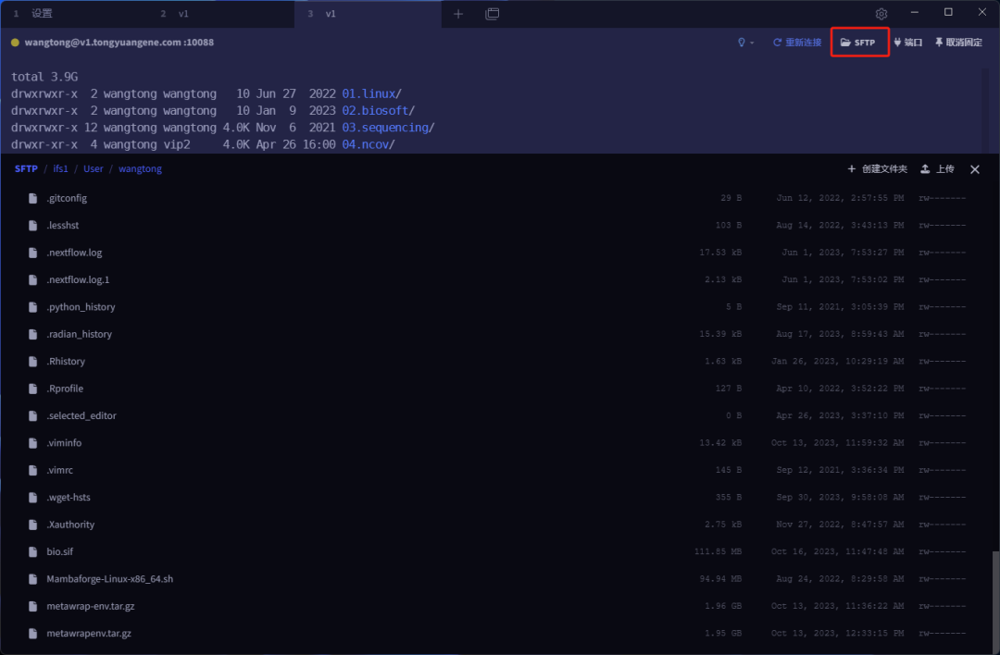

# tabby

> 目前我们上课时用的服务器SSH连接工具是termius。主要是因为termius跨平台，免费，美观，支持sftp。免费版虽然够用，但有些特别好的功能需要购买订阅版。由于使用windows系统，有时候也会使用xshell套件。xshell是windows平台最好用的ssh工具了，不过总是要更新，且每次退出要有一个提示框。今天为大家介绍另外一款跨平台，免费的全功能版本SSH工具tabby。

## tabby简介

tabby是一款跨平台的现代化SSH工具，它是完全开源免费的，支持多种链接协议。

官网：<https://tabby.sh/>

**功能亮点：**

- 在 Windows、Mac 和 Linux 上运行
- 具有连接管理器的集成 SSH 客户端
- 集成串行终端
- PowerShell，PS Core，WSL，Git-Bash，Cygwin，Cmder和CMD支持
- 完全支持Unicode，包括双角字符
- 通过 SFTP 和 Zmodem 从 SSH 会话到SSH会话的文件传输
- 主题和配色方案
- 完全可配置的快捷键和多弦快捷键
- 记住您的选项卡和拆分窗格
- Windows上适当的shell体验，包括选项卡完成
- 用于 SSH 机密和配置的集成加密容器

## 安装使用

下载地址：https://github.com/Eugeny/tabby/releases/latest

**1. 打开tabby，选择中文语言**

**2.创建SSH链接**

**3.输入IP地址，用户名以及密码**

**4. 登录服务器**

## 个性化设置

设置主题，字体型号，字体大小等。

## 传输文件

tabby支持sz/rz命令传输小文件，也支持sftp传输文件。

