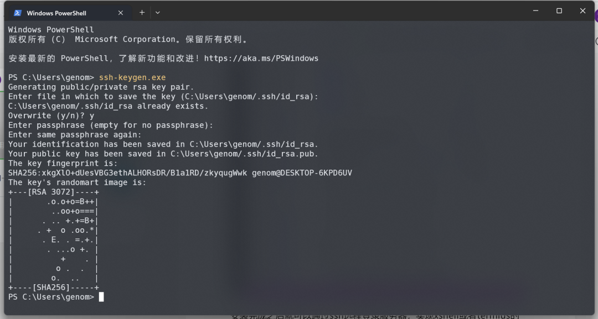

# 2.4 vscode

> “工欲善其事必先利其器”，一款优秀的软件工具可以极大的提供工作效率，让人赏心悦目，心旷神怡。而vscode就是一款非常优秀的工具，建议每一台电脑中都应该安装一下。

##  vscode简介

在做生物信息分析过程中，经常需要查看序列，编辑文本，修改程序代码等，这个过程中就需要使用文本编辑器。一般系统自带的文本编辑器都过于简单，例如windows的记事本等，**不能打开大文件**，不能识别不同换行符，不支持语法高亮等，无法达到工作要求。优秀的文本编辑器有很多，例如收费的Utraledit，Sublime Text3，editplus等，免费的有notepad++，atom等，这里我们推荐使用微软推出的vscode编辑器，它的一个显著特性就是支持windows，mac和Linux多个平台，使用体验都差不多。安装完在图形界面下，可以使用右键快速打开多种扩展名的文本文件。


## 安装使用

软件的安装和使用比较简单，直接下载对应的系统版本即可。然后下一步下一步安装就行。这里需要特别注意，在安装第二步，最好将下面两项勾选上，这样做的目的是在鼠标右键会多处一个“**通过code打开**”的菜单，这样打开文件非常方便。
**下载地址：**<https://code.visualstudio.com/>


接下来在系统中，常用的文本文件都可以直接使用vscode打开了。比如windows系统中各种扩展名的文件，比如*txt，.log等，不需要都使用excel，word，记事本打开了。包括各种生物数据，fastq，fasta，gff，vcf，bed等格式，最好都使用vscode来打开，而不是记事本或word。


## 安装中文语言包

默认的使用语言是英文，如果不习惯看英文菜单，可以通过安装扩展包设置为中文菜单，也很简单。选择安装扩展包，左侧最下面的选项图标，然后搜索“Chinese”，点击安装，**然后重启**就可以了。


## 高亮生物数据

安装bioSyntax显示各种生物数据，没太多用处，就是开起来好看而已。


## vscode远程连接服务器

vscode通过插件功能，无所不能。首先，ctrl+shift+x，打开vscode扩展，搜索Remote Development插件，该插件带有remote-ssh功能。


安装完成之后就可以通过ssh远程登录服务器，实现xshell或者termius的功能。


## 自动登录

该过程不是必须，为了使用方便，可以设置自动登录功能，如果不设置，也可以每次输入密码，windows系统打开终端命令行，通过ssh-keygen生产密钥对，将公钥 上传至服务器。在windows终端中输入ssh-keygen命令



然后将id_rsa.pub文件找到，上传到服务器。

```shell
"C:\Users\xxxx\.ssh\id_rsa.pub"
```

其中xxxx为用户名，你自己电脑更改为自己用户名，不要教条的直接复制xxxx。

在服务器端，将该文件追加写入authorized_keys

```shell
(base) wangtong 09:45:00 ~/.ssh
$ cat id_rsa.pub >>authorized_keys
```

我们服务器中默认目录不在/home下，且开启了selinux，所以需要修改一下权限。

```shell
#修改权限
chcon -R -u system_u -t ssh_home_t .ssh/
```

**配置config文件**

最后在本地vscode配置文件config中添加本地密钥文件。

```shell
# Read more about SSH config files: https://linux.die.net/man/5/ssh_config
Host N1
 HostName n1.tongyuangene.com
 User wangtong
 Port 10088
 IdentityFile "C:\Users\xxxx\.ssh\id_rsa"
```

## ssh远程登录

选择左侧图标，双击刚才配置好的ssh，观察左下角登录状态，如果提示输入密码，则是自动登录没有配置成功，输入密码即可。


这样就登录成功了。`ctrl+`快捷键即可打开远程终端。使用起来与termius差不多。


## 配置python环境


利用vscode远程连接服务器使用功能python非常方便，不仅可以直接运行python，还可以打开jupyter，进行交互式数据分析。

**1.首先安装mambaforge**

```shell
#1 下载bioconda
wget https://github.com/conda-forge/miniforge/releases/latest/download/Miniforge3-Linux-x86_64.sh

#2 安装
sh Miniforge3-Linux-x86_64.sh
source ~/.bashrc

#3 添加软件源
conda config --add channels bioconda 
```

**2.安装python环境**

```shell
#1 创建虚拟环境
mamba create -n python 

#2 安装python以及数据分析包
mamba install -y numpy
mamba install -y pandas
mamba install -y matplotlib
mamba install -y seaborn
mamba install -y scipy
```

**3.安装python，jupyter插件**

通过菜单直接打开python文件或者jupyter文件，接口直接进行调试运行。如果运行不了，就需要在服务器端也安装python和jupyter扩展。


## 配置R环境

虽然rstudio-server已经非常好用了，但rstudio-server只能使用一个服务器管理员安装的R。如果想**在图形化模式下使用自己安装的R**，则可以通过vscode实现。

**1.配置R环境**

这里同样通过bioconda来管理R以及R包。

```shell
#1 配置R
mamba install -y r-base
mamba install -y radian
mamba install -y r-languageserver
mamba install -y r-httpgd
conda install r-irkernel
```

**2.安装R插件**

这里安装的是配合远程SSH的插件。


**3.配置vscode**

vscode目前比较麻烦的就是需要通过文本修改一下配置，这对于一些新手不太友好。


- 搜索"r.rterm"，
- 在r.term. Linux 中输入radian路径
- 在r.rterm.option，删除--no-save,--no-restore，添加--no-site-file
- 勾选r.sessionWatcher，实现绘图IDE和查看数据框
- 勾选httpgd

**4.运行R**

正确完成以上配置，就可以直接在vscode中运行R，可以实现代码自动补齐，View()查看数据，显示绘图等。还可以通过设置键盘快捷键实现R赋值操作符以及管道操作符等。


