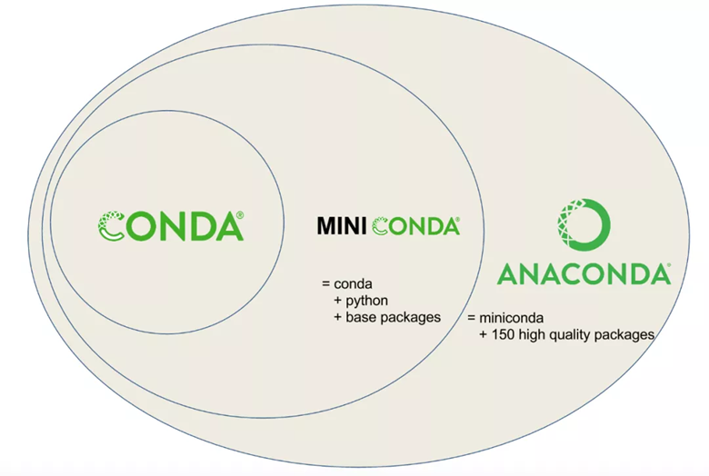

# 5.3 Bioconda

## 1 bioconda简介

bioconda是一个管理生物信息软件的一个工具软件，可以将bioconda当成生物信息软件的AppStore。它基于Anaconda可以进行生物软件的搜索，下载，安装，升级，删除等操作。通过一条命令即可完成绝大部分生物软件的安装。目前已经是最好的生物软件管理工具之一，目前支持超过7000多款生物软件的安装。

官方网址：http://bioconda.github.io/

目前已经有超过7000多款生物都几件可以通过bioconda直接安装。

https://anaconda.org/bioconda/repo

为什么要选择使用bioconda，因为其很好的解决了生物软件安装过程中的各种问题，主要包括以下几点：

1、自动解决了软件依赖问题，实现一条命令可以安装很多软件；

2、bioconda可以很方便进行软件升级；

3、无需管理员权限也可以安装很多软件；

4、可以同时管理软件的多个版本

5、所有软件安装在同一目录下，方便进行管理和迁移。

## 2 bioconda软件安装

要想使用bioconda来安装生物软件，首先要安装bioconda。bioconda来自与Anaconda软件，本质上只是Anaconda一个单独的生物软件源。经常看到Anaconda，Miniconda以及bioconda，三者之间有什么关系呢？

Anaconda： 集合了常用Python包的数据科学平台 （full）

Miniconda：精简版Anaconda （Lite）

bioconda： 专门用来管理生物软件 （定制版）

Anaconda和Miniconda是软件，bioconda只是一个特定的软件源。三者的管理工具都是conda命令。

                               

图 1 Anaconda，miniconda以及conda三者的关系

要想使用bioconda，需要三个步骤，下载软件，安装软件，添加软件源。

**1、下载安装：**

```shell
wget https://repo.continuum.io/miniconda/Miniconda3-latest-Linux-x86_64.sh 
```

**2、安装**

```shell
sh Miniconda3-latest-Linux-x86_64.sh 
source ~/.bashrc
```

**3、添加软件源：**

目前bioconda提供是两个软件源，分别是biconda和conda-forge，默认的defaults是用来管理python相关的包。bioconda是官方维护的软件源，conda-forge通道是社区维护的，包含很多不在默认通道里面的通用型软件。安装完成之后需要将这两个软件源都添加进来。

```shell
conda config --add channels bioconda 

conda config --add channels conda-forge
```

以上步奏的效果是在每个用户的家目录下创建一个.condarc文件，并将这些软件源写入该文件。

```
$ cat ~/.condarc
channels:
 - conda-forge
 - bioconda
 - defaults
```

 

**4、添加国内镜像（非必须）**

目前国内清华大学以及北京外国语大学等也提供biocodna的镜像，可以将这些镜像添加进来，替换官方镜像。但目前bioconda官方镜像速度还可以，且国内镜像如果有多人访问时会造成拥堵，反而更慢了，具体使用看个人需求，一般无需更换镜像。

```
#添加清华大学镜像
conda config --add channels https://mirrors.tuna.tsinghua.edu.cn/anaconda/pkgs/free/
conda config --add channels https://mirrors.tuna.tsinghua.edu.cn/anaconda/pkgs/main/
conda config --add channels https://mirrors.tuna.tsinghua.edu.cn/anaconda/cloud/bioconda
conda config --add channels https://mirrors.tuna.tsinghua.edu.cn/anaconda/cloud/conda-forge/
```

