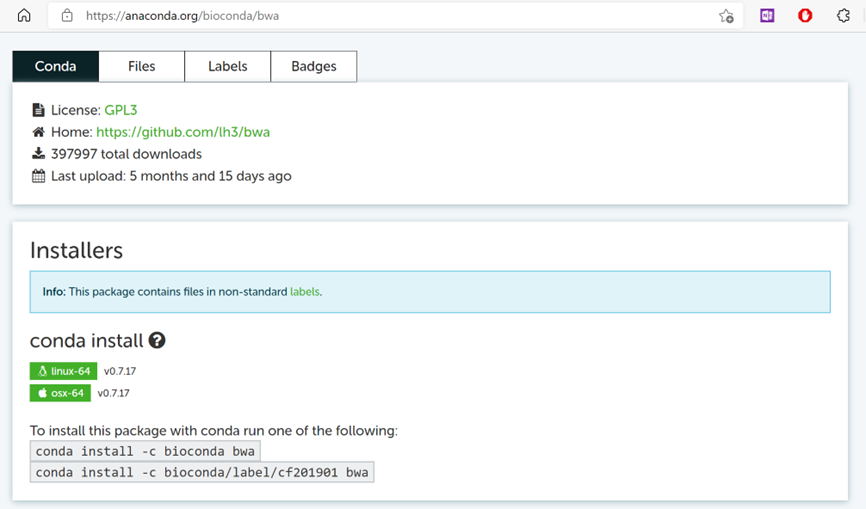

# 5.5 利用bioconda管理生物软件

## 1 bioconda基本命令
安装并且配置完bioconda之后，就可以使用bioconda来管理生物软件了。可以经行搜索（search），安装（install），升级（update），卸载（remove）等操作。下面给出bioconda一些常用功能。

表 1 **bioconda****常用选项参数**

| info      | 显示某个软件信息           |
| --------- | -------------------------- |
| help      | 给出帮助信息               |
| list      | 查看所有安装的软件         |
| search    | 查找安装的软件             |
| create    | 创建一个新的conda环境      |
| install   | 安装需要的软件             |
| update    | 对软件进行升级             |
| upgrade   | 与update相同               |
| remove    | 卸载已经安装的软件         |
| uninstall | 与remove相同               |
| config    | 配置软件源                 |
| clean     | 移除没用的软件安装包和缓冲 |
| package   | 低配版软件工具，还在实验中 |

 

安装并添加软件源之后就可以使用bioconda进行软件安装了。首先根据软件名进行搜索，如果可以搜索到，就可以使用install进行安装了。

不过由于bioconda目录结构过大，每个软件又有不同的版本，因此搜索速度较慢，最好直接知道软件名，或者通过网页端进行搜索。
                        

图 1 网页端搜索bwa软件结果

下面是bioconda管理软件的一些常用命令，大部分的conda命令可以替换为mamba。

```shell
#查看已安装软件  
conda list  

#搜索软件    
conda search bwa    
#安装软件    
conda install -y bwa=0.7.17    
#升级软件  
conda update bwa  
#移除软件  
conda remove bwa 
```
重新初始化
安装完这个版本bioconda（22.9.0）之后，再次安装软件就会出现命令行被清空的情况。只剩下一个（base），没有名称时间和目录。这个时候需要重新进行初始化。

```shell
#conda 初始化
conda init 
#刷新设置
source ~/.bashrc
```
## 2 使用bioconda安装常用软件
```shell
# 安装基础软件
mamba install -y bwa 
mamba install -y samtools
mamba install -y bcftools
mamba install -y blast 
mamba install -y blat 
mamba install -y mummer 
mamba install -y mafft 
mamba install -y muscle 
mamba install -y lastz
mamba install -y sratools
mamba install -y seqkit
mamba install -y seqtk
mamba install -y bedtools
mamba install -y bedops
mamba install -y gfatools
mamba install -y circos
mamba install -y entrez-direct
mamba install -y emboss

#安装数据质控软件
mamba install -y fastqc multiqc 
mamba install -y trimmomatic
mamba install -y fastp
mamba create -n nanoplot -y nanoplot

#安装基因组拼接相关工具
mamba install -y velvet
mamba install -y flye
mamba install -y miniasm
mamba install -y canu
mamba install -y megahit
mamba install -y spades
mamba install -y quast
mamba install -y racon
mamba install -y miniasm
mamba install -y nanopolish

#安装基因功能分析软件
mamba install -y prodigal
mamba install -y glimmer
mamba install -y augustus
mamba install -y trf
```