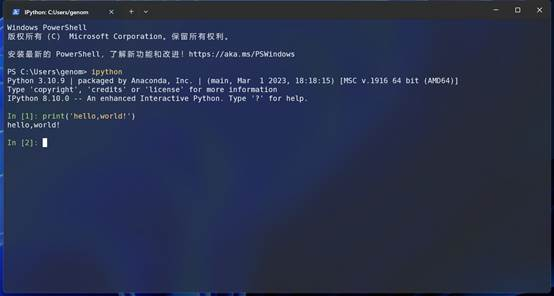

# 8.1 python语言简介

> 本节内容，我们来介绍一下python语言

## python语言简介

Python由荷兰国家数学与计算机科学研究中心的吉多·范罗苏姆于1990年代初设计，作为一门叫做ABC语言的替代品。之所以叫做Python，是因为这个名字是来自于20世纪70年代MontyPython六人喜剧团体创作的英国电视喜剧片《蒙提·派森的飞行马戏团》 (MontyPython and the Flying Circus)。

python的英文释义是蟒蛇，因此，python的吉祥物是蟒蛇，类似于perl语言的骆驼。所以一般python数据的封面都是一条蟒蛇。


图1 python作者Guido Van Rossum

Python提供了高效的高级数据结构，还能简单有效地面向对象编程。Python语法和动态类型，以及解释型语言的本质，使它成为多数平台上写脚本和快速开发应用的编程语言，随着版本的不断更新和语言新功能的添加，逐渐被用于独立的、大型项目的开发。

Python在各个编程语言中比较适合新手学习，Python解释器易于扩展，可以使用C、C++或其他可以通过C调用的语言扩展新的功能和数据类型。 Python也可用于可定制化软件中的扩展程序语言。Python丰富的标准库，提供了适用于各个主要系统平台的源码或机器码。（百度百科）


图 2 python官网

python官网：<https://www.python.org>

##  python优点

- 文本处理
- 开发流程
- 爬虫
- Web 后端开发
- 自动化运维、
- 数据科学
- 机器学习
- 深度学习
- 扩展模块多

## python缺点

- 运行效率低
- 版本兼容性差
- 扩展模块多，学习成本大
- 不同包之间语法结构不一致

## python生物信息编程应用

python生物信息编程主要用于以下方向：

1. 处理生物数据，开发自己的生物数据分析方法；
2. 批量生成脚本；
3. 开发自动化流程；
4. 处理其他生物软件结果文件；
5. 安装配置使用调试python生物软件；
6. 读懂代码；
7. python数据分析机器学习


## python两种运行方式

###  脚本式

将要运行的代码写入文件中，一般是文本文件，例如新建一个py01.py文件，然后将要运行的代码写入文件中，保存文件，然后在命令行通过python解释器来运行。

```shell
print('hello, world!')
```
在系统终端中运行
```shell

$ python py01.py

$ hello,world!
```


在文件中可以添加一种成为“shebang”或者“hasbang”的开头，用于指定默认情况下运行给定脚本的解释器。添加了“shebang”，则无需指定解释器
```python

#!/usr/bin/python

print('hello, world!')
```


直接运行
```

$ ./py01.py

$ hello,world!
```

脚本语言无需编译即可直接运行，如果是编译型语言，例如c语言，则需要首先编译程序，然后才能运行。

脚本式可以一直记录代码，不断修改，调试，比较适合开发应用程序，进行自动化和批量化运行。对于数据分析交互式更加适合。

### 交互式

交互式类似于Linux Shell交互环境，通过与解释器进行交互来运行，输入一条命令，通过运算立刻返回结果。“交互式”可以很方便进行数据探索，更加适合进行数据分析。python数据分析可以通过ipython或者jupyter进行交互式数据分析。



图 3 ipython交互式运行

脚本式与交互式二者并不矛盾，可以首先使用交互式进行数据探索，当运行完成之后可以将整个数据分析过程整理为一个脚本文件。


## python开发环境

1. python官方IDLE：<https://www.python.org/>
2. ipython：<https://ipython.org/>
3. Anaconda：<https://www.anaconda.com/> 
4. Jupyter：<https://jupyter.org/>
5. PyCharm：<https://www.jetbrains.com/pycharm/>
6. spyder：<https://www.spyder-ide.org/>
7. Rstudio：<https://posit.co/>
9. vscode：<https://code.visualstudio.com/docs/languages/python>
10. 终端模拟器：Linux Shell，windows CMD，macos终端