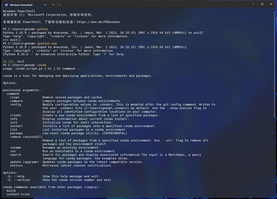

# 8.2 python分析环境搭建

> 本次内容我们介绍一下如何搭建python分析环境

##  Anaconda简介

Anaconda是一家数据科学公司，主要业务包括为企业提供基于python的商业数据科学分析支持。Anaconda是该公司的商标，也是产品名称。Anaconda既有免费的产品也有付费产品和服务。

https://www.anaconda.com/about-us

Anaconda也是一个免费的开源的数据科学分析平台。它将数据科学中的很多工具集中在一起，现在除了支持python之外，同事也支持R语言，Julia，Octave等语言。在生物信息分析中常用的bioconda，也是基于Anaconda来构建的。


图 1 Anaconda内置很多数据分析模块

## 为什么选择Anaconda？

使用Anaconda可以非常方便的配置好python数据科学环境。Anaconda支持windows，macos以及Linux。自带超过1000多个python数据分析的包，一次安装即可使用。最重要的是，这些包之间一般不会有兼容性问题。没有的python包也可以使用conda命令进行管理。同时也支持虚拟环境，可以非常方便的解决python版本以及兼容性问题。

此外，Anaconda3自带了python，ipython，spyder，juypter等软件，使用起来非常方便。

```{note}

Anaconda是Python的一个完整发行版本，安装自带了1000多个开源包，如果不需要安装全部python包，也可以选择精简版的Miniconda。Miniconda仅仅包含python以及运行conda所需要的模块。
```


## 安装Anaconda

**1.选择适合自己系统版本**

https://docs.anaconda.com/free/anaconda/

https://www.anaconda.com/download#downloads

 


图 2 下载Anaconda

```{note}
Note：windows 7 系统只支持到2019.10版本
windows8系统支持到2022.10版本
https://repo.anaconda.com/archive/
```


 **2.双击安装包进行安装**

安装过程中默认是不添加到环境变量中，软件默认也不推荐加入，但这里面还是强烈推荐加入到环境变量中，这样在终端中就可以直接使用python，ipython，conda等命令。


图 3 加入环境变量

 

**3. 通过开始菜单启动Anaconda**


图 4 Anaconda启动界面

**4. 通过Anaconda Navigator启动**


图 5  通过Anaconda Navigator启动

**5. 通过终端直接启动**

直接在cmd终端中输入`python.exe`，`ipython.exe`，`conda`等命令直接使用。



图 6 通过终端使用python