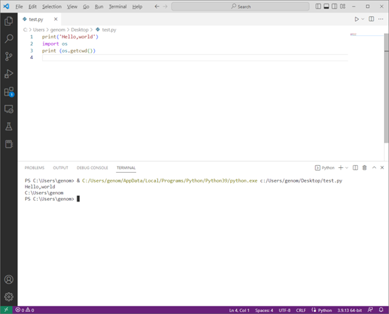

# 8.3 使用vscode运行python

> 虽然Anaconda中自带很多运行python的软件，包括ipython，jupyter，spyder等，但启动速度慢，操作复杂，不如使用vscode方便。这次内容我们来介绍一下如何在vscode中运行python。使用Anaconda+vscode搭建最佳python运行环境。


## vscode简介
Anaconda安装完成之后即可直接使用python进行数据分析了。不过Anaconda Navigator启动速度比较慢。这里强烈推荐使用vscode运行的方法。

vscode是微软公司出品的一款非常流行的文编编辑器，通过vscode强大的插件扩展功能。vscode几乎可以编辑全部编程语言。vscode+python也是当前很多人运行python的主流方法。相比与pycharm等著名python 集成开发环境，vscode有诸多优势。

- vscode是免费的，pycharm社区版免费，专业版需要付费订阅；

- 支持所有主流操作系统，不同系统之间使用体验一致；

- 启动速度快，占用资源少；

- 初学者使用友好，功能强大，很多程序员主编辑器；

- vscode作为文本编辑器，可以查看多种类型文本文件；

- vscode支持远程开发，本地编写代码，远程服务器运行，pycharm收费版才支持该功能；

- 在vscode也可以直接打开jupyter文件；

- 与github都属于微软产品，集成到github codesapce中；

- 可以在同一款编辑器运行python，使用jupyter数据分析以及使用Quarto编辑文档。

其实vscode与pycharm都非常强大，根据个人需求进行选择。

下面介绍一下如何在vscode中使用python。

## 下载vscode

根据个人系统选择对应的版本。

https://code.visualstudio.com/Download


图 1 下载vscode

 在安装vscode过程中，请将下面菜单全部勾选。


图2  安装vscode

##  安装插件

安装完vscode之后还不能直接运行python，需要安装一些插件，vscode可以通过安装插件实现各种各样的功能。

打开vscode，选择左侧菜单，或者直接按快捷键“ctrl+shfit+x”，在插件应用商店中搜索插件，如果有微软官方提供的版本，尽量选择官方版本。

下面列出一些常用的插件。

 

- Chinese：间体中文菜单

- Python：连接vscode与python解释器

- Jupyter：运行jupyter

- Remote Development：远程开发套件，通过ssh远程连接服务器

- Material Icon Theme：文件图标

- Python Indent：python：控制python缩进

- Snippets：自动补全代码

 


图 3 vscode安装python插件


## vscode中运行python

启动vscode，新建一个python文件或者jupyter文件。编辑代码，按Ctrl+F5快捷键运行python。

```python
print(‘Hello Python World!’)
```



图 4 vscode运行python

新建一个jupyter文件，选择Anaconda解释器，可以直接打开jupyter文件，支持绘图显示。


图 5 在vscode中运行jupyter

vscode本身可以创建多个窗口，一边显示代码，一边进行操作。macos系统默认不方便调整窗口分屏，可以直接在vscode中进行操作。这里我们在vscode中直接新建终端，然后右侧显示即可。这样也非常方便。


图 6 使用vscode分屏运行python

 

##  vscode设置

vscode可以进行进行多种个性化设置，之前只能通过更改json文件，现在也支持图形化设置。


图 7 设置为暗色主题

点击设置，选择python，可以重新设置python解释器，这里可以选择自己系统安装的Anaconda版本python。如果安装anaconda默认将python加入系统环境变量，这里可以不设置。


图8 修改默认python解释器

选择不同版本解释器，这样很多python数据分析的包都可以使用了。


图 9 通过右下角选择python版本

##  vscode快捷键

使用vscode一定要使用快捷键，这样可以极大提高编写代码的效率。windows中采用Ctrl，如果是mac系统，替换为Command。一些快捷键与微软其他程序相似。

| **快捷键**             | **作用**             |
| ---------------------- | -------------------- |
| **Ctrl + K，Ctrl + S** | 显示快捷键           |
| **Ctrl + K，Ctrl + T** | 更改主题             |
| **Ctrl +Win +Alt+ N**  | 新建文件             |
| **Ctrl + `**           | 打开终端             |
| **Ctrl + F5**          | 运行代码             |
| **Ctrl + [**           | 缩进和取消缩进代码块 |
| **Ctrl + /**           | 注释掉代码块         |
| **Alt + 上下方向键**   | 移动代码块           |
| **Ctrl + B**           | 隐藏资源管理器       |

 