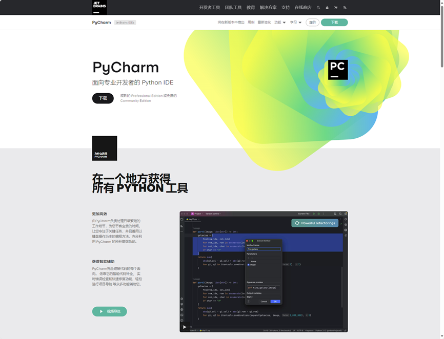
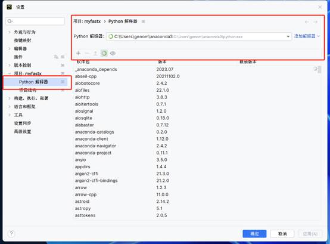
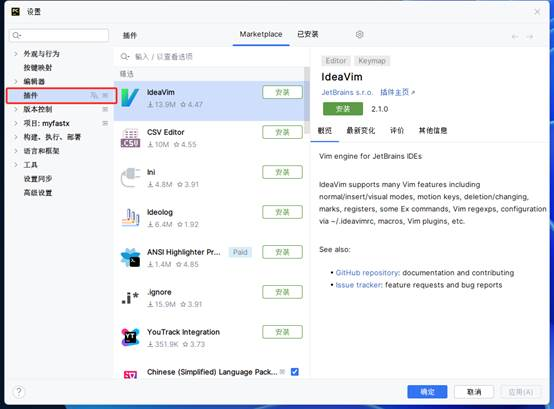
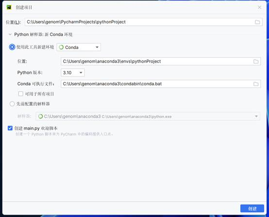
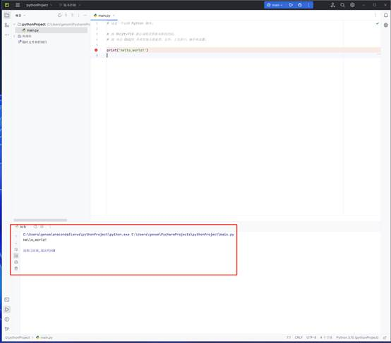

# 8.4 pycharm开发环境

> Anaconda + vscode是非常好的python运行环境，另外一个好用的是pycharm开发环境，这次内容来介绍一下如何配置pycharm运行环境。

##  pycharm简介

PyCharm是一款深受Python程序员欢迎的IDE，因为它是专门为使用Python编程而开发的。完整版需要**付费**订阅，但很多开发人员觉得免费的社区版（PyCharm Community Edition)也很有用。PyCharm是一种常用的Python IDE，带有一整套可以帮助用户在使用Python语言开发时提高其效率的工具，比如调试、语法高亮、Project管理、代码跳转、智能提示、自动完成、单元测试、版本控制。

pycharm官网：<https://www.jetbrains.com.cn/pycharm/>



图1 pycharm官网

## 下载安装pycharm

下载地址：https://www.jetbrains.com.cn/pycharm/download/?section=windows


图 2 pycharm

## 配置python解释器



图 3 添加python解释器


## 安装插件
与vscode类似，pycharm也支持安装插件。




图4 安装插件

 


图5 安装中文插件


图 6 Key Promoter X插件

pycharm插件Key Promoter X，可以提示快捷键。

## 在pycharm中运行python

**1. 新建项目**



图 6 新建项目

 

**2. 编辑代码**

```python
print('hello,world!')
```

**3. 运行代码**



图 7pycharm运行python

##  pycharm常用快捷键

表 1 python常用快捷键

| **快捷键**              | **作用**                 |
| ----------------------- | ------------------------ |
| **Alt+Shift+F10**       | 选择程序文件并运行代码   |
| **Alt+Shift+F9**        | 选择程序文件并调试代码   |
| **Shift+F10**           | 运行代码                 |
| **Shift+F9**            | 调试代码                 |
| **Ctrl+Shift+F10**      | 运行当前编辑区的程序文件 |
| **Shift + Shift**       | 搜索                     |
| **Ctrl + Alt + L**      | 格式化代码               |
| **选中代码tab**         | 向右缩进                 |
| **选中代码shfit + tab** | 向左缩进                 |
| **选中代码 """**        | 多行注释                 |

 

