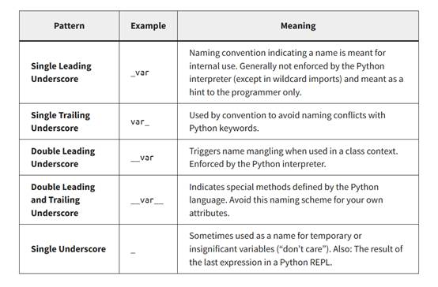

# 8.6 变量

> 变量是计算机编程中非常重要的一个概念。变量就是可以变化的量，与常量相反，例如一个固定的数字，字符属于常量。变量是计算机语言中能储存计算结果或能表示值的抽象概念。定义一个变量，其实就是一种使用方便的占位符，用于引用计算机内存地址，该地址可以存储运行时可更改的程序信息。

## 什么是变量？


变量需要赋值，这个值可以是一个数字，字符，也可以是更多内容。变量在程序运行过程中可以不停变化。一些程序语言在定义变量的时候需要声明变量类型，一些可以直接定义变量。

在python语言中，可以直接定义变量。不过需要注意，在定义变量的过程中需要遵守一定的规则。这与绝大部分的编程语言类似。

1. 可以用字母、下划线、数字组成；

2. 变量名只能由字母或下划线开头，不能以数字开头；

3. 变量名不能具有二义性；

4. 不要与系统内置关键字重名;

5. 命名中不能有空格，需要空格的地方换成下划线；

6. 变量中不要使用点号，点号在python中有重要作用；

python推荐驼峰命名法，小驼峰式命名法第一个单词以小写字母开始，后续单词的首字母大写，例如：firstName、lastName；

大驼峰式命名法，每一个单词的首字母都采用大写字母，例如：FirstName、LastName、CamelCase。

也可以经常使用下划线来分割单词，例如student_nam，name_length。

此外，不能使用系统内置的关键字来命名变量。下面代码可以查看系统中的内置关键字。

```python
import keyword

print(keyword.kwlist)

```

##  python下划线变量

在python中经常会看到很多包含下划线的变量，分为单下划线与多下划线，有些在前，有些在后。这些下换线变量有特殊含义。下面网站总结了python中下划线的变量含义。

表 3 python下划线的含义



链接地址：<https://dbader.org/blog/meaning-of-underscores-in-python>

 

## python中点的作用

python是一门面向对象语言，在python语言中点号”.”有重要作用，因此，不能在定义变量中添加点号，最好也不要在目录结构，文件名中包含点号。

python通过点号来访问一个对象的属性与方法。对象可以理解为一个人，属性是静态信息，例如姓名，性别，身高，体重，籍贯等。而方法属于动态信息，例如一个人会跑，跳，唱歌，听说读写等。

在python中，通过点号来访问一个对象的属性和方法，方法需要加括号。可以将点号翻译成“的”。例如定义一个对象小明（xiaoming），xiaoming.name翻译为小明的姓名。当在python中定义了一个变量之后，不同变量类型就不同的属性和方法了，可以通过dir（）函数可以查看一个对象全部属性与方法。
```python
\# 加载numpy模块

import numpy as np

\# 定义一个对象

a = np.arange(10)

\# 查看对象属性与方法

dir(a)

\# 通过点号查看a对象属性

a.dtype

\# 通过点号访问对象方法

a.sum()
```