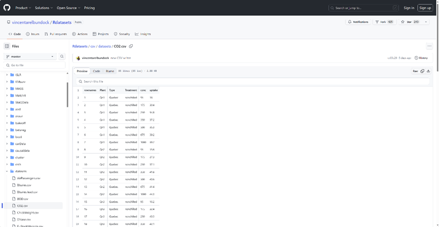
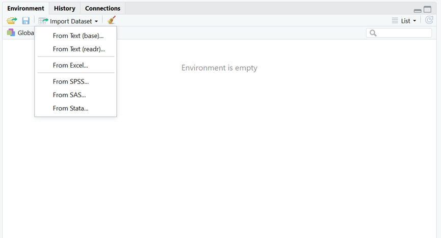

# 9.10 文件操作

> 一般情况下我们需要分析的数据都是存储在文件中，那么利用R分析数据的第一步就是将输入读入R语言。如果分析的数据是记录着纸质载体上，还需要将数据手动录入，然后保存为一个文件。在R中分析文件一般是文件，通常是以逗号分隔的csv文件，如果数据本身包含逗号，就需要使用制表符tab分隔的文件。有些情况下还有需要处理其他统计软件生成的文件，例如Excel生成的xlsx格式文件等。R可以很方便的读写多种格式文件。

## 1 结构化数据与非结构化数据

### 1.1 结构化数据

结构化数据指的是以固定格式和模式存储的数据，通常是表格形式的数据。这种数据在存在于关系型数据库中，并能够通过行号、列名等基于语义信息的标示来定位和访问。常见的结构化数据包括：数字、文字、日期等易于计算和存储的数据。

### 1.2 非结构化数据

与结构化数据相比，非结构化数据则是一种没有固定格式的无序数据。这些数据不适合在传统关系型数据库中进行存储，它们不能轻松地被行号或列名所标示和访问，没有固定的数据格式和组织形式。非结构化数据的数据分类很广泛，包括音频、视频、图像、电子邮件、社交媒体信息、博客、文件、日志、文档等等。

## 2常用文件类型 

**1、csv**

逗号分隔值（Comma-Separated Values，CSV，有时也称为字符分隔值，因为分隔字符也可以不是逗号），其文件以纯文本形式存储表格数据（数字和文本）。纯文本意味着该文件是一个字符序列，不含必须像二进制数字那样被解读的数据。CSV文件由任意数目的记录组成，记录间以某种换行符分隔；每条记录由字段组成，字段间的分隔符是其它字符或字符串，最常见的是逗号或制表符。通常，所有记录都有完全相同的字段序列。通常都是纯文本文件。

```R
name,age

张三,20

李四,30
```

 **2、tsv**

TSV：tab separated values；即“制表符分隔值”，如：

```R
name  age

张三   20

李四   30
```

**3、excel**

扩展名为*.xlsx，*.xls结尾，一个Excel文件成为一个工作簿，一个工作簿中可以包含多个工作表（sheet），读写Excel文件时需要单独制定读取哪张工作表。

**4、R自带数据格式**

除了常规各种文本表格之外，R还提供了两种文件格式，分别是RDS与Rdata格式。RDS可以用来存储单个数据集，Rdata可以存储多个R数据集。R内置格式的好处是对R软件支持更好，便于分享，且内置压缩算法，同样的数据内容，文件更小，便于传输。

## 3下载练习数据

如果需要一些结构化数据作为练习，可以使用R软件中内置的数据集。这些数据集都是一些非常经典的练习数据集，在python中也同样适用。下面的网址给出了R中2264个数据集，这些数据集包括R软件内置的数据集和一些R扩展包的数据集。

数据集地址：https://github.com/vincentarelbundock/Rdatasets

数据集简介：https://vincentarelbundock.github.io/Rdatasets/articles/data.html

 

```R
#使用git命令下载数据

git clone https://github.com/vincentarelbundock/Rdatasets.git
```

​                               

图 1 下载练习数据

## 4 Rstudio导入文件

可以通过Rstudio图形化的方式导入数据，提供了baseR与readr的方法，也可以直接导入excel文件。

 

图 2 通过Rstudio导入文件

data ：文件路径

header ： 第一行是否作为表头

sep ：分隔符

row.names： 哪一列作为行名

stringsAsFactors： 字符串是否作为因子

na.strings ：空值用什么表示