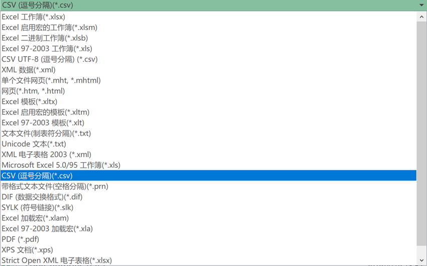

# 9.11 R读写文件

> 在Rstudio中，可以通过点击鼠标读入文件，在读入文件之前，需要对文件格式和内容有所了解。例如文件是否是一个标准的列表形式，也就是是否为结构化数据。文件存储格式，是二进制还是纯文本，如果是纯文本，文件扩展名是什么？用什么分隔符分割？文件有多少行，多少列？ 第一行是否为列名，第一列是否为行名？清楚了这些之后就可以读入文件了。

 R提供了大量读入文件的函数，这些函数通常是以read.*开头，后面接文件扩展，例如read.csv，read.xlsx，read.spss等。其中最常用的为read.table。read.table包括以下重要选项参数。

1、data：后面接文件路径，注意文件路径一定要加引号，注意windows系统文件路径的写法。

2、header：只接逻辑值TRUE或者FALSE，代表第一行是否作为表头，默认为FALSE。如果不设置，R会默认添加V1，V2等作为列名。

3、sep：分隔符，读入文件最重要的一个选项，如果设置错误，文件格式很乱，通常就是逗号“，”，制表符“\t”或者冒号“：”等。

4、row.names：后面接数字，指定哪一列作为行名，默认是0，通常可以设置为1。

5、stringsAsFactors：后面接逻辑值，R语言默认会将文件中的字符串自动转换为因子，如果不像这么做，可以设置为F。

6、na.strings：后面接字符串，指定文件中空值的表示方法。


## 1 读取csv文件

```r
x <- read_csv("mtcars.csv", na = "NA", comment = "#")

#获取工作目录
getwd()
#setwd()设置工作目录
#查看当前目录下文件
dir()
#读入一个文件，存入x变量  
x <- read.table("Rdata/CountMatrix.csv")  
#读入文件，指定分隔符
x <- read.table(file = "CountMatrix.csv",header = T,sep = ",")
#读入文件，指定分隔符和列名
x <- read.csv(file = "CountMatrix.csv",header = T,row.names = 1) 
#读入文件，指定分隔符、表头与行名以及字符串不作为因子
x <- read.csv(file = "Rdata/CountMatrix.csv",header = T,sep = ",",row.names = 1,na.strings = "NA",stringsAsFactors = F) 
无论使用哪个函数读取文件，R中读入的数据都存储为数据框这种数据类型。通常将文件保存为一个变量。读入文件之后，需要验证文件是否读入成功，通常使用head函数截取文件头部显示出来，判断格式是否正确，在Rstudio中也可以使用View()函数将全部内容显示出来。如果格式不正确就需要修改命令重新读取文件；如果没有问题，就可以对数据进行后续的分析了。
#查看数据结构
class(x)  
#查看文件头部
head(x)  
#查看文件尾部
tail(x) 
#查看行名，列名
rownames(x)  
colnames(x)
#View窗口中查看数据
View(x)
#查看数据属性信息
str(x)  
```

## 2写入文件
数据处理结束之后，需要将存储在变量中的结果保存到文件中，R提供了大量写入文件的函数，这些函数通常与read系列都是对应的，用法也类似使用起来也并不难。
```r
#写入文件
write.csv(x = dta,file = "matrix.csv",sep = ",",append = F) 
```
x：要写入文件中的数据集名字。
File：文件路径和文件名，注意加引号，需要自己给文件命名，注意扩展名最好与分隔符匹配。
row.names:是否包含行名
sep：分隔符，如果是csv文件，sep设置为逗号，制表符分割，则设置为“\t”
append:接逻辑值，是否追加写入。

## 3 读写excel文件
Excel是全球最流行的电子表格程序，即使你可以使用R语言处理所有的数据分析工作，但是总有一天你不得不处理别人传给你Excel生成的电子表格需要你帮忙处理。还好R可以很方便的处理excel的电子表格。
通常处理Excel表格有两种方法。
**方法一：另存为csv或者tsv**



图 1 Excel另存为csv文件
**方法二：readr，xlsx，openxlsx等包**
R中有大量可以读写Excel电子表格的包，使用方法与read.table()函数类似，只需注意Excel的电子表格分为工作簿与工作表，一个工作簿中包含多个工作表（sheet），因此需要指定读取工作簿中那个工作表，可以指定工作表的名字，也可以使用顺序号。

```r
#安装openxlsx包
install.packages("openxlsx")
#加载openxlsx包
library(openxlsx)
#读入excel文件，指定sheet号
x <- read.xlsx(file = "vlookup.xlsx",sheetIndex = 1,header = T)
#写入Excel文件，设置sheet名
write.xlsx(x = x,sheetName = "dta",file = "dta.xlsx",append = F)
```


## 4 读入纸质版表格

如果一个纸质版表格太大，不方便进行手动输入，可以采用扫描转换的方式。首先将表格扫描为excel格式，然后在读入python中。这里推荐使用一款布丁扫描的App。该款App目前可以免费使用。可以很方便的拍照识别表格，然后转换为Excel表格，识别率非常高。

                 

图 23 布丁扫描导入数据

## 5 其他R数据格式
除了常规各种文本表格之外，R还提供了两种文件格式，分别是RDS与Rdata格式。RDS可以用来存储单个数据集，Rdata可以存储多个R数据集。R内置格式的好处是对R软件支持更好，便于分享，且内置压缩算法，同样的数据内容，文件更小，便于传输。
```r
?iris
head(iris)
getwd()
dir()
saveRDS(iris,file="iris.RDS")
rdsdata <- readRDS("RData/iris.RDS")
#Write RData file
load(file = "RData/Ch02.R")
save(iris,iris3,file = "iris.Rdata")
save.image()
```
