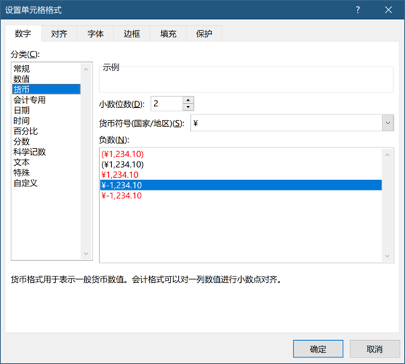

# 9.12数据结构

> 在使用R语言过程中，每一步中都需要关注R语言的数据结构。数据结构是R语言中最重要的内容，也是最难的一部分，学会了这部分之后，R语言就不难了。很多时候，函数无法运行，都是因为数据结构的问题。在学习R语言数据结构之前需要首先了解下数据的类型。

## 1数据类型

数据类型主要表示数据代表哪种内容，是字符串还是数值，逻辑值，或者时间日期等。数值可以用于计算，字符串不能用来计算，逻辑值用来判断等。

​                               

图 1 Excel中数据类型

 

表 1 数值类型

| **类型**        | **说明**                      |
| --------------- | ----------------------------- |
| 字符(charactor) | 常常被引号包围                |
| 数值(numeric)   | 实数向量                      |
| 复数(complex)   | 复数向量                      |
| 逻辑(logical)   | 二元逻辑向量(T=TRUE, F=FALSE) |

## 2常用数据结构

R的数据结构主要包括以下几种，每一种都有固定的用处，学习R语言需要非常熟悉每一种数据结构的特点。

表2 R中常用数据结构

|       | **数据结构**       | **说明**                               | **允许多种类型** |
| ----- | ------------------ | -------------------------------------- | ---------------- |
| **1** | 向量(vector)       | 最基本的类型                           | **否**           |
| **2** | 因子(factor)       | 表示类别/分类数据                      | **否**           |
| **3** | 数组(array)        | 带下标的多维数据集合                   | **否**           |
| **4** | 矩阵(matrix)       | 二维数组                               | **否**           |
| **5** | 数据框(data frame) | 行和列组成的表，每列可以是不同数据类型 | **是**           |
| **6** | 列表(list)         | 不同对象的有序集合                     | **是**           |
| **7** | 时间序列           | 根据时间顺序排列的数据                 | **是**           |
| **8** | **类**             | **不同数据组合**                       | **是**           |

## 3内置数据集

R 语言的一个好处是内置了大量数据集，一般R扩展包也包含数据集，这样无需自己准备输入文件，可以很方便的重复案例的内容。启动R之后，默认已经加载了datasets包，里面包含了大量数据集，使用data()函数可以显示所有数据集。直接敲数据集的名字就能够打印出数据集的内容，内置数据集与自己通过文件将数据读入R中，存储为变量效果上是一样的。

 

```
# 显示所有内置数据集 
data() 

#加载扩展包数据集 
data(package = "MASS")  
data(package = "ggplot2") 
```

