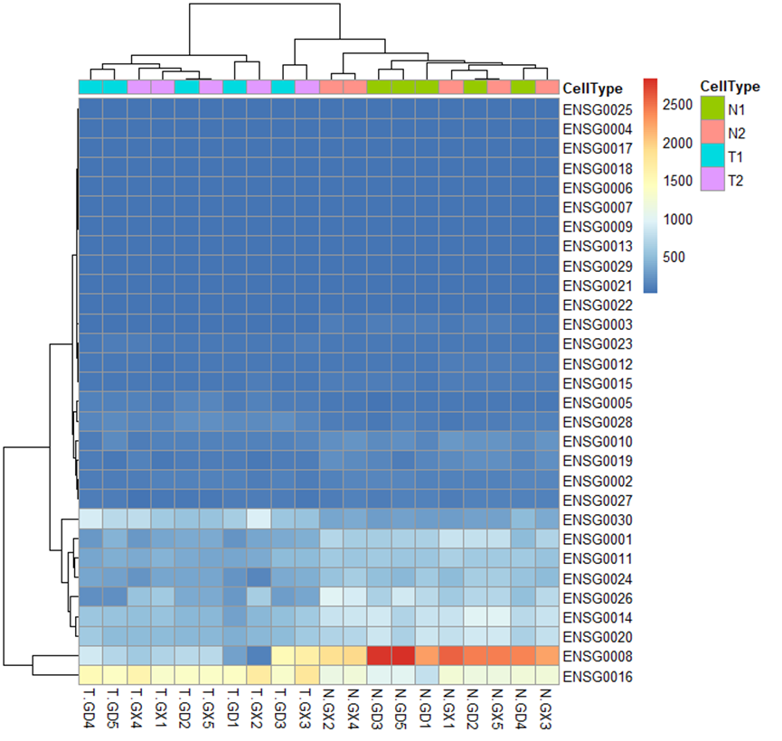
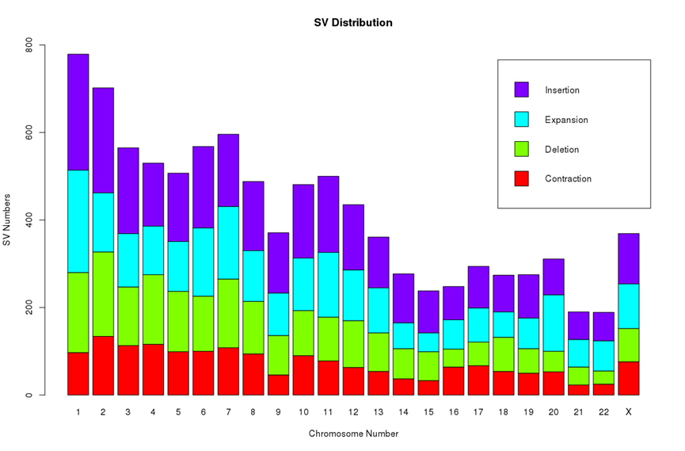

# 9.14 矩阵

> 矩阵（Matrix）是一个按照长方阵列排列的复数或实数集合。向量是一维的，而矩阵是二维的，需要有行和列。矩阵是R语言中使用较多的一种数据结构，矩阵分为数值矩阵和字符串矩阵，常用的是数据矩阵，基因的表达数据为数值矩阵。矩阵有两大作用，一个是用来计算相关性，另外可以用来绘制热图。

## 1 创建矩阵

```r
state.x77  
m <- matrix(1:20,nrow = 4,ncol = 5)  
rowSums(state.x77)  
colMeans(state.x77)  
cor(state.x77)  
```


## 2 矩阵索引

矩阵属于二位数据，需要给定行列的。

```r
state.x77
state.x77[1,2]
state.x77[1,]
state.x77["Alabama",]
rownames(state.x77)
colnames(state.x77)
```

## 3 利用矩阵绘制热图



图 1利用pheatmap绘制热图

R非常擅长绘制热图，基础包中的heatmap()可以直接绘制热图，gplots 包 heatmap.2()也可以绘制热图，pheatmap包 pheatmap()函数可以绘制更加优雅的热图，ComplexHeatmap包可以绘制复杂的热图。
```r
# 利用pheatmap绘制热图
#install.packages("pheatmap")
library(pheatmap)
x <- read.csv("Rdata/heatmap.csv",header = T,row.names = 1)
class(x)
pheatmap(x)
annotation_col <- data.frame(CellType=factor(rep(c("N1","T1","N2","T2"),each=5)))
rownames(annotation_col) <- colnames(x)
pheatmap(x,annotation_col = annotation_col)
pheatmap(x,annotation_col = annotation_col,display_numbers = T)
pheatmap(x,annotation_col = annotation_col,display_numbers = T,number_format = "%.2f")
pheatmap(x,annotation_col = annotation_col,display_numbers = T,number_format = "%.1f",number_color = "black")
```


## 4 分组条形图

​                               

图 2堆叠条形图

```r
x <- read.csv("Rdata/sv_distrubution.csv",header = T,row.names = 1)  
x  
barplot(x)  
barplot(as.matrix(x))  
barplot(t(as.matrix(x)))  
barplot(t(as.matrix(x)),col = rainbow(4))  
barplot(t(as.matrix(x)),col = rainbow(4),beside = T)  
barplot(t(as.matrix(x)),col = rainbow(4),legend.text = colnames(x))  
barplot(t(as.matrix(x)),col = rainbow(4),legend.text = colnames(x),ylim = c(0,800))  
barplot(t(as.matrix(x)),col = rainbow(4),legend.text = colnames(x),ylim = c(0,800),  main = "SV Distribution",xlab="Chromosome Number",ylab="SV Numbers") 
```