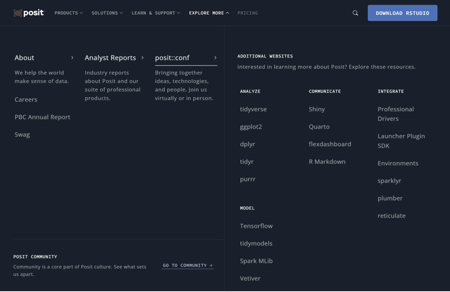
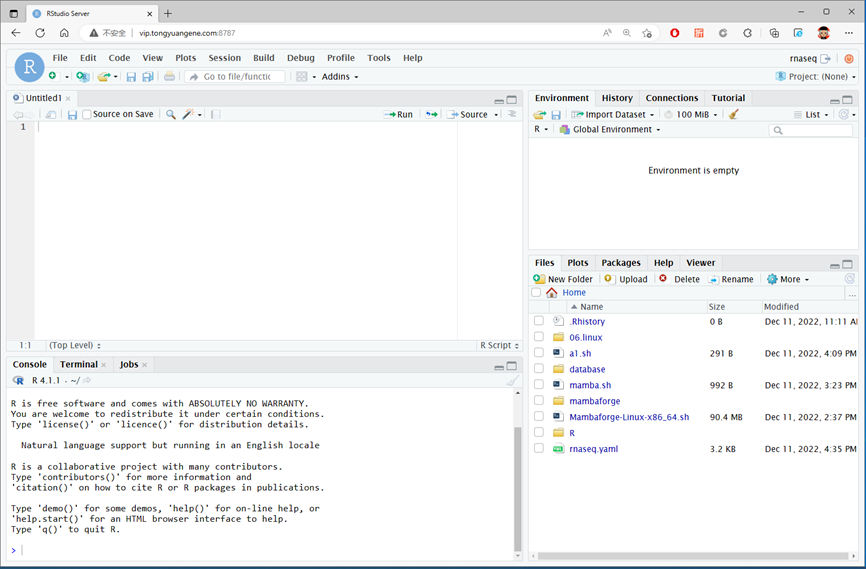

# 9.2 R分析环境搭建

## R软件安装

R语言支持windows，macos，linux等多个系统平台，提供图形化界面，下载和安装都不难，可以直接从官网进行下载。R语言平均每半年更新一个比较大的版本，中间也会有一些小版本，建议安装最新的版本。可以从R的官网下载软件安装包，此外，微软也提供一个版本的R软件，微软版本的R提供一些额外功能，例如对多线程支持更好。

**安装建议:**

1. R和Rstudio建议安装最新版本；
2. 选择最近的镜像地址；
3. 检查用户名是否为中文，Rstudio不支持中文；
4. 先安装R，在安装Rstudio；
5. 软件安装到系统默认目录下；
6. 如果有需要，安装Rtools；
7. 苹果电脑Arm芯片需要选择合适的版本。

R官网：< https://www.r-project.org/>

Microsoft R：<https://mran.microsoft.com/>

（截止到2023年5月，R最新版本为4.3.0）

​                      

图 1 R语言官网

### windows系统：

R下载地址：<https://cloud.r-project.org/bin/windows/base/R-4.3.2-win.exe>

Rtools下载地址：<https://cloud.r-project.org/bin/windows/Rtools/rtools43/files/rtools43-5863-5818.exe>

### Mac系统

Mac R：<https://cloud.r-project.org/bin/macosx/big-sur-x86_64/base/R-4.3.2-x86_64.pkg>

Mac **arm芯片**：<https://cloud.r-project.org/bin/macosx/big-sur-arm64/base/R-4.3.2-arm64.pkg>

## Rstudio软件安装

### 安装Rstudio

当前R语言的集成开发环境很多，但其中Rstudio可以说是最优秀的，Rstudio是R软件的一个集成开发环境，为R的使用提供了极大的便利，Rstudio本身并不集成R软件，需要首先安装R软件，Rstudio会调用R软件。Rstudio支持windows，macos，Linux等多个系统平台，并且提供免费的桌面版与服务器版本可供选择，服务器版本可以搭建多用户使用场景，直接通过网络浏览器访问R。此外，Rstudio公司还开发了大量R语言的扩展包，操作简单，功能强大，极大扩展了R语言的功能。目前Rstudio公司已改名Posit。

官方网站：<https://posit.co/>

下载地址：<https://posit.co/download/rstudio-desktop/>

windows：<https://download1.rstudio.org/electron/windows/RStudio-2023.09.1-494.exe>

macos：<https://download1.rstudio.org/electron/macos/RStudio-2023.09.1-494.dmg>

​    

图 2 Posit官网

## 登录rstudio-server 

Rstudio提供一个rstudio-server服务器端程序，可以通过浏览器访问Rstudio环境。如果是系统管理员，可以安装rstudio-server服务，默认版本的Rstudio-server只支持一个版本的R。每个用户只能使用管理员设定的R版本。无法将自己安装的R语言软件在网页端使用，请知悉这点。但可以自己安装R扩展包。

通过浏览器，例如Chrome，Firefox，Safari等均可，尽量别使用IE以及360浏览器，可能会登录失败。rstudio-server默认端口号为8787，只需在IP地址之后加上端口号即可，账户密码与SSH登录账号一样。

​                               

图 3 登录R语言环境

输入账户密码，与登录服务器账户密码相同。登录之后就可以使用Rstudio了。

 

图 4 在网页端使用R语言