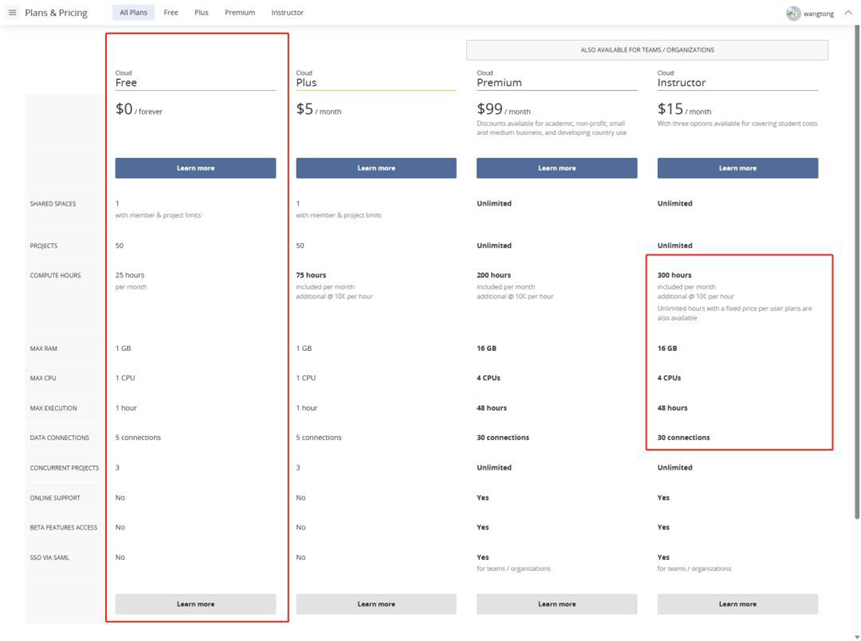
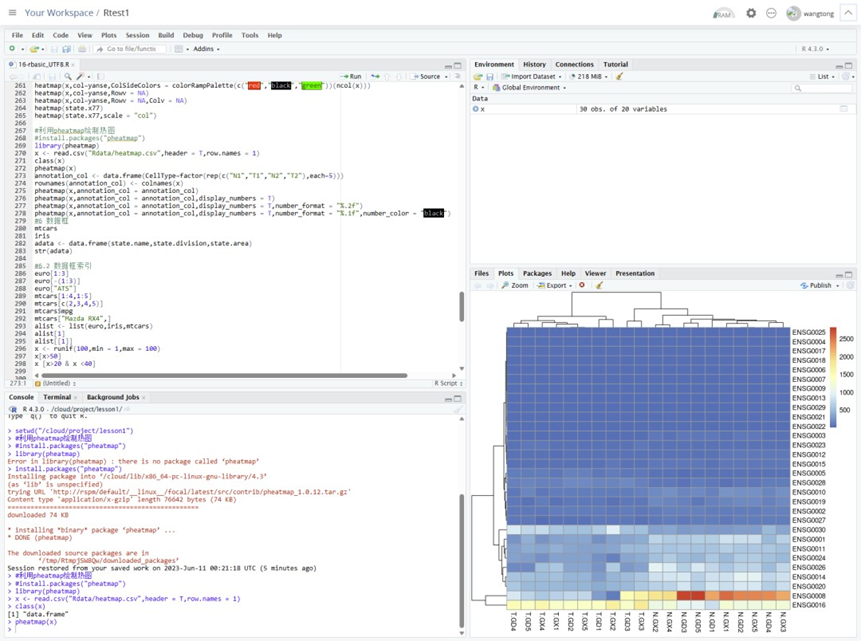
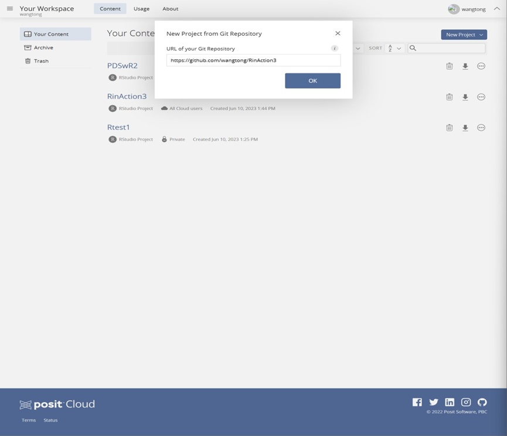

# 免费R分析环境

posit（原 Rstudio）公司提供了云服务 posit cloud，是一个在线的 Rstudio 与 Jupyter 环境。 并且有免费版。

目前 posit cloud 提供四个订阅计划可供选择，有免费版，提供 1 个 1G 内存，1 个 CPU，可 创建 50 个项目，每月计算时间为 25 个小时。每月 5 美元版本配置一样，只不过每个月提供 75 小时使用，超过部分每小时 10 美分。教学版本 15 元每个月，提供 16GB 内存以及 4个 CPU，每个月 300 小时计算时长。高级版本每个月 99 美元，对于学术用户，非营利组织， 中小企业，发展中国家可以提供折扣。

​                              

图 1 Posit Cloud 价格表

登录 posit 网站，选择登录方式，可以使用自己邮箱注册，也可以选择 google，github 等账 号直接登录。

网站地址：https://posit.cloud/

创建一个 Rstudio 项目，接下来就可以轻松使用 R了。只有 1G内存，并且只有25小时时长， 我们使用它主要用来做测试，在这里安装R包非常快速。也可以完成一些简单计算。使用体 验还是非常好的。如果一个环境出问题，可以重新创建一个新的项目，不同项目之间无干扰。

 图2 通过Posit Cloud运行 R

直接导入 github项目：

​                               

图3 直接导入 github 项目

[https://github.com/wangtong/RinAction3 ](https://github.com/wangtong/RinAction3)

https://github.com/hadley/r4ds

 

 

图6直接导入 github 项目