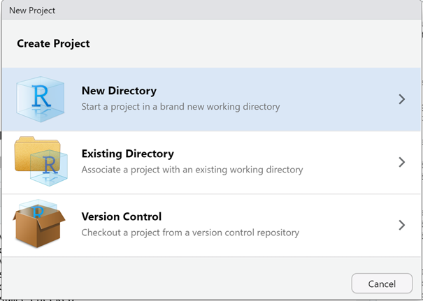

# 开始使用R

## 设置工作目录

使用R语言的第一个过程就是设置工作目录，使用R语言经常需要读写文件，设置好工作目录可以方便读写文件。需要对不同系统目录的写法有所了解，windows目录结构与Linux目录结构主要差别在两点：第一，Linux系统不存在盘符，所有数据路径都是有“/”开始；第二：Linux系统采用正斜线分割目录，windows采用反斜线分割目录。在R中可以使用正斜线。另外，Rstudio目前对中文支持并不好，目录中最好不要有中文，否则会报错。

windows系统目录结构：“C:/Users/xxx/Desktop/”

macos系统目录结构：/Users/xxx/Desktop/

Linux系统目录结构：“/home/xxx/”

**方法一：Crtl+Shift+H快捷键**

​                               

图 1 通过菜单设置工作目录

**方法二：使用鼠标**

 

图 2 通过文件管理窗口设置工作目录

**方法三：使用R函数**

```shell
getwd() 
setwd("c:/Users/xxx/Desktop/") 

```

## 创建Project

创建Project可以将所有数据放到一个目录下，R的Project会保存分析过程中全部内容，方便管理以及分享。

 

图 3 创建R Projetc

Rstdudio目前支持多种项目，包括一个全新的项目，也可以从一个包含数据的目录作为项目目录，也可以将一个github项目克隆到本地。

 

图4 选择合适的项目类型

新建Rstudio项目可以包含多种类型，包括数据分析，R包，shiny应用，quarto等，选择不同的类型会提供不同的模板数据。

 

图 5 rstudio导入github项目

可以直接将github项目导入Rstudio中。

[https://github.com/wangtong/RinAction3 ](https://github.com/wangtong/RinAction3)

https://github.com/hadley/r4ds

R软件有交互式与脚本式运行两种方式，交互式便于进行数据探索，脚本式便于批量化和自动化处理。

## 交互式运行

在R的交互式运行中，默认的命令行提示符为大于号”**>**”，需要在英文状态下运行，也就是半角模式。输入要使用你的函数，然后按回车运行，如果命令正确，返回结果。当命令错误时，会返回错误提示，有些情况下会提示警告信息。当一条命令不完整时，会出现二级命令行提示符加号“**+**”，这种情况下需要将命令补齐完整。可以随时使用ESC键终止操作。

```r
dir() 

a <- 1 
b <- 2 
c <- a+b 
c 
print(c) 
1.02 ** 365 
0.98 ** 365 
ls() 
rm(a) 

```

从R 4.1.0版本开始，R语言新增了对管道的支持，管道符号为“**|>**”，可以将多个函数结合使用。在Rstudio中，通过快捷键**Ctrl + Shift + **可以输出该符号。

```r
mtcars |> head()
```
## 脚本式运行

脚本方式运行中，创建一个扩展名为.R的文件，例如test.R可以在Rstudio脚本窗口中一条条运行，也可以一起全部运行。在windows或者macos系统中，可以使用source命令运行整个脚本。

 

图 6 运行R脚本

在Linux命令行中，可以使用Rscript命令运行脚本文件，或者使用R -f来运行，当计算量较大，需要较长的运算时，或者可重复性计算等条件下。需要使用无监督的脚本式运行。在使用脚本运行R时，需要保证脚本能够正确执行，通常先使用小数据进行测试，并且运行过程中将结果及时保存为文件，例如绘制出的图片，而不是交互式显示。R脚本也可以提供选项参数，将R脚本转换为一个可执行程序。

```R
#运行R 脚本

Rscript test.R

R -f test.R

#运行R程序

pafCoordsDotPlotly.R -i CANU.paf -o output -l -p 10 -k 5   
```


## RMarkdown文本

Rmarkdown可以为基于R语言的数据分析提供一种统一的协作框架，可以集成代码、输出结果和文本注释。目前Rmarkdown已经升级为Quarto。

Quarto是目前最流行的开源出版系统。它是Rmarkdown的升级版。使用Quarto可以进行分析，贡献，重现结果。

Quarto使用Pandoc Markdown进行编写文档，包括方程式、引用、交叉应用，图形、标注，高级布局等都可以在一个文档中完成。

Quarto可以生成HTML、PDF、MS Word、ePub 等格式文档、演示文稿、网站、博客和书籍。

 

图 7 Quarto生成报告