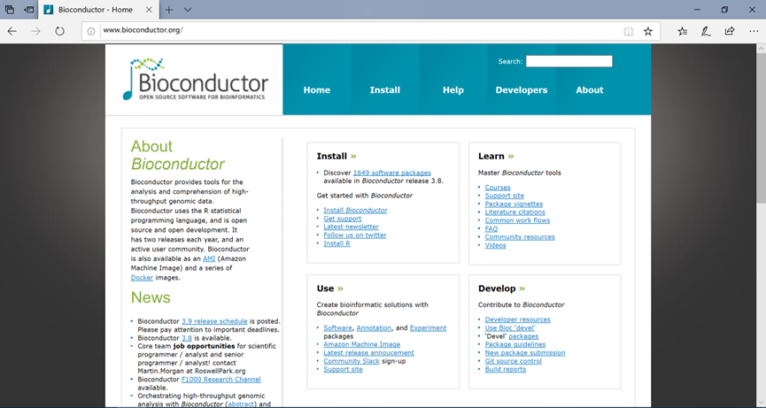
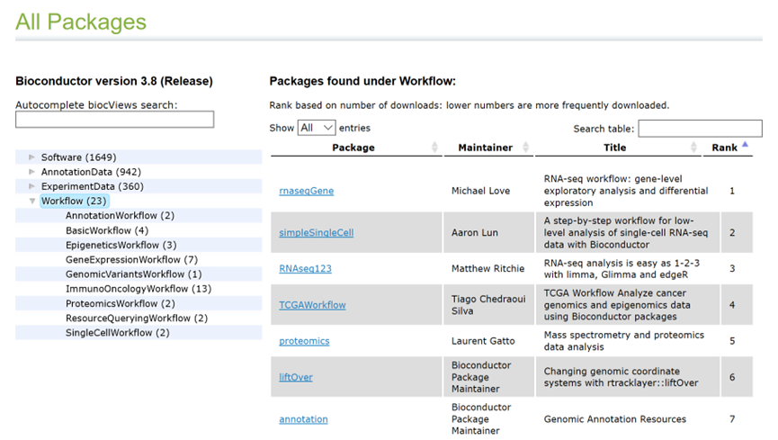
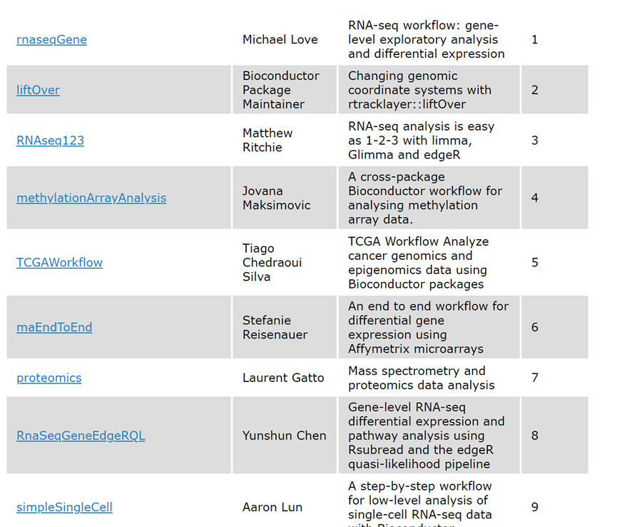

# 9.9 Bioconductor


## 1 Bioconductor简介

Bioconductor 是建立在R语言环境上的，用于生物信息数据的注释、处理、分析及可视化工具包的总集，由系列R扩展包组成。很多生物数据都是使用bioconductor包来分析的。

Bioconductor官网：<http://www.bioconductor.org/>

                             

图 1 Bioconductor项目官网

**bioconductor包能做什么？**

1. 处理结构化数据，生物数据统计，分析，绘图；
2. 处理MicroArrays芯片数据，RNAseq数据，流式细胞仪数据，定量PCR数据，质谱数据等;
3. 基因功能注释，GO，KEGG等；
4. 生物大数据的数据挖掘，机器学习等；

 

**bioconductor包不擅长做什么？**

1. 非结构化数据处理，例如处理字符串；
2. 很难处理序列匹配，序列拼接，序列比对等工作；

Bioconductor 统计排名：<http://bioconductor.org/packages/stats/>

Bioconductor workflows：<http://www.bioconductor.org/packages/release/BiocViews.html#___Workflow>

## 3.2 Bioconductor分类

1. 实验数据包ExperimentData
2. 软件包（Software）
3. 注释数据包（AnnotationData）

下面列出bioconductor一些常用的扩展包，发展很快，现在已经有软件包1700多了。

- 处理芯片数据： affy, affydata, affyPLM, affyQCReport, annaffy, annotate,
- 处理序列：ShortRead，Biobase, Biostrings,
-  RNAseq分析：Deseq，Deseq2，edgeR，limma，baySeq，DEGseq，DEXseq；
- Chp-seq分析：CSAR，chipseq，ChIPseqR，ChIPsiim；
- 基因功能注释：AnnotationDbi，biomaRt, GOstats，
- annotate，GeneAnswers，Goseq，topGO；
- 其他： gcrma, genefilter, geneplotter, GenomicRanges, marray, multtest, vsn, 和xtable

 

图 18 bioconductor 分类

## 3常用工作流程

Bioconductor提供28个完整工作流程Workflow，这些workflow是利用多个R包完成一些完整的数据分析工作。每个工作流程提供案例数据，脚本，结果，文档以及详细的介绍，是非常好的学习材料。包括RNAseq数据分析，芯片数据分析，单细胞测序，TCGA数据挖掘，基因功能注释等完整流程。

网站：<http://www.bioconductor.org/packages/release/BiocViews.html#___Workflow>

 

图 3 Bioconductor workflow

## 4 Bioconductor包的安装

为了便于bioconductor包的管理，bioconductor采用不同的函数来管理bioconductor的扩展包。并且bioconductor的服务器与R也不同，因此，在安装bioconductor包之前，还需要修改bioconductor包的默认镜像站点。由于bioconductor的镜像站点比较少，因此，这一步非常关键，会对下载速度产生非常大的影响。

```r
chooseBioCmirror()  
if (!requireNamespace("BiocManager"))
    install.packages("BiocManager")
BiocManager::install(“Deseq2”)
library(Deseq2)

```